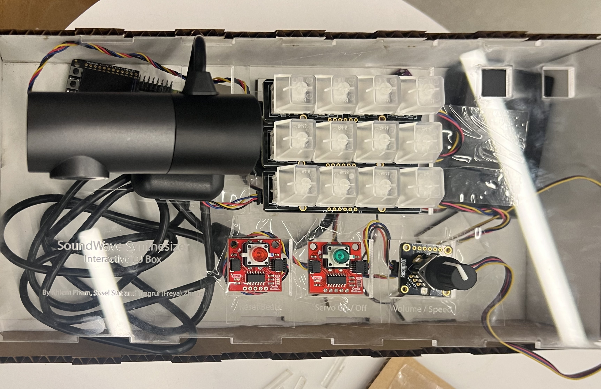
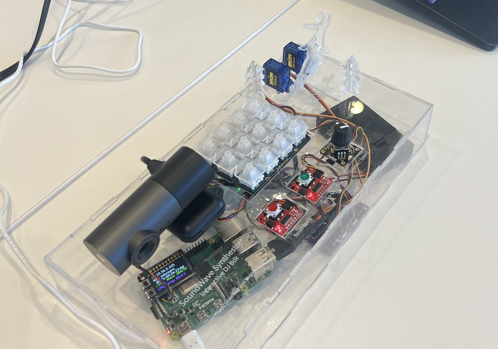
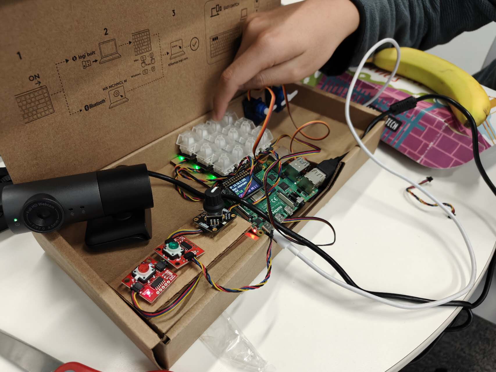
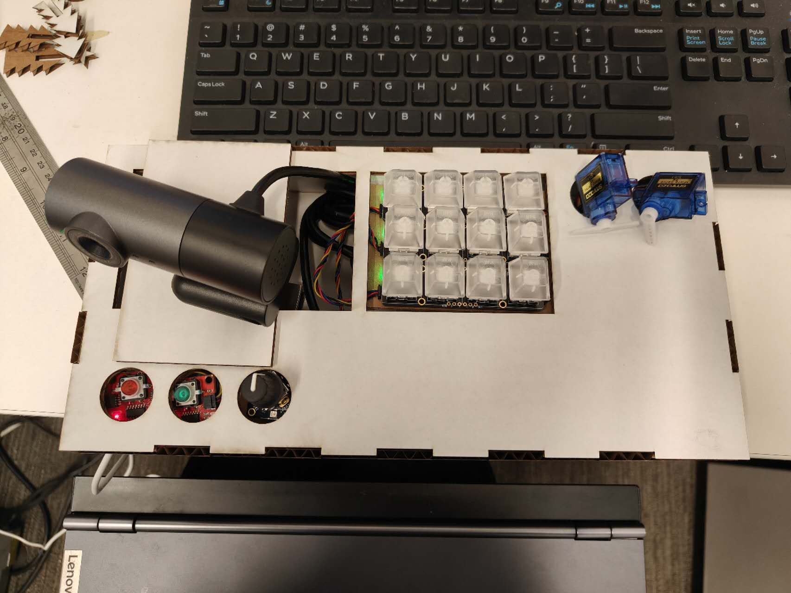
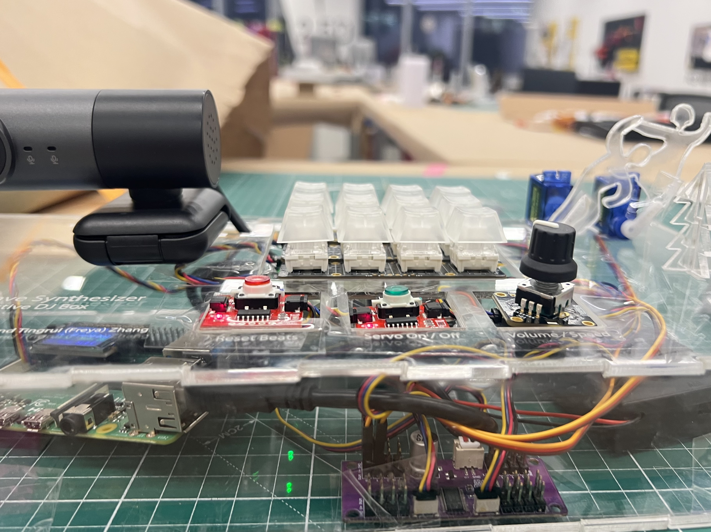
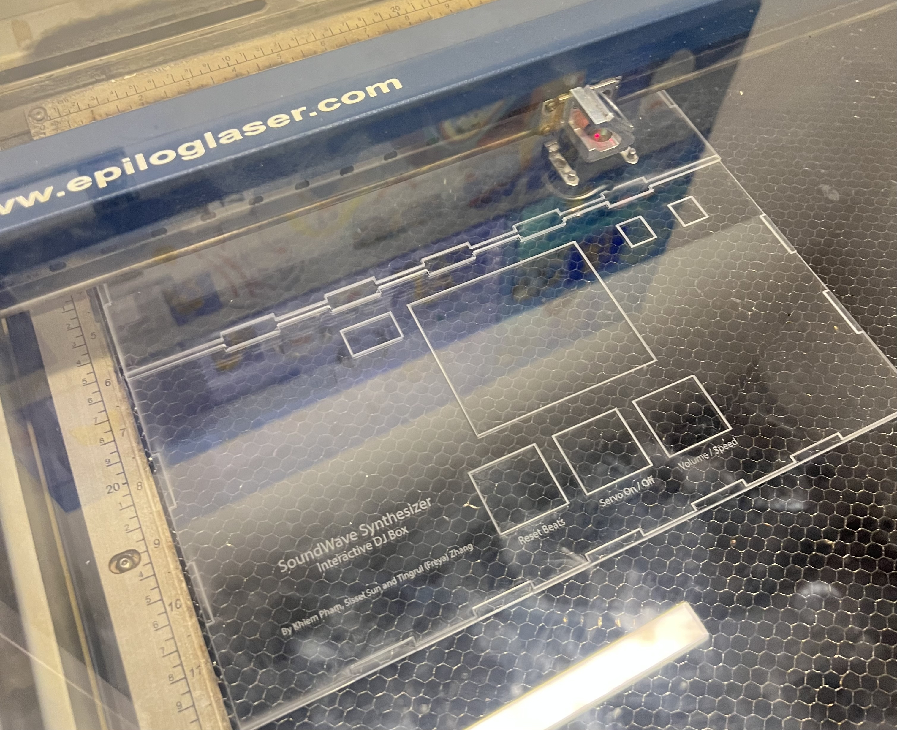

# Final Project - SoundWave Synthesizer

+ Khiem Pham - dpk45
+ Sissel Sun - rs923
+ Tingrui（Freya) Zhang - tz428

## **Ideation**

Our project introduces a unique music toolkit designed for individuals new to DJing. It's a user-friendly platform that simplifies music creation, making it accessible and enjoyable for beginners. 

The centerpiece is the DJ Box, which allows users to add various drum beats to a track. The setup includes dynamic lights on the keyboard that respond to the beats, along with two small figurines that move in sync with the beat, creating a playful and engaging environment for music composition.

# **Project Timeline**
  - Nov 14 - Project Planning
  - Nov 21 - Functional checkoff: Implement basic functions of looping, instrument playing and volume control. Try out music visualization.
  - Nov 30 - Fully functioning demo: Added servo control and resetting beats
  - Dec 5 - Design and laser cut the case
  - Dec 12 - Presentation
  - Dec 15 - Work on documentations

## **Parts Involved**
- Raspberry Pi
- 1x4 Neokeys
- Rotary encoder
- Buttons
- Servos
- webcamera (as speaker)
- Cardboard (for the laser-cut frame)
- Acrylic

## **Fallback Plan**

One of the challenges we have is trying to visualize the user-created beats by generative abstract paintings. We will test out the visualization mechanism first (before Nov 21) and if the visualization is not intuitive, we will consider switching to LEDs. 

## **Functioning Project**

## **Features**
- **Control Interface:** Utilizing 12 keys to control multiple instruments. We used sound samples from [Wavbvkery](https://wavbvkery.com/acoustic-drum-samples/) that include:
  - Snare drum
  - Hi-hat
  - Kick
  - Crash
  - Clap
  - Stick
  - Ride
  - Tom
  - Hat Bell
  - Cowbell
- **Beats Visualization:** 
  - Each key represents a different note, which will be highlighted in a rainbow of colors when triggered.
  - We designed two figures that dance with the beat, driven by servos, for the box.
- **Looping & Resetting:** An automatic mechanism dedicated to recording and looping the beats played by the user. A button allows for easy reset to start over.
- **Volume Adjusting:** We used a rotary encoder for adjusting volume.
- **Speed Adjusting:** The rotary encoder can also adjust speed. It switches between adjusting volume and speed upon pressing. 

## **Design Process**
1. Soldered the neokeys and qwiic buttons to enable them to function separately when connected in series.
2. Prototyped a demo for functional checkoff that included basic functions such as instrument playing and volume control.
3. Completed a fully-functional demo. We used an existing cardboard box as the case.

  

  [Demo Video](img/demo_1.mp4)

4. Allocated components' positions and designed the case for laser cutting. We used [MakerCase](https://en.makercase.com/#/basicbox) to help us prototype the case. See [lasercut](lasercut/) for design file iterations. The final files are [board1_new](lasercut/board1_new.pdf), [board2_new](lasercut/board2_new.pdf) and [board_combined](lasercut/board_combined.pdf).

5. Tested cutting case with cardboard and made corrections.

  
  

6. Laser cutted the arcylic case, assembled it and debugged the system.

  

## Code

See [main.py](BeatMaker/main.py)

## **Challenges and Revisions**

- **Noise Issue:** We observed that the two moving figures, powered by servos, produced noticeable noise. To address this, we added a button that allows users to toggle the interaction with the figures on or off.

- **Knob for Volume and Speed Control:** Originally, our design required two separate knobs to adjust volume and speed. However, during development, we found that the knob could switch between two states by being pressed. Consequently, we combined these two functionalities into a single knob. Following feedback from our instructor during a class presentation, we implemented the use of an LED on the component to indicate whether the knob is currently adjusting volume or speed.

- **Laser Cutting Challenges:** We encountered issues with laser cutting acrylic. Despite calibration and various adjustments, the laser couldn't smoothly cut through the acrylic using the standard settings for the material we were using. Even after slowing down the speed, the desired cut was not achieved. Ultimately, we resorted to multiple repetitions to complete the cutting process. We checked the laser cutter's height, power supply, material specifications, and parameters, but have yet to pinpoint the exact cause of the issue.

## **Video Demo of Final Project**
[Video Demo](https://drive.google.com/file/d/1bJgLtm6H5zh4QI7i1hZ8hsi9uHci-zHL/view?usp=sharing)

