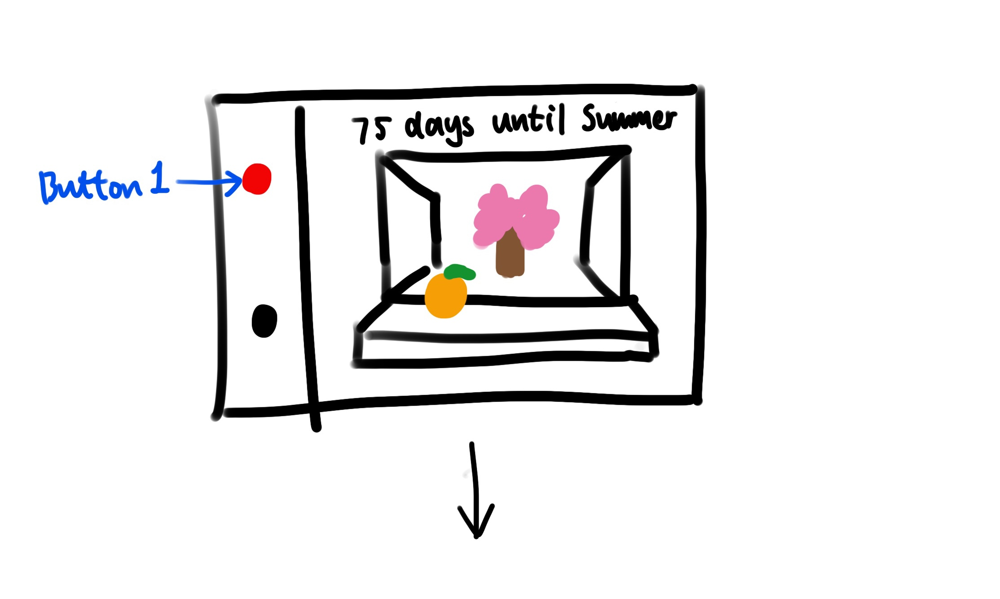
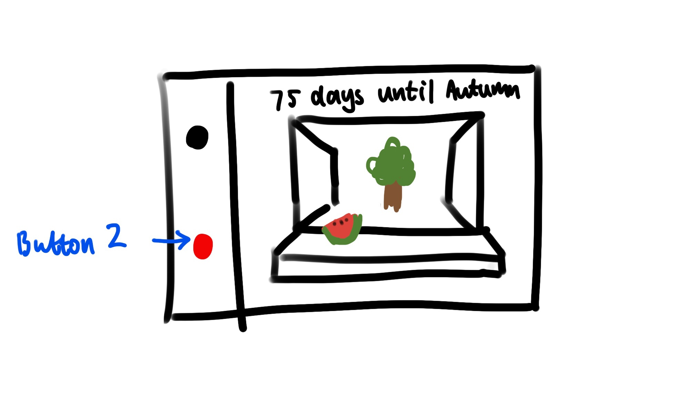

# Final Project - SoundWave Synthesizer

+ Khiem Pham - dpk45
+ Sissel Sun - rs923
+ Tingrui（Freya) Zhang - tz428

## **Ideation**

Our project introduces a unique music toolkit designed for individuals new to DJing. It's a user-friendly platform that simplifies music creation, making it accessible and enjoyable for beginners. 

The centerpiece is the DJ Box, which allows users to add various drum beats to a track. The setup includes dynamic lights on the keyboard that respond to the beats, along with two small figurines that move in sync with the beat, creating a playful and engaging environment for music compositio.

## **Features**
- **Control Interface:** Utilizing 12 keys to control multiple instruments such as:
  - Snare drums
  - Bass drums
  - Hi-hats
- **Beats Visualization:** 
    - Each key represents a different note, which will be highlighted in various colors when triggered.
  - We designed two figures that move with the beat, driven by servos, for the box.
- **Looping & Resetting:** An automatic mechanism dedicated to recording and looping the beats played by the user. A button allows for easy reset to start over.
- **Volume Adjusting:** A knob for adjusting volume.
- **Speed Adjusting:** A knob for adjusting speed.

## **Workflow**
1. Soldered the keyboard group and qwiic to enable them to function separately when connected in series.
2. Prototyped a demo.
3. Allocated components' positions and designed the case.
4. Tested the case and made corrections.
5. Officially assembled and debugged.

## **Parts Involved**
- Raspberry Pi
- Alligator clips
- Buttons
- Servo
- webcamera (as speaker)
- Plywood (for the laser-cut frame)
- Acrylic

## **Challenges and Revisions**

- **Noise Issue with Moving Figures:** We observed that the two moving figures, powered by servos, produced noticeable noise. To address this, we added a button that allows users to toggle the interaction with the figures on or off.

- **Knob Design for Volume and Speed Control:** Originally, our design required two separate knobs to adjust volume and speed. However, during development, we found that the knob could switch between two states by being pressed. Consequently, we combined these two functionalities into a single knob. Following feedback from our instructor during a class presentation, we implemented the use of an LED on the component to indicate whether the knob is currently adjusting volume or speed.

- **Laser Engraving Acrylic Challenges:** We encountered issues with laser cutting acrylic. Despite calibration and various adjustments, the laser couldn't smoothly cut through the acrylic using the standard settings for the material we were using. Even after slowing down the speed, the desired cut was not achieved. Ultimately, we resorted to multiple repetitions to complete the cutting process. We checked the laser cutter's height, power supply, material specifications, and parameters, but have yet to pinpoint the exact cause of the issue.

