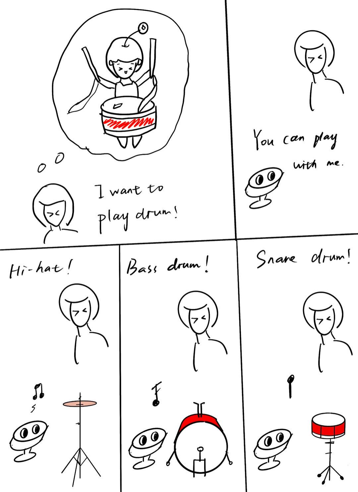

# Chatterboxes
### Collaborators:
- Sissel Sun - rs923
- Tingrui（Freya) Zhang - tz428
- Khiem Pham - dpk45

[](https://www.youtube.com/embed/Q8FWzLMobx0?start=19)

In this lab, we want you to design interaction with a speech-enabled device--something that listens and talks to you. This device can do anything *but* control lights (since we already did that in Lab 1).  First, we want you first to storyboard what you imagine the conversational interaction to be like. Then, you will use wizarding techniques to elicit examples of what people might say, ask, or respond.  We then want you to use the examples collected from at least two other people to inform the redesign of the device.

We will focus on **audio** as the main modality for interaction to start; these general techniques can be extended to **video**, **haptics** or other interactive mechanisms in the second part of the Lab.

## Prep for Part 1: Get the Latest Content and Pick up Additional Parts 

### Pick up Web Camera If You Don't Have One

Students who have not already received a web camera will receive their [IMISES web cameras](https://www.amazon.com/Microphone-Speaker-Balance-Conference-Streaming/dp/B0B7B7SYSY/ref=sr_1_3?keywords=webcam%2Bwith%2Bmicrophone%2Band%2Bspeaker&qid=1663090960&s=electronics&sprefix=webcam%2Bwith%2Bmicrophone%2Band%2Bsp%2Celectronics%2C123&sr=1-3&th=1) on Thursday at the beginning of lab. If you cannot make it to class on Thursday, please contact the TAs to ensure you get your web camera. 

**Please note:** connect the webcam/speaker/microphone while the pi is *off*. 

### Get the Latest Content

As always, pull updates from the class Interactive-Lab-Hub to both your Pi and your own GitHub repo. There are 2 ways you can do so:

**\[recommended\]**Option 1: On the Pi, `cd` to your `Interactive-Lab-Hub`, pull the updates from upstream (class lab-hub) and push the updates back to your own GitHub repo. You will need the *personal access token* for this.

```
pi@ixe00:~$ cd Interactive-Lab-Hub
pi@ixe00:~/Interactive-Lab-Hub $ git pull upstream Fall2022
pi@ixe00:~/Interactive-Lab-Hub $ git add .
pi@ixe00:~/Interactive-Lab-Hub $ git commit -m "get lab3 updates"
pi@ixe00:~/Interactive-Lab-Hub $ git push
```

Option 2: On your your own GitHub repo, [create pull request](https://github.com/FAR-Lab/Developing-and-Designing-Interactive-Devices/blob/2022Fall/readings/Submitting%20Labs.md) to get updates from the class Interactive-Lab-Hub. After you have latest updates online, go on your Pi, `cd` to your `Interactive-Lab-Hub` and use `git pull` to get updates from your own GitHub repo.

## Part 1.
### Setup 

*DO NOT* forget to work on your virtual environment! 

Run the setup script
```chmod u+x setup.sh && sudo ./setup.sh  ```

### Text to Speech 

In this part of lab, we are going to start peeking into the world of audio on your Pi! 

We will be using the microphone and speaker on your webcamera. In the directory is a folder called `speech-scripts` containing several shell scripts. `cd` to the folder and list out all the files by `ls`:

```
pi@ixe00:~/speech-scripts $ ls
Download        festival_demo.sh  GoogleTTS_demo.sh  pico2text_demo.sh
espeak_demo.sh  flite_demo.sh     lookdave.wav
```

You can run these shell files `.sh` by typing `./filename`, for example, typing `./espeak_demo.sh` and see what happens. Take some time to look at each script and see how it works. You can see a script by typing `cat filename`. For instance:

```
pi@ixe00:~/speech-scripts $ cat festival_demo.sh 
#from: https://elinux.org/RPi_Text_to_Speech_(Speech_Synthesis)#Festival_Text_to_Speech
```
You can test the commands by running
```
echo "Just what do you think you're doing, Dave?" | festival --tts
```

Now, you might wonder what exactly is a `.sh` file? 
Typically, a `.sh` file is a shell script which you can execute in a terminal. The example files we offer here are for you to figure out the ways to play with audio on your Pi!

You can also play audio files directly with `aplay filename`. Try typing `aplay lookdave.wav`.

\*\***Write your own shell file to use your favorite of these TTS engines to have your Pi greet you by name.**\*\*
(This shell file should be saved to your own repo for this lab.)

See [greet.sh](speech-scripts/greet.sh).

---
Bonus:
[Piper](https://github.com/rhasspy/piper) is another fast neural based text to speech package for raspberry pi which can be installed easily through python with:
```
pip install piper-tts
```
and used from the command line. Running the command below the first time will download the model, concurrent runs will be faster. 
```
echo 'Welcome to the world of speech synthesis!' | piper \
  --model en_US-lessac-medium \
  --output_file welcome.wav
```
Check the file that was created by running `aplay welcome.wav`. Many more languages are supported and audio can be streamed dirctly to an audio output, rather than into an file by:

```
echo 'This sentence is spoken first. This sentence is synthesized while the first sentence is spoken.' | \
  piper --model en_US-lessac-medium --output-raw | \
  aplay -r 22050 -f S16_LE -t raw -
```
  
### Speech to Text

Next setup speech to text. We are using a speech recognition engine, [Vosk](https://alphacephei.com/vosk/), which is made by researchers at Carnegie Mellon University. Vosk is amazing because it is an offline speech recognition engine; that is, all the processing for the speech recognition is happening onboard the Raspberry Pi. 
```
pip install vosk
pip install sounddevice
```

Test if vosk works by transcribing text:

```
vosk-transcriber -i recorded_mono.wav -o test.txt
```

You can use vosk with the microphone by running 
```
python test_microphone.py -m en
```

\*\***Write your own shell file that verbally asks for a numerical based input (such as a phone number, zipcode, number of pets, etc) and records the answer the respondent provides.**\*\*
See [numerical.sh](./speech-scripts/numerical.sh) and [numerical.py](./speech-scripts/numerical.py).

### Serving Pages

In Lab 1, we served a webpage with flask. In this lab, you may find it useful to serve a webpage for the controller on a remote device. Here is a simple example of a webserver.

```
pi@ixe00:~/Interactive-Lab-Hub/Lab 3 $ python server.py
 * Serving Flask app "server" (lazy loading)
 * Environment: production
   WARNING: This is a development server. Do not use it in a production deployment.
   Use a production WSGI server instead.
 * Debug mode: on
 * Running on http://0.0.0.0:5000/ (Press CTRL+C to quit)
 * Restarting with stat
 * Debugger is active!
 * Debugger PIN: 162-573-883
```
From a remote browser on the same network, check to make sure your webserver is working by going to `http://<YourPiIPAddress>:5000`. You should be able to see "Hello World" on the webpage.

### Storyboard

Storyboard and/or use a Verplank diagram to design a speech-enabled device. (Stuck? Make a device that talks for dogs. If that is too stupid, find an application that is better than that.) 

\*\***Post your storyboard and diagram here.**\*\*

We want to complete a voice interactive percussion instrument, and we imagine that this bot can produce a corresponding sound after hearing a certain instrument with voice input.

### Design & Sketches



\*\***Please describe and document your process.**\*\*

### Acting out the dialogue

Find a partner, and *without sharing the script with your partner* try out the dialogue you've designed, where you (as the device designer) act as the device you are designing.  Please record this interaction (for example, using Zoom's record feature).

\*\***Describe if the dialogue seemed different than what you imagined when it was acted out, and how.**\*\*

### Wizarding with the Pi (optional)
In the [demo directory](./demo), you will find an example Wizard of Oz project. In that project, you can see how audio and sensor data is streamed from the Pi to a wizard controller that runs in the browser.  You may use this demo code as a template. By running the `app.py` script, you can see how audio and sensor data (Adafruit MPU-6050 6-DoF Accel and Gyro Sensor) is streamed from the Pi to a wizard controller that runs in the browser `http://<YouPiIPAddress>:5000`. You can control what the system says from the controller as well!

It would be hard for a human to mimic the sound of drums, so we wizard the pi to act out the dialogue. 

[Demo Video](https://drive.google.com/file/d/184GVbuQsBwKqN5MAbR5yLaF0UbEF0hwl/view?usp=sharing)

Code: see [drum.py](./speech-scripts/drum.py)

\*\***Describe if the dialogue seemed different than what you imagined, or when acted out, when it was wizarded, and how.**\*\*

When testing out with the wizarded pi, we found the keyword recognition is lower than expected because of no context. If we just say “bass drum”, the recognizer will think it’s something like “ah strong” and fail to play the bass drum sound. To solve this issue, we added a custom word list ("bass", "snare", "drum", "hi", "hat", "[unk]"). It includes the instruments we need and maps all other words to “unknown”. As a result, words with similar pronunciation will get mapped to our keyword and the accuracy is increased. Another thing we did not expect is that users might say “can you play hi hat” instead of just “hi hat”. So to make our system more robust, we let it detect substring in the recognized text instead of matching the text directly. This ensures a noise in the speech recognition would not affect the result. 

# Lab 3 Part 2

For Part 2, you will redesign the interaction with the speech-enabled device using the data collected, as well as feedback from part 1.

## Prep for Part 2

1. What are concrete things that could use improvement in the design of your device? For example: wording, timing, anticipation of misunderstandings...
2. What are other modes of interaction _beyond speech_ that you might also use to clarify how to interact?
3. Make a new storyboard, diagram and/or script based on these reflections.

## Prototype your system

The system should:
* use the Raspberry Pi 
* use one or more sensors
* require participants to speak to it. 

*Document how the system works*
We want to design a bot that can record percussion loops. The interactive process we envision is for an artist to select instruments while arranging rhythms, and have the instruments sound according to their own set drum beats. Multiple instruments are recorded in one cycle, which can be repeated to form a regular rhythm.
Our system can select the instruments to be arranged, input rhythm through tapping, and switch between different instruments through voice control, continuously mixing to make the rhythm more full.

Code: see [drum_part2.py](./speech-scripts/drum_part2.py)

*Include videos or screencaptures of both the system and the controller.*

[Video Demo](https://drive.google.com/file/d/1O5FGOTK_JrV2HJgykIsxRE6jEwC26ZUM/view?usp=drive_link)

## Test the system
Try to get at least two people to interact with your system. (Ideally, you would inform them that there is a wizard _after_ the interaction, but we recognize that can be hard.)

Answer the following:

### What worked well about the system and what didn't?
Freya: The triggering of the sound was relatively smooth, but the initial playback of the recorded rhythm was chaotic due to the lack of start and end times. 

Khiem: It was able to understand the my choices of instrument through speech recognition quite robustly and recognize the beats through touch censoring. 

Sissel: The system did a relatively good job in recognizing the keywords and playing the corresponding instrument after adding a customized word list. However, during the playback phase, some beats are not played precisely at the recorded time, so each playback sounds a little different than others. In addition, the system did not provide vocal feedback on whether an instrument was successfully selected (there is only terminal output), which caused some confusion.

### What worked well about the controller and what didn't?

Freya: Overall, the controller is relatively sensitive. But two small issues arose. The first one was that we initially set an error prompt tone, such as saying an undefined instrument and playing a "sorry.mp3". Later, we found that this audio would be used as input to continuously trigger itself. Thus, we set a time protection mechanism to trigger "sorry.mp3" in the program to solve this problem. However, it was later discovered that there was no problem on the Mac system, and we speculate that this may be due to the default webcamera microphone and earpiece in the Windows system being indistinguishable, while the two do not affect each other in Mac OS. The second issue is that the pronunciation of the word 'bass drum' is difficult to accurately recognize, so we made a setting before input to ensure that the voice input is matched as well as possible.

Khiem: There is a delay (from voice to registration) that I don't know when it has actually started registering my touch, resulting in missed beats. The touch censor also has some delay, though I think that is the limit of the hardware.

Sissel: The touch sensing for playing a beat has a delay and sometimes the touch does not get recognized. This made it harder than we expected to customize beats. 

### What lessons can you take away from the WoZ interactions for designing a more autonomous version of the system?

Freya: To design a more autonomous version of the system, several crucial lessons must be applied. Firstly, precise start and end times for recorded rhythms should be implemented to ensure a coherent and synchronized playback experience. Secondly, error handling mechanisms need improvement to prevent feedback loops, as observed in the initial version. Thirdly, cross-platform compatibility should be ensured, addressing discrepancies like microphone recognition between different operating systems. Furthermore, enhancing voice recognition accuracy, particularly for challenging words, is vital for a smoother user experience. Additionally, user guidance and training mechanisms should be in place to help users utilize voice controls effectively and minimize errors. Lastly, a proactive plan for continuous system improvement, guided by user feedback, is essential to refine and optimize the system's performance over time.

Khiem: I realize that I and many others prefer no to insignificant delays in our interactions with the system, especially if the system is intended to be interactive. Of course, delay is always present in constrained yet 'smart' system, so I wonder if we can reduce system delay by being 'approximate'.

Sissel: For our system to work better, it’s necessary to reduce the delays and increase the accuracy of recognizing a touch. We realize that might be difficult because of hardware constraints. Another thing we could improve is to provide more vocal feedback for new users, notifying them whether an instrument is selected or the machine does not recognize the command. 

### How could you use your system to create a dataset of interaction? What other sensing modalities would make sense to capture?

Freya: To generate a dataset of user interactions, our system can record various aspects of user engagement. It can capture instrument selections, rhythm arrangements, and voice commands during interactions. Additionally, it should log instances of errors and user feedback to refine system performance. 

To create a more comprehensive dataset of interactions, we should align our hardware sensors with human intuition. For example, we can introduce options for string instrument arrangements, making music composition feel more natural. User input methods could transition from tapping on conductive tape to sliding sliders, mirroring musicians' actions. Additionally, incorporating sensors to detect the force applied can capture the nuances of percussion instruments, enriching the sound experience. These enhancements will offer greater potential for improving system autonomy and enhancing the user experience, adding depth to the dataset.

Khiem: record the speed commands that users often make, use video to track users' satisfaction. 

SIssel: We can provide more commands that support more instruments, use the camera to track the user’s emotions, and ask for feedback when errors or negative emotions are detected.