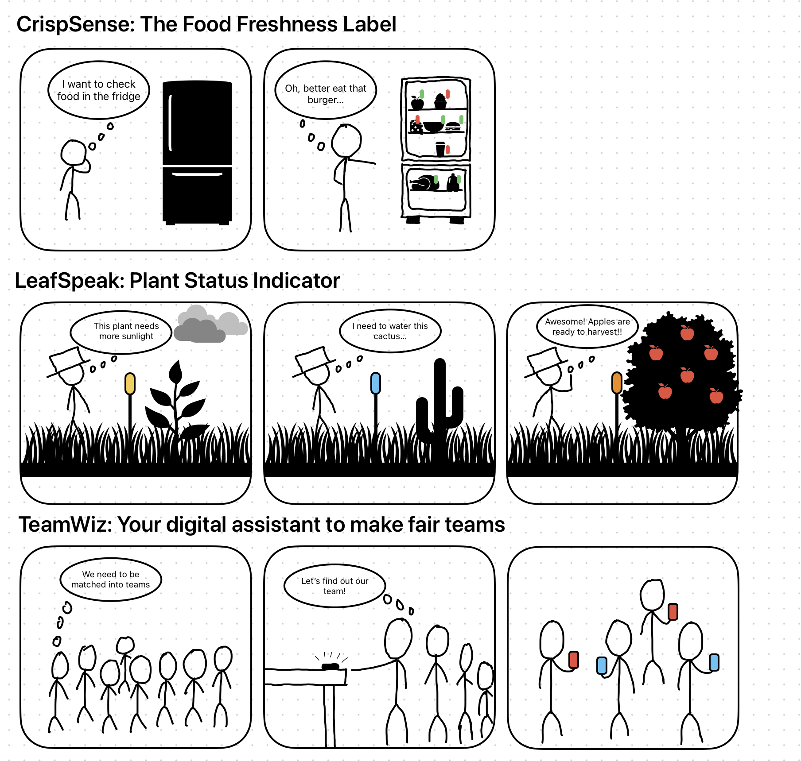
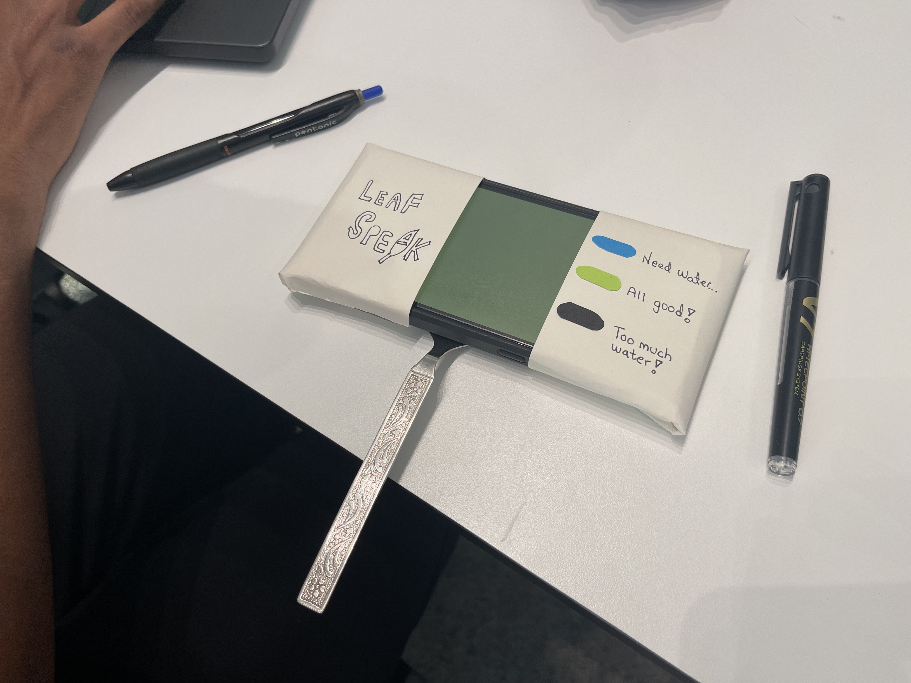
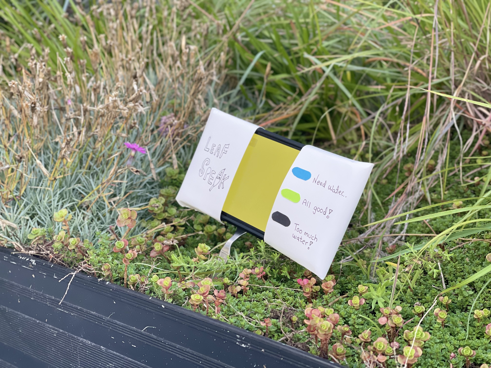

# Staging Interaction

\*\***NAME OF COLLABORATORS HERE**\*\*

Siddharth Kothari - sk2793 \
Omar Mohamed - om84 \
Tahmid Kazi - tk596

In the original stage production of Peter Pan, Tinker Bell was represented by a darting light created by a small handheld mirror off-stage, reflecting a little circle of light from a powerful lamp. Tinkerbell communicates her presence through this light to the other characters. See more info [here](https://en.wikipedia.org/wiki/Tinker_Bell). 

There is no actor that plays Tinkerbell--her existence in the play comes from the interactions that the other characters have with her.

For lab this week, we draw on this and other inspirations from theatre to stage interactions with a device where the main mode of display/output for the interactive device you are designing is lighting. You will plot the interaction with a storyboard, and use your computer and a smartphone to experiment with what the interactions will look and feel like. 

_Make sure you read all the instructions and understand the whole of the laboratory activity before starting!_

## Prep

### To start the semester, you will need:
1. Read about Git [here](https://git-scm.com/book/en/v2/Getting-Started-What-is-Git%3F).
2. Set up your own Github "Lab Hub" repository to keep all you work in record by [following these instructions](https://github.com/FAR-Lab/Developing-and-Designing-Interactive-Devices/blob/2021Fall/readings/Submitting%20Labs.md).
3. Set up the README.md for your Hub repository (for instance, so that it has your name and points to your own Lab 1) and [learn how to](https://guides.github.com/features/mastering-markdown/) organize and post links to your submissions on your README.md so we can find them easily.

### For this lab, you will need:
1. Paper
2. Markers/ Pens
3. Scissors
4. Smart Phone -- The main required feature is that the phone needs to have a browser and display a webpage.
5. Computer -- We will use your computer to host a webpage which also features controls.
6. Found objects and materials -- You will have to costume your phone so that it looks like some other devices. These materials can include doll clothes, a paper lantern, a bottle, human clothes, a pillow case, etc. Be creative!

### Deliverables for this lab are: 
1. 7 Storyboards
1. 3 Sketches/photos of costumed devices
1. Any reflections you have on the process
1. Video sketch of 3 prototyped interactions
1. Submit the items above in the lab1 folder of your class [Github page], either as links or uploaded files. Each group member should post their own copy of the work to their own Lab Hub, even if some of the work is the same from each person in the group.

### The Report
This README.md page in your own repository should be edited to include the work you have done (the deliverables mentioned above). Following the format below, you can delete everything but the headers and the sections between the **stars**. Write the answers to the questions under the starred sentences. Include any material that explains what you did in this lab hub folder, and link it in your README.md for the lab.

## Lab Overview
For this assignment, you are going to:

A) [Plan](#part-a-plan) 

B) [Act out the interaction](#part-b-act-out-the-interaction) 

C) [Prototype the device](#part-c-prototype-the-device)

D) [Wizard the device](#part-d-wizard-the-device) 

E) [Costume the device](#part-e-costume-the-device)

F) [Record the interaction](#part-f-record)

Labs are due on Mondays. Make sure this page is linked to on your main class hub page.

## Part A. Plan 

To stage an interaction with your interactive device, think about:

_Setting:_ Where is this interaction happening? (e.g., a jungle, the kitchen) When is it happening?

_Players:_ Who is involved in the interaction? Who else is there? If you reflect on the design of current day interactive devices like the Amazon Alexa, it’s clear they didn’t take into account people who had roommates, or the presence of children. Think through all the people who are in the setting.

_Activity:_ What is happening between the actors?

_Goals:_ What are the goals of each player? (e.g., jumping to a tree, opening the fridge). 

The interactive device can be anything *except* a computer, a tablet computer or a smart phone, but the main way it interacts needs to be using light.

\*\***Describe your setting, players, activity and goals here.**\*\*
### (1) ChrispSense: The food freshness Label
**Setting:** The user opens a refridgerator in a kitched to see what ingredients they have for cooking their next meal.

**Players:** The refridgerator and the user.

**Activity:** The user opens the refrigerator and immediately sees visual labels that make it easy to tell apart fresh food from stale food, and those foods about to expire.The label for the items that have expired turn ‘red’ while those about to expire turn orange, and the fresh food is labeled green.

**Goals:** To visually tell apart food items based on their freshness to allow user to make conscious decisions thereby reducing food wastage.

### (2) LeafSpeak: The Plant's voice
**Setting:** A plant and a caretaker in a nursery on a bright sunny morning.

**Players:** The plant and its caretaker

**Activity:** The LeafSpeak device, positioned in the soil, shifts its color to blue as soon as it identifies the plant's thirst for water. In a plantation or nursery, numerous plants may demand varying amounts of water. These devices individually shift to a 'blue' hue when the particular plant requires hydration, transitioning to green once the water supply suffices, and to black if overwatering occurs. Furthermore, an orange hue emerges when a plant or tree is ripe for harvesting, while a yellow glow signifies the need for increased sunlight.

**Goals:** To notify the plant’s caretaker about its water/sunlight needs.

### (3) TeamWiz: Your digital assistant to make fair teams
**Setting:** A table with TeamWiz devices outside a Soccer field with players waiting in a queue to enter the field.

**Players:** (For the sake of this example, it will be 8 players to correspond with the 8 phones)

**Activity:** A group of players queue up to pick up their TeamWiz devices. As soon as a TeamWiz device is picked up it turns red or blue indicating which team (red or blue) the user belongs to. Additionally, should a player or two have to leave the game midway, all TeamWiz devices would blink-change their colors and re-distribute the team for fair play.

**Goals:** To divide a group of players into teams without any biases.

Storyboards are a tool for visually exploring a users interaction with a device. They are a fast and cheap method to understand user flow, and iterate on a design before attempting to build on it. Take some time to read through this explanation of [storyboarding in UX design](https://www.smashingmagazine.com/2017/10/storyboarding-ux-design/). Sketch seven storyboards of the interactions you are planning. **It does not need to be perfect**, but must get across the behavior of the interactive device and the other characters in the scene. 

\*\***Include pictures of your storyboards here**\*\*

Present your ideas to the other people in your breakout room (or in small groups). You can just get feedback from one another or you can work together on the other parts of the lab.

\*\***Summarize feedback you got here.**\*\*

We presented several ideas to everyone, people liked the idea of CrispSense, and they provides alot of inputs to the plant status indicator, making it more interactive, this becomes what we eventually prototyped interaction for. 

## Part B. Act out the Interaction

Try physically acting out the interaction you planned. For now, you can just pretend the device is doing the things you’ve scripted for it. 

\*\***Are there things that seemed better on paper than acted out?**\*\*

On paper we are able to simulate multiple scenarios and experiment with more light colors, but acting out do make more visual sense and is more immersive.

\*\***Are there new ideas that occur to you or your collaborators that come up from the acting?**\*\*

When acting out, we have noticed eignificantly more "details" about device's deployment and positioning versus ideal setting on paper. We are able to start more discussion surrounding the "producting environment" for our interactions.

## Part C. Prototype the device

You will be using your smartphone as a stand-in for the device you are prototyping. You will use the browser of your smart phone to act as a “light” and use a remote control interface to remotely change the light on that device. 

Code for the "Tinkerbelle" tool, and instructions for setting up the server and your phone are [here](https://github.com/FAR-Lab/tinkerbelle).

We invented this tool for this lab! 

If you run into technical issues with this tool, you can also use a light switch, dimmer, etc. that you can can manually or remotely control.

\*\***Give us feedback on Tinkerbelle.**\*\*

Tinkerbelle is amazing! 

## Part D. Wizard the device
Take a little time to set up the wizarding set-up that allows for someone to remotely control the device while someone acts with it. Hint: You can use Zoom to record videos, and you can pin someone’s video feed if that is the scene which you want to record. 

\*\***Include your first attempts at recording the set-up video here.**\*\*

https://youtu.be/ASheoEyk49Y

Now, hange the goal within the same setting, and update the interaction with the paper prototype. 

\*\***Show the follow-up work here.**\*\*

## Part E. Costume the device

Only now should you start worrying about what the device should look like. Develop three costumes so that you can use your phone as this device.

Think about the setting of the device: is the environment a place where the device could overheat? Is water a danger? Does it need to have bright colors in an emergency setting?

\*\***Include sketches of what your devices might look like here.**\*\*

\*\***What concerns or opportunitities are influencing the way you've designed the device to look?**\*\*

We want the device to look like a small ultility device while naturally blend in as a "smart" piece of the garden. So we have made the covers and additional labels for the aesthetics. We have also included a metal stem to support the device on the soil.

## Part F. Record

\*\***Take a video of your prototyped interaction.**\*\*

https://youtu.be/ASheoEyk49Y

\*\***Please indicate anyone you collaborated with on this Lab.**\*\*
Be generous in acknowledging their contributions! And also recognizing any other influences (e.g. from YouTube, Github, Twitter) that informed your design. 

# Staging Interaction, Part 2 

This describes the second week's work for this lab activity.

## Prep (to be done before Lab on Wednesday)

You will be assigned three partners from another group. Go to their github pages, view their videos, and provide them with reactions, suggestions & feedback: explain to them what you saw happening in their video. Guess the scene and the goals of the character. Ask them about anything that wasn’t clear. 

\*\***Summarize feedback from your partners here.**\*\*
1. Thomas: Clear interaction, better colour to alert the person for over watering.
If there are lots of plants around, we need a better way to analyzd multiple plants, like through an app.

2. Julia lin: I like the idea of a fridge food indicator. It is useful to know whether the food is expired or not. Also, the plant status indicator is cool, and the video is awesome. A little advice is maybe this device can try to add more than 3 statuses.

3. Neelraj: Really unique idea with a cool usage of the phone as the "sensor" I think that the costuming could have been a bit better. I think that the usage of light is very clear, but could be a little more creative.

## Make it your own

\*\***Document everything here. (Particularly, we would like to see the storyboard and video, although photos of the prototype are also great.)**\*\*

## Part A. Plan 

\*\***Describe your setting, players, activity and goals here.**\*\*
### <u>1. CrispSense (enhanced): AR powered food freshness label</u>

<b>Setting:</b> The user opens a refrigerator in a kitchen to see what ingredients they have for cooking their next meal.

<b>Players:</b> The refrigerator and the user

<b>Activity:</b> The user opens the refrigerator and scans through the food through their phone camera. The user's phone automatically puts augmented reality labels on the food items that make it easy to tell apart fresh food from stale food, and those foods about to expire. 

<b>Goals:</b> To easily tell apart good food from those about to expire for optimum usage of food resources.

### <u>2. Fortune Teller Robot</u>

<b>Setting:</b> Even though fortune-tellings are not real, people still seek them as either a way to comfort themselves or self-entertainment. The setting for this interaction will be when someone is seeking “inspiration” from a fortune-telling bot. 

<b>Players:</b> The user, and a small bot. 

<b>Activity:</b> The interaction starts when the user asks a question, the bot will respond by acting out the response or display a meaningful text. 

<b>Goals:</b> To easily tell apart good food from those about to expire for optimum usage of food resources.

### <u>3. PanicParrot: The emergency escape guide</u>

<b>Setting:</b> The interaction happens during an (fire) emergency. The user is trapped and is trying to escape.

<b>Players:</b> The fire alarm, the Panic Parrot Device, and the person who is trying to escape.

<b>Activity:</b> The device will sound the alarm and guide the user away from danger. As the user moves away from the source of fire, the alarm will gradually decrease to show signs of safety.

<b>Goals:</b> The goal of this interaction is to make the user aware of its surrounding dangers in an intuitive, easy to understand way. While providing clear guidance to safety.

### <u>4. Cat language translator </u>

<b>Setting:</b>The interaction is happening in a person’s home. 

<b>Players:</b>The cat and the homeowner

<b>Activity:</b>The purpose of this activity is to allow the homeowner to better understand what their cat is saying. In an ideal world, both cats and humans would be speaking the same language, however in this reality there is a very obvious communication gap and we need such a translator gadget to understand our pets. When the cat speaks, this wearable device picks up the audio and then runs a translator, which then flashes the english (or another human language) translation on the screen, as well as playing the audio version of the thing that the cat said.

<b>Goals:</b>The goal is to better communicate the cat’s needs to its owner. If it needs food or the bathroom, this translator will let the owner know.

### <u>5. Turtle-detector</u>

<b>Setting:</b>The interaction is happening in the shallow sea near the beach. 

<b>Players:</b>The endangered turtles, ships that are trying to dock on the harbor on the beach, the people on the beach.

<b>Activity:</b>There are certain species of turtles that are endangered and as such, governments around the world have invested in measures to ensure that no human activity can endanger the turtles during nesting season. In the sea near the beach there exists a buoy tied to a giant underwater motion sensor chain that silently waits to detect the arrival of the turtles. By default the buoy has a giant LED flag that is colored green and a speaker system that is silent, to indicate to everyone near the beach that the coast is clear to resume all human activity (ships coming into harbor, people on the beach). As soon as these endangered turtles pass the barrier, the buoy sensor turns the LED flag light to red and blares a warning sound out into the entire lagoon to indicate that the turtles have arrived. That way no ships or humans will interfere with the turtles while they lay their eggs. As soon as the turtles turn back, the light turns back to green again.

<b>Goals:</b> The goal is to make it safer for the turtles to lay their eggs and produce more offspring since their population is endangered.

### <u>6. Wake-up-for-sure Bed: No more lazy mornings!</u>

<b>Setting:</b> Its 7AM, a bright sunny monday morning and the user is sleeping on the bed.

<b>Players:</b> The user, and the wake-up-for-sure bed. 

<b>Activity:</b> Its a lazy monday morning and the user refuses to wake up. But the wake-up-for-sure bed starts vibrating and shaking with an annoying alarm that makes it impossible for the user to sleep. The user is forced to wake up and start a productive day ahead.

<b>Goals:</b> To make the user wake up on time and start a productive day ahead.

### <u>7. SoundGlow: Hear with Your Eyes: Illuminate Your World!</u>

<b>Setting:</b> A hearing impaired user holding is SoundGlow device in a concert/ and later a library.

<b>Players:</b> The user, the soundGlow device, and the environment. 

<b>Activity:</b> The user walks around with his/her SoundGlow device in a concert and it starts to glow in different colors while following the rythm of the music. It allows the user to see and feel music as colors. Later the user walks into a library and the device starts to glow in a dim grayish color to indicate that the environment is quiet.

<b>Goals:</b> To allow a hearing impaired user to visualise sounds through colors.

## Part B. Act out the Interaction

Try physically acting out the interaction you planned. For now, you can just pretend the device is doing the things you’ve scripted for it. 

\*\***Are there things that seemed better on paper than acted out?**\*\*

When we did the crispsense enhance version, the acting just makes more sense since while acting we are thinking about informations relevant to the items we are holding. This gives us a better clue on what the final product is going to look and feel like. 
We acted out an immersive wake up experience which helped us to measure the effectiveness of the device. 

\*\***Are there new ideas that occur to you or your collaborators that come up from the acting?**\*\*

For ideas on assistive technology on visual or hearing impaired people, we learned that extra sensory input such as vibration, sound or light (respective to each disability) are important to compensate for the loss of hearing or vision. 

For CrispSense enhanced version, we learned that large and obvious text are needed in an Augmented Reality experience, And any visual element needs to appear at the convenient location, hinting the object-text relationship. 

## Part C. Prototype the device
We prototyped the CrispSense interaction a software tool called reality composer.
(see video in Part F)

## Part E. Costume the device

\*\***Include sketches of what your devices might look like here.**\*\*

\*\***What concerns or opportunitities are influencing the way you've designed the device to look?**\*\*

We wanted the CrispSense device to visually neat, and show all the text in clear legible text. We also wanted the text to move along with the object, so the user would be able to categorize food on the go.

## Part F. Record

\*\***Take a video of your prototyped interaction.**\*\*

https://youtu.be/PEbXGXp2Gho

https://youtu.be/09Eour2aSHk
