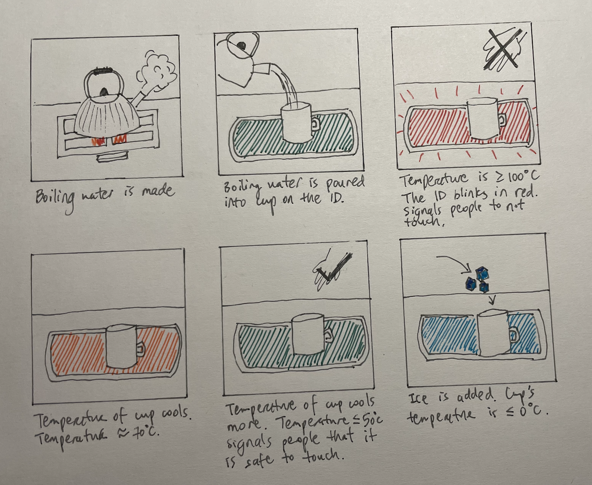
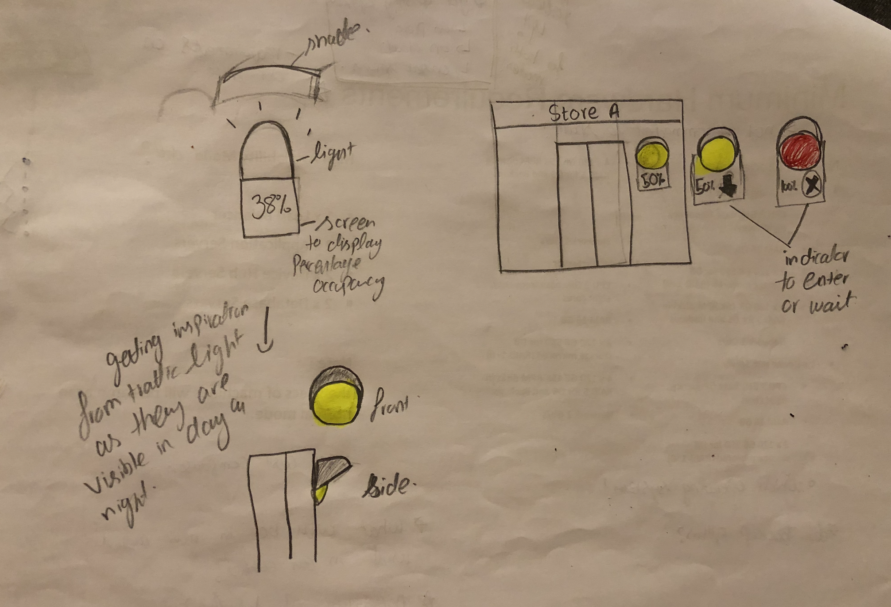

# Staging Interaction

In the original stage production of Peter Pan, Tinker Bell was represented by a darting light created by a small handheld mirror off-stage, reflecting a little circle of light from a powerful lamp. Tinkerbell communicates her presence through this light to the other characters. See more info [here](https://en.wikipedia.org/wiki/Tinker_Bell). 

There is no actor that plays Tinkerbell--her existence in the play comes from the interactions that the other characters have with her.

For lab this week, we draw on this and other inspirations from theatre to stage interactions with a device where the main mode of display/output for the interactive device you are designing is lighting. You will plot the interaction with a storyboard, and use your computer and a smartphone to experiment with what the interactions will look and feel like. _Make sure you read all the instructions and understand the whole of the laboratory activity before starting!_

## Prep

1. Set up [your Github "Lab Hub" repository](../../../) by [following these instructions](https://github.com/FAR-Lab/Developing-and-Designing-Interactive-Devices/blob/2021Spring/readings/Submitting%20Labs.md).
2. Set up the README.md for your Hub repository (for instance, so that it has your name and points to your own Lab 1) and [learn how](https://guides.github.com/features/mastering-markdown/) to post links to your submissions on your readme.md so we can find them easily.

### For lab, you will need:

1. Paper
1. Markers/ Pen
1. Smart Phone--Main required feature is that the phone needs to have a browser and display a webpage.
1. Computer--we will use your computer to host a webpage which also features controls
1. Found objects and materials--you’ll have to costume your phone so that it looks like some other device. These materials can include doll clothes, a paper lantern, a bottle, human clothes, a pillow case. Be creative!
1. Scissors

### Deliverables for this lab are: 
1. Storyboard
1. Sketches/photos of costumed device
1. Any reflections you have on the process.
1. Video sketch of the prototyped interaction.
1. Submit these in the lab1 folder of your class [Github page], either as links or uploaded files. Each group member should post their own copy of the work to their own Lab Hub, even if some of the work is the same for each person in the group.

## Overview
For this assignment, you are going to 

A) [Plan](#part-a-plan) 

B) [Act out the interaction](#part-b-act-out-the-interaction) 

C) [Prototype the device](#part-c-prototype-the-device)

D) [Wizard the device](#part-d-wizard-the-device) 

E) [Costume the device](#part-e-costume-the-device)

F) [Record the interaction](#part-f-record)

## The Report
This readme.md page in your own repository should be edited to include the work you have done. You can delete everything but the headers and the sections between the **stars**. Write the answers to the questions under the starred sentences. Include any material that explains what you did in this lab hub folder, and link it in the readme.

Labs are due on Mondays. Make sure this page is linked to on your main class hub page.

## Part A. Plan 

To stage the interaction with your interactive device, think about:

_Setting:_ Where is this interaction happening? (e.g., a jungle, the kitchen) When is it happening?

_Players:_ Who is involved in the interaction? Who else is there? If you reflect on the design of current day interactive devices like the Amazon Alexa, it’s clear they didn’t take into account people who had roommates, or the presence of children. Think through all the people who are in the setting.

_Activity:_ What is happening between the actors?

_Goals:_ What are the goals of each player? (e.g., jumping to a tree, opening the fridge). 

The interactive device can be anything *except* a computer, a tablet computer or a smart phone, but the main way it interacts needs to be using light.

**Setting: The interaction is happening outside at a grocery store on saturday noon, which is basically the peak time for the store. During teh current pandemic.**

**Players: Everyone who is entering or exiting the store at that time is part of the interaction.**

**Activity: During the current pandemic social distancing is the most esstial norm that is enforced everywhere for the safety of oneself and everyone around them. In order t ensure social distancing every place/store has limited the number of people who can be present at any given time. Shops especially grocery stores faced a major challange enforcing this. They have one representative stand outside the store who ensure people queue up and allows a new customer to enter one someone exists.**

**This particular grocery store has a long queue and everyone from the queue keeps coming up to the store representative to ask estimated wait time etc. Plus people have to stand in line throughout and wait for their turn. They are calculating the odds of going to another nearby grocery store and again eending up in a waiting line.**

**Goals: The goal of the device HeadCount is to serve as an indicator of current occupancy of the store. HeadCount can be programmed to set the store cpacity. It detects the number of people entring and exsiting the store and changes color based on the current occupancy. It lights up green if 0-40% of occupancy limit is achived, yellow if the occupany is between 40-70%, orange if it's more than 70% but less than 100% and red if it's fully occupied. This would serve as an indicator for people driving by to stop at a store that is less occupied and secondly will eliminate the need for the store representative to stand outside the whole time. People standing in line can self monitor the HeadCount and walk to the gate only when the light is not red.**

Sketch a storyboard of the interactions you are planning. It does not need to be perfect, but must get across the behavior of the interactive device and the other characters in the scene. 
**Storyboard**

Present your idea to the other people in your breakout room. You can just get feedback from one another or you can work together on the other parts of the lab.

**The major feedback was that it is very useful  for current situation but that is only one usecase, need to think for future aswell. What can be some other use cases of HeadCount when things get back to normal and occupancy constraints are lifted. Another thing that was highlighted was how would I ensure someone who is  seeing the device change colors for the first time know what it interprets to. Maybe have a small screen by a side that is showing the live counter or anything.**

## Part B. Act out the Interaction

Try physically acting out the interaction you planned. For now, you can just pretend the device is doing the things you’ve scripted for it. 

**Are there things that seemed better on paper than acted out?**

**I am quarantined in my apartment so it was hard to mimic a setting of a grocery store. It was easy to brainstorm the setting and use cases on paper as compared to acting out**

**Are there new ideas that occur to you or your collaborators that come up from the acting?**

**While acting out the situation by hanging a prototype at the top of the door I realised the charecteristics that need to be focused on while designing the device, such as the shape and size should be such that it's visible from a distance and is noticeable, there should be a shade around so that light color is prominent in sun's brightness, light shold be flashing instead of static so that it's easier to notice, might need a small screen aswell to show the current headcout in numbers in order to make it easier for people to interpret the meaning of differnt colors.**

## Part C. Prototype the device

You will be using your smartphone as a stand-in for the device you are prototyping. You will use the browser of your smart phone to act as a “light” and use a remote control interface to remotely change the light on that device. 

Code for the "Tinkerbelle" tool, and instructions for setting up the server and your phone are [here](https://github.com/FAR-Lab/tinkerbelle).

We invented this tool for this lab! 
**Give us feedback on Tinkerbelle.**

## Part D. Wizard the device
Take a little time to set up the wizarding set-up that allows for someone to remotely control the device while someone acts with it. Hint: You can use Zoom to record videos, and you can pin someone’s video feed if that is the scene which you want to record. 

**Include your first attempts at recording the set-up video here.**
[initial setup](https://drive.google.com/file/d/1jmOMSWGNnItg-AAk2THo0Rhe_EPYrf0W/view?usp=sharing)

Now, hange the goal within the same setting, and update the interaction with the paper prototype. 

**Show the follow-up work here.**
[Follow-up](https://drive.google.com/file/d/1yOQhk-Z6C44AT5n7P4qbm1FbKL8Of9x9/view?usp=sharing)

## Part E. Costume the device

Only now should you start worrying about what the device should look like. Develop a costume so that you can use your phone as this device.

Think about the setting of the device: is the environment a place where the device could overheat? Is water a danger? Does it need to have bright colors in an emergency setting?

**Include sketches of what your device might look like here.**

**What concerns or opportunitities are influencing the way you've designed the device to look?**
**The major concern is that since the device would be installed outdoors, the light should be visible in broad daylight and at night both. Thus need a shade that can enable so. Got inspiration from the design of traffic lights as they are desgined such that it's visible from a distance as well as prominent thpugh out the day. Secondly the shape of the device is also important, since the device will be sensing the number of people entering or exiting the door the device needs to be placed above the door. Circular light would be more prominent as compared to horizontal.**

## Part F. Record

**Take a video of your prototyped interaction.**
Be generous in acknowledging their contributions! And also recognizing any other influences (e.g. from YouTube, Github, Twitter) that informed your design. 

[Prototyped Interaction](https://drive.google.com/file/d/1O6vTY38pDJ6mKbe_dZ-VJl-uIvgOqsxT/view?usp=sharing)

**The setting/context of the product was hard to mimic while being alone and in quarantine so I used a [video](https://www.youtube.com/watch?v=tPLIbTgi3a4) from youtube as the backgroud and overlayed it with the product demo to show the use of product in context.**  

# Staging Interaction, Part 2 

This describes the second week's work for this lab activity.

## Prep (to be done before Lab on Wednesday)

You will be assigned three partners from another group. Go to their github pages, view their videos, and provide them with reactions, suggestions & feedback: explain to them what you saw happening in their video. Guess the scene and the goals of the character. Ask them about anything that wasn’t clear. 

**Summarize feedback from your partners here.**

## Make it your own

Do last week’s assignment again, but this time: 
1) It doesn’t have to (just) use light, 
2) You can use any modality (e.g., vibration, sound) to prototype the behaviors, 
3) We will be grading with an emphasis on creativity. 

**Document everything here.**
