# Staging Interaction
\*\***Part 1: Shiying Wu (sw2298), Mingzhe Sun (ms3636)**\*\*

\*\***Part 2: John Li (jl4239), Shiying Wu (sw2298), Mingze Gao (mg2454), Crystal Chong (cc2795), Qianxin(Carl) Gan (qg72), Mingzhe Sun (ms3636)**\*\*
=======
\*\***Crystal Chong**\*\*

In the original stage production of Peter Pan, Tinker Bell was represented by a darting light created by a small handheld mirror off-stage, reflecting a little circle of light from a powerful lamp. Tinkerbell communicates her presence through this light to the other characters. See more info [here](https://en.wikipedia.org/wiki/Tinker_Bell). 

There is no actor that plays Tinkerbell--her existence in the play comes from the interactions that the other characters have with her.

For lab this week, we draw on this and other inspirations from theatre to stage interactions with a device where the main mode of display/output for the interactive device you are designing is lighting. You will plot the interaction with a storyboard, and use your computer and a smartphone to experiment with what the interactions will look and feel like. 

_Make sure you read all the instructions and understand the whole of the laboratory activity before starting!_

## Prep

### To start the semester, you will need:
1. Read about Git [here](https://git-scm.com/book/en/v2/Getting-Started-What-is-Git%3F).
2. Set up your own Github "Lab Hub" repository to keep all you work in record by [following these instructions](https://github.com/FAR-Lab/Developing-and-Designing-Interactive-Devices/blob/2021Fall/readings/Submitting%20Labs.md).
3. Set up the README.md for your Hub repository (for instance, so that it has your name and points to your own Lab 1) and [learn how to](https://guides.github.com/features/mastering-markdown/) organize and post links to your submissions on your README.md so we can find them easily.

### For this lab, you will need:
1. Paper
2. Markers/ Pens
3. Scissors
4. Smart Phone -- The main required feature is that the phone needs to have a browser and display a webpage.
5. Computer -- We will use your computer to host a webpage which also features controls.
6. Found objects and materials -- You will have to costume your phone so that it looks like some other devices. These materials can include doll clothes, a paper lantern, a bottle, human clothes, a pillow case, etc. Be creative!

### Deliverables for this lab are: 
1. 7 Storyboards
1. 3 Sketches/photos of costumed devices
1. Any reflections you have on the process
1. Video sketch of 3 prototyped interactions
1. Submit the items above in the lab1 folder of your class [Github page], either as links or uploaded files. Each group member should post their own copy of the work to their own Lab Hub, even if some of the work is the same from each person in the group.

\*\* Qianxin(Carl) Gan (qg72) & Mingze Gao (mg2454) \*\*
 

## Lab Overview

A) [Plan](#part-a-plan) 

B) [Act out the interaction](#part-b-act-out-the-interaction) 

C) [Prototype the device](#part-c-prototype-the-device)

D) [Wizard the device](#part-d-wizard-the-device) 

E) [Costume the device](#part-e-costume-the-device)

F) [Record the interaction](#part-f-record)

## Part A. Plan 

\*\***Describe your setting, players, activity and goals here.**\*\*

As a student, we sit for a long time for lectures and completing assignments and tasks. Long periods of sitting without proper breaks and posture adjustments can lead to various negative consequences for our health and well-being.
=======
# Introducing the Pet Companion Device: Your Furry Friend's Perfect Pal

Welcome to a groundbreaking addition for every household – the **Pet Companion Device**. Engineered to seamlessly fit into bustling city apartments or tranquil countryside abodes, this revolutionary device is always on standby, day or night. A loyal companion that remains by your pet's side, even when you're away.

\*\***Describe your setting, players, activity and goals here.**\*\*

### Tailored for Every Member of the Family

Catering to pet owners, children, and their cherished animal companions, this device offers an array of dynamic interactions. Picture your pet cat engrossed in playful engagement with the device, igniting its screen with a symphony of vibrant colors that mirror its every move:

- When your cat emits a soft meow, witness the screen morph into a soothing Blue hue.
- A gentle lick from your furry companion douses the screen in a playful Purple glow.
- Inquisitive paws dancing across the device conjure a cheerful Purple and Black radiance.
- Energetic punches and swats paint the screen in gleaming Black and White brilliance.
- When your pet cat finds repose on the device, the screen softly transitions to a tranquil Green, reflecting its serene moment of rest.
- As you draw near home, the screen emanates a warm Yellow, indicating your approach.
- Should unfamiliar faces approach, the screen bathes the surroundings in a calming Red and angry aura.

### Bridging the Gap for Pet Owners

For pet owners, the primary objective revolves around nurturing an unbreakable bond and soothing their pets' solitude. Through the Pet Companion Device, they seamlessly provide unending entertainment and companionship, alleviating their pets' loneliness and ensuring their well-being, regardless of their physical absence.

### A World of Interaction for Pets

Conversely, the device opens up a world of interaction for pets, satisfying their innate curiosity and thirst for engagement. With playful barks, licks, taps, or swipes, pets set off captivating color changes and delightful sounds, bestowing a wellspring of amusement and a semblance of interaction – akin to spending quality time with their human caregivers.

\*\***Include pictures of your storyboards here**\*\*

\*\***Summarize feedback you got here.**\*\*
Yifan Yu: I really like the cat your team draw in the story board. The cat looks cute. Also the internal mechanics are particularly detailed and I really like the concept of what you have designed for the internal structure. Your video is very creative, and the cardboard chosen would give us a better idea of the volume size of the product. But I would like to see more interaction between people and product. I also hope that this product will have more features in the future, especially the more practical ones making it more than just a cat with glowing eyes. There also should be some explanation in the video your team provide.

We all agreed that this idea of encouraging better sitting posture is great. However, we're aware that if the user becomes annoyed by the device and turns it aside, its value will diminish. Additionally, we recognize that this device is more suitable for private spaces without others present. Exploring a more compact design that enhances portability could widen its applicability. We also think it would be better to not only remind users of their improper posture but also provide guidance on correct posture and potential exercises to help maintain their health.
=======
_Setting:_ In our design, we are implementing a scenario based ambience lighting that can correspond to different modes of interations. More specifically, in the most common spaces that one might be at: workstation, bedroom, personal vehicle, etc.

_Players:_ The design is centered around one user, but is scalable to multiple users depending on the scenario (e.g. in shared spaces, etc.). For multiple users, it can be used as a status indicator.

_Activity:_ The user is the primary actor who interacts with the ambiance lighting device. The device changes lighting modes based on the user's activities and preferences.

_Goals:_ The goal of the player is to maximize their performance and stay in a good mood with the help of our ambience lighting system. For example, the ambience lighting system can help players to drive better according to their mood and their desired driving style. Another example is that our lighting system can reflect on the sleeping quality of the users and cheer them up if they are not in a good mood whenever they are in the room.

\*\***Include pictures of your storyboards here**\*\*

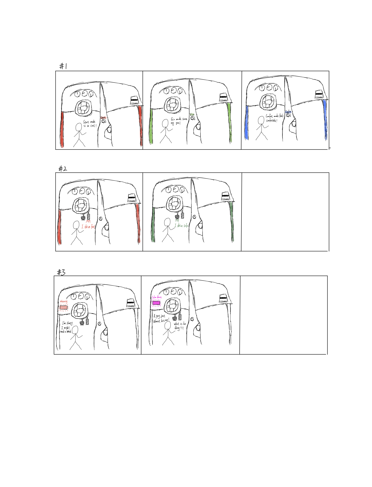
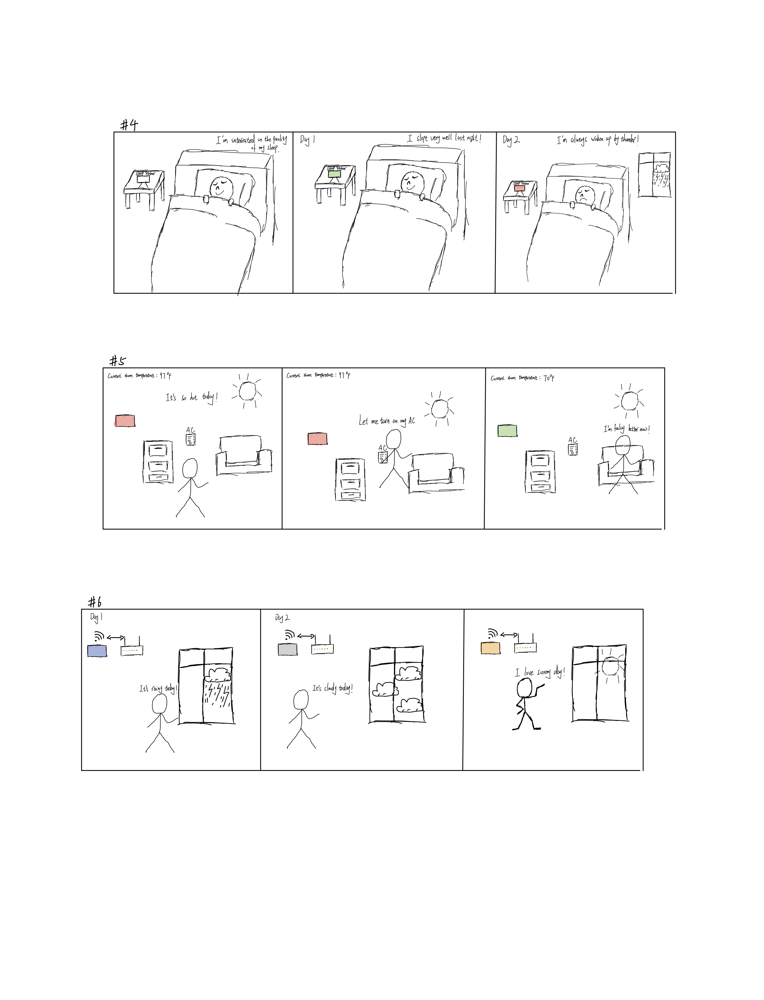
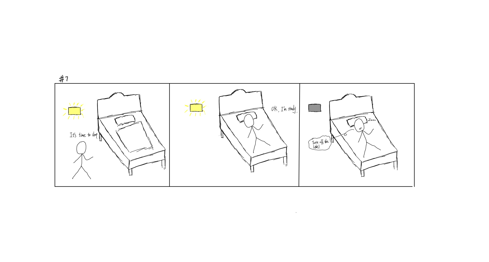

\*\***Summarize feedback you got here.**\*\*

Crystal: This is so cool! Great scenarios. I think this is a great companion device that would help out a lot in providing insights and keeping track of everyday activities.

Yiming: I really like the sketches of devices you created, especially the mood-based design. I think it will be very useful in the real-word.

Ben: The video looks great! Makes the interaction very clear. 

Gloria: I love the storyboards, especially the car one! It could also be a good inspiration for people who have road rage reminding them to be aware of their emotion control by using the light device. It’s just an expansion idea. Your video and demonstrations were very clear and easy to follow. 

Michael: Great video! One question I have about the RoomBuddy is the light feature for sleeping. In the video, the light turns green to indicate good sleep quality. However, I was wondering when this light turns on, as the video makes it seem like the light turns on while the person is still sleeping. Is this after they wake up? If not, I feel like the light might disturb someones sleep

Mingzhe Sun: Very impressive device. I like the idea that the RoomBuddy can interact with the the users emotion. I think this interaction is very useful to regulate people’s emotion. One suggestion I have would be to provide positive support color when people are not in a good mood.

## Part B. Act out the Interaction

\*\***Are there things that seemed better on paper than acted out?**\*\*

While acting, we might realize that timing could be one of the issues in sending messages to the device. For example, if the user's motion is too fast or too slow, it might cause the device to misinterpret the intended action. 

\*\***Are there new ideas that occur to you or your collaborators that come up from the acting?**\*\*

We have an idea that helps users to interact with devices effectively. By adding a short User Guidance, it could contain simple animations or instructional prompts that guide users on how to interact with the device in different scenarios. In addition, we also thought of further blending in the system with the surroundings.

## Part C. Prototype the device

\*\***Give us feedback on Tinkerbelle.**\*\*

The overall process of using Tinkerbelle is very convenient and hassle-free. It would be nice if some more features can be added. For example, when using the phone as a lighting device, we would like to see a full-screen mode that displays only the color, instead of having buttons on the screen at the moment. In addition, it would be great if it can work without private network or even internet.

## Part D. Wizard the device

\*\***Include your first attempts at recording the set-up video here.**\*\*

[YouTube Video for the Set-up](https://youtube.com/shorts/tdQswdd_Q1Q?feature=share)

\*\***Show the follow-up work here.**\*\*

After testing out the device in the physical environment, we further improved the design of the in-car display, and associated the weather forcasting feature with windbell. In such way, we can further incorporate our design into the natural surroundings of the prototyped settings, and provide our device with a more friendly touch.

## Part E. Costume the device

\*\***Include sketches of what your devices might look like here.**\*\*

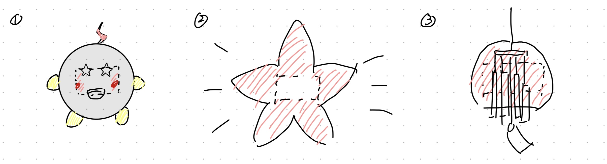

\*\***What concerns or opportunitities are influencing the way you've designed the device to look?**\*\*

By designing the device, a few concerns might influence the way to design our product. Firstly, the device will be placed in multiple areas inside the vehicles or rooms; therefore, the installation is crucial. The design of the device should facilitate simple and easy installation. Secondly, the size and flexibility could also be one of the concerns. The places to install the device might be slightly different. For example, the device might be placed behind the vehicle's door handler or in the corner of the bedroom. By considering these cases, the device should be designed using bendable materials.

## Part F. Record

\*\***Take a video of your prototyped interaction.**\*\*

[Youtube Video for the Prototyped Interactions](https://youtube.com/shorts/-T5DoJo7uYs?feature=share)

In addition, here is a prototype for the weather/mood based windbell design:

\*\***Please indicate anyone you collaborated with on this Lab.**\*\*

Throughout this lab, Qianxin Gan and Mingze Gao collaborated together with equal contribution towards different parts of the design. In addition, we would also like to appreciate the generousity of Ziyang Wei.

# Staging Interaction, Part 2 

\*\***NAME OF COLLABORATORS HERE**\*\*
John Li (jl4239), Shiying Wu (sw2298), Mingze Gao (mg2454), Crystal Chong (cc2795), Qianxin(Carl) Gan (qg72), Mingzhe Sun (ms3636)

## Part A. Plan 
**_Setting:_** The interaction takes place in a kitchen, where the device is typically affixed to the refrigerator door, though it is also detachable. The interaction initiates when a user stands within the range where the device can detect their presence. The interaction can be triggered through either touch or voice commands.

**_Players:_** Anyone standing in front of the device can interact with it. Voice commands are not tied to specific users; in other words, anyone saying the keyword 'Hi, <device\>' can activate it.

**_Activity:_** 7 different activities are provided by the device:

**1. Dietary Guardian:** This device scans the food items provided by the user and assesses whether this combination is healthy or not, taking into account the user's health records, dietary restrictions, and current medications. It conveys this information through a color-coded system: red for unsafe and green for safe. Additionally, it provides further details through both audio and text projected onto the fridge.

**2. Food Compatibility Advisor:** When the user is uncertain about a specific food combination, they can invoke the device through an audio command, and the device will respond with a color-coded system: red for unsafe and green for safe. Furthermore, it provides additional details through both audio and text projected onto the fridge.

**3. Ingredient Checker:** Upload your grocery shopping list from your phone or let the device scan the receipt, allowing our system to check for potential food safety concerns before your purchase. Additionally, it will remind you of items already in the fridge, displaying their last purchase date to prevent duplicate purchases.

**4. Interactive Educational Helper:** Users can engage with the device in quiz mode to test their knowledge of food combinations.

**5. Fridge Inventory Condition Checker:** When the user brings in new groceries, they can activate the grocery loading mode to monitor the freshness of their food. As items are placed in the fridge, the device identifies them, verbally confirming the food name and storage date with the user. If the device detects that the food is likely spoiled, it turns red and emits a warning sound to alert the user when they approach the fridge.

**6. Drink & Beverage Tracker:** For bartenders, keeping tabs on drink and beverage inventory is essential to avoid running out of supplies. Each time the user adds a new drink to the fridge, the device updates the inventory count accordingly. Users can also set a minimum threshold for each drink while loading them into the fridge. If the quantity of a drink falls below the set threshold, the device turns red and emits a warning sound.

**7. Monsieur le Chef:** Stumped about dinner options? This device suggests potential meals based on your current fridge inventory and provides recipes to help you decide.

**_Goals:_** The goal of the player is to maintain a healthy diet.

\*\***Summarize feedback you got here.**\*\*

Overall, the feedback for our design concepts is very positive: our design concepts are well-thought-out and offer a variety of functionalities aimed at different needs and scenarios. At the same time, we were advised to use simpler language, as readability is also a key factor in addition to professionalism for our design. One of the suggestions is to provide users with a guide to what they can expect from the product. Lastly, We were advised to consider enhancing user experience by adding more feedback in addition to light. For example, we can incorporate sound cues and vibrations into our design to facilitate the users. In addition, it is possible to empower Learning Algorithms in the device that interfaces with a Smart Phone Application. This application holds the capability to assist the device in sending timely reminders and facilitating orders initiated by the user. It could also use data from the household to provide more personalized advice and further optimize the user experience.

 
=======
Ben: I liked the device a lot! My only negative comment would be that you didn’t really answer all the questions posed in the prompt. I thought your video was very clear and good. The interaction was well demonstrated.

Gilberto: I really liked the illustrations for your device, the only thing I can say is to reorganize the answers to how the professor wanted

Gloria: I really like your drawings! Your demo video was very cool and I liked how cat eyes changed as different external actions performed. One thing I would suggest is that adding explanations/notes next to your drawings would be very helpful for people to follow :)

Kenneth: I really liked the simple but cute and effective drawings for your storyboard. It was very clear to me what your ideas were for your device. I also liked the video you made for showcasing the device, it was clear and visually effective. It also includes subtitles, which makes things even clearer. The concept was cute and creative, I liked the use of the stuffed elephant to show how an animal can interact with the device :). You could possibly add more features and have some form of human interaction not just with pets and the device. Also for lab1b, I think adding sound such as purring or growling when the pet does certain actions would be very cool.

We got several useful feedbacks, first of all we accidently put the url of our two video in the opposite place, so we fixed that immediatly. We were also advise to use simplier language, readability is more important than being 'professional'. We were also advised to create a preview of our video, We take a look into that real quick. Lastly, We were advice to try to consider add funcationaility of device body reaction and also sound reaction in respons to pets action, to enhance the user experience, that will also be next on our todo list.
>>>>>>> CarlQGan-Fall2023

## Part B. Act out the Interaction

Initially, we envisioned our device as a camera-like toy positioned atop the feeding machine, assuming it would effectively capture pet behavior. However, we came to recognize that this approach might limit the device's capabilities and hinder its ability to comprehensively gather the wide spectrum of information pets convey. 

\*\***Are there things that seemed better on paper than acted out?**\*\*
At first, we plan to use text to display all the information needed by the user. However, when we acted out displaying text on screen, we figured that text is not intuitive and hard for people to read on such a device. Therefore, we started to think about more interactive ways of showing that information by using light and voice. This finding guides our future design of the device.

When we actually acted out the scenario, we noticed that users might ignore the device when they're really focused on their tasks. The phone screen might not be bright enough to get their attention. We thought that adding some kind of sound or haptic feedback could help to make sure they notice the device's cues.
=======
This is especially crucial given that pets predominantly interact with the feeding machine when they're hungry. Our goal is to ensure our bot can gather a diverse array of data to truly grasp and cater to our lonely pets' needs.
>>>>>>> CarlQGan-Fall2023

\*\***Are there new ideas that occur to you or your collaborators that come up from the acting?**\*\*

While acting out the scenario, we realized that there's potential to add more interactive elements to the device. The brief role-play also made me personally aware of how bad posture could lead to discomfort, like back pain. I even felt the need to stand up and stretch. This experience sparked the idea of incorporating a timer function into the device. This function could remind users to take breaks if they've been sitting for too long, which could be really helpful.
=======
We realized that since the device is designed to be a food advisor, it should also have the capability to provide food recommendations. With this idea in mind, we expanded the device's functionality to turn it into an at-home chef and nutritionist.
 

## Part C. Prototype the device

\*\***Feedback on Tinkerbelle.**\*\*
The user experience of Tinkerbelle is user-friendly and trouble-free. It could be improved if additional functionalities could be incorporated. For instance, while using the phone as a lighting tool, a full-screen mode that exclusively showcases the color without any buttons would be desirable. In addition, adding the feature that users can manually input RGB numbers can increase the flexibility of Tinkerbelle. 
=======
During the implementation phase, a novel concept emerged in response to emergency scenarios, such as break-ins, fires, or floods. We considered the possibility of the device seamlessly transitioning between red and white colors while emitting a warning noise, effectively alerting both occupants and pets within the household to potential dangers.

This innovative addition would significantly enhance the device's utility, expanding its role from a pet companion to a vital safety feature in the home.

## Part C. Prototype the device

\*\***Give us feedback on Tinkerbelle.**\*\*
>>>>>>> CarlQGan-Fall2023

There were some issue connecting the device with a public wifi. But was definitly a great tool, we were also able to utilize the sound input box function. Thank you for designing this!!!

## Part D. Wizard the device

\*\***Include your first attempts at recording the set-up video here.**\*\*

[https://youtube.com/shorts/9iTrWCWAa60?si=6_9f6S8R_mHE0Dvx](https://youtu.be/j6D6OLSrnlQ?si=aAyYXWXkLJLpcdm0)

Now, hange the goal within the same setting, and update the interaction with the paper prototype. 

\*\***Show the follow-up work here.**\*\*

- Device turns on/user presents in front of device: Black color (so user only see the clock)
- User's sitting posture changes: The worser the posture, the redder the device
- User corrects his/her posture: The device becomes black again to act like a clock
=======
See part F for details.
=======

>>>>>>> CarlQGan-Fall2023

 

## Part E. Costume the device 

\*\***Include sketches of what your devices might look like here.**\*\*

 
Costume 1: Analog Style Clock
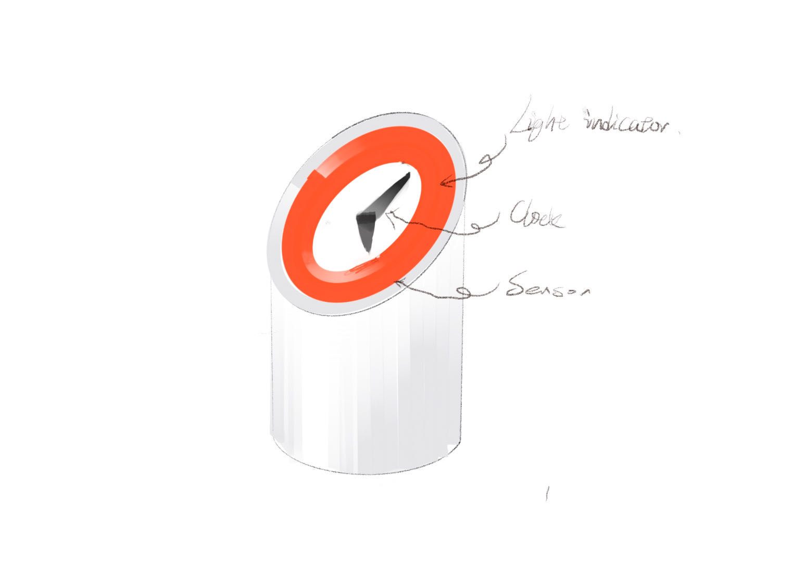
=======
\*\***Include sketches of what your devices might look like here.**\*\*

Minimalist design:

For a device that seamlessly blends into modern interiors, envision a sleek, compact form resembling a polished stone. Its smooth, rounded edges and matte finish would not only be visually appealing but also practical, preventing overheating concerns.

Sporty Design:

resembles a resilient rubber ball. This design would be resilient to accidental drops and impacts, and it could incorporate a water-resistant seal to safeguard against potential spills.

Pet-Friendly Companion Buddy Design:

we craft the device to resemble a small, plush animal friend, akin to a soft toy. The exterior could be covered in a gentle, pet-friendly fabric that's comfortable to touch and cuddle. Incorporate embroidered features like eyes, a nose, and a smiling mouth to give the device a friendly expression. The overall size should be compact and lightweight for easy handling by your pet.

>>>>>>> CarlQGan-Fall2023

\*\***What concerns or opportunitities are influencing the way you've designed the device to look?**\*\*
=======
Minimalism Design

Our first design is a coin-sized, portable device designed for effortless convenience. This tiny attachment seamlessly affixes to your phone, you can carry this device around and make evaluation of the food.

Wearable Design

Our second design is a sleek, glass-like device that instantly scans food, analyzing its nutritional quality, freshness, and safety. It then illuminates the results in vibrant colors, making it effortless to distinguish between good and bad food choices, ensuring your health and well-being with just a glance.

Seamlessly Household Design

Our third is a fridge-sticker-sized smart device that blends into your kitchen. It identifies the quality of the food in your fridge, categorizing it as fresh, near expiry, or spoiled, and offers personalized meal suggestions based on what's available. It's like having a nutritionist right in your kitchen, ensuring you make the best food choices while minimizing waste.

\*\***What concerns or opportunities are influencing the way you've designed the device to look?**\*\*

By designing the device, a few concerns might influence the way to design our product. Firstly, the device can be carried to different places; therefore, accessibility and flexibility have to be carefully considered. The design of the device should be simple and portable. Secondly, the size of the product needs to be very reasonable to adapt to every situation. For example, we have designed three different formats of the product to provide alternative ways of accessing the device. 
 

Circular Form: The circular shape not only carries a symbolism of continuity and balance but also aligns with our safety considerations. By avoiding sharp corners, we're actively mitigating potential risks associated with accidental collisions involving pets or children. This approach serves to create a safe and understated presence in your home.

Materials: To adhere to the safety guidelines around pets and kids, we'll carefully select materials that are both pet-friendly and child-safe. We'll prioritize non-toxic options that are also durable and easy to clean, given the device's proximity to these important members of your household.

Thoughtful Interactions: We'll discreetly design touch-sensitive areas on the device's surface. These areas will respond to interactions from pets and children, triggering delicate reactions such as subtle vibrations or faint chimes. This approach fosters curiosity and engagement without causing any discomfort.

In this design, our focus is on seamlessly incorporating the circular shape and employing unobtrusive design elements. 

## Part F. Record

\*\***Take a video of your prototyped interaction.**\*\*

https://youtube.com/shorts/l5hPg9sLFPg?si=iLrlx1Lnfxs2qKOj

\*\***Please indicate anyone you collaborated with on this Lab.**\*\*
We were inspired by the example in class. Also, we got inspiration from some classmates.

# Staging Interaction, Part 2 

\*\***NAME OF COLLABORATORS HERE**\*\*
John Li (jl4239), Shiying Wu (sw2298), Mingze Gao (mg2454), Crystal Chong (cc2795), Qianxin(Carl) Gan (qg72), Mingzhe Sun (ms3636)

## Part A. Plan 
**_Setting:_** The interaction takes place in a kitchen, where the device is typically affixed to the refrigerator door, though it is also detachable. The interaction initiates when a user stands within the range where the device can detect their presence. The interaction can be triggered through either touch or voice commands.

**_Players:_** Anyone standing in front of the device can interact with it. Voice commands are not tied to specific users; in other words, anyone saying the keyword 'Hi, <device\>' can activate it.

**_Activity:_** 7 different activities are provided by the device:

**1. Dietary Guardian:** This device scans the food items provided by the user and assesses whether this combination is healthy or not, taking into account the user's health records, dietary restrictions, and current medications. It conveys this information through a color-coded system: red for unsafe and green for safe. Additionally, it provides further details through both audio and text projected onto the fridge.

**2. Food Compatibility Advisor:** When the user is uncertain about a specific food combination, they can invoke the device through an audio command, and the device will respond with a color-coded system: red for unsafe and green for safe. Furthermore, it provides additional details through both audio and text projected onto the fridge.

**3. Ingredient Checker:** Upload your grocery shopping list from your phone or let the device scan the receipt, allowing our system to check for potential food safety concerns before your purchase. Additionally, it will remind you of items already in the fridge, displaying their last purchase date to prevent duplicate purchases.

**4. Interactive Educational Helper:** Users can engage with the device in quiz mode to test their knowledge of food combinations.

**5. Fridge Inventory Condition Checker:** When the user brings in new groceries, they can activate the grocery loading mode to monitor the freshness of their food. As items are placed in the fridge, the device identifies them, verbally confirming the food name and storage date with the user. If the device detects that the food is likely spoiled, it turns red and emits a warning sound to alert the user when they approach the fridge.

**6. Drink & Beverage Tracker:** For bartenders, keeping tabs on drink and beverage inventory is essential to avoid running out of supplies. Each time the user adds a new drink to the fridge, the device updates the inventory count accordingly. Users can also set a minimum threshold for each drink while loading them into the fridge. If the quantity of a drink falls below the set threshold, the device turns red and emits a warning sound.

**7. Monsieur le Chef:** Stumped about dinner options? This device suggests potential meals based on your current fridge inventory and provides recipes to help you decide.

**_Goals:_** The goal of the player is to maintain a healthy diet.

\*\***Summarize feedback you got here.**\*\*

Overall, the feedback for our design concepts is very positive: our design concepts are well-thought-out and offer a variety of functionalities aimed at different needs and scenarios. At the same time, we were advised to use simpler language, as readability is also a key factor in addition to professionalism for our design. One of the suggestions is to provide users with a guide to what they can expect from the product. Lastly, We were advised to consider enhancing user experience by adding more feedback in addition to light. For example, we can incorporate sound cues and vibrations into our design to facilitate the users. In addition, it is possible to empower Learning Algorithms in the device that interfaces with a Smart Phone Application. This application holds the capability to assist the device in sending timely reminders and facilitating orders initiated by the user. It could also use data from the household to provide more personalized advice and further optimize the user experience.
=======
As a student, we sit for a long time for lectures and completing assignments and tasks. Long periods of sitting without proper breaks and posture adjustments can lead to various negative consequences for our health and well-being.

_Setting:_ The device is strategically placed within a student's study space or workspace, positioned on the desk where the user sits to engage in their work or study activities. The interaction occurs when the device detects the user and provides a real-time sitting posture response.

_Players:_ The user of the device is the person who sits in front of the device. The device is purposefully designed to center its attention on this specific user, disregarding any other individuals who might be sharing the same workspace.

_Activity:_ The device's colors change in real-time, shifting towards red tones as the user's sitting posture becomes less healthy. This prompts the user to adjust their posture for improved ergonomics during their tasks.

_Goals:_ The goal of the user is to obtain a healthy sitting posture during work or study. The goal of the device is to successfully prompt and promote healthier sitting through real-time color feedback.

Storyboards are a tool for visually exploring a users interaction with a device. They are a fast and cheap method to understand user flow, and iterate on a design before attempting to build on it. Take some time to read through this explanation of [storyboarding in UX design](https://www.smashingmagazine.com/2017/10/storyboarding-ux-design/). Sketch seven storyboards of the interactions you are planning. **It does not need to be perfect**, but must get across the behavior of the interactive device and the other characters in the scene. 

\*\***Include pictures of your storyboards here**\*\*

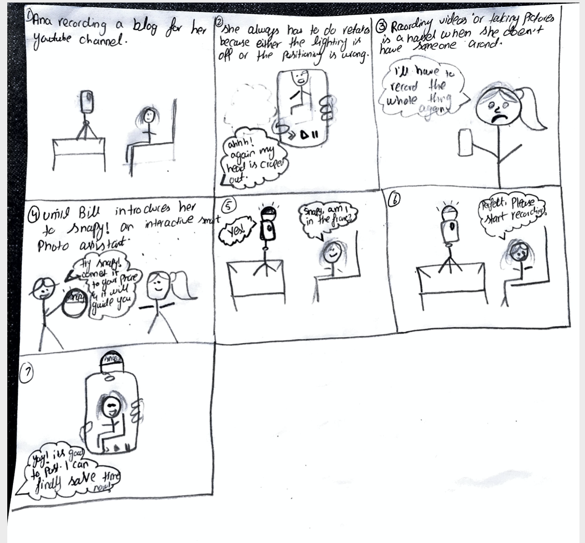
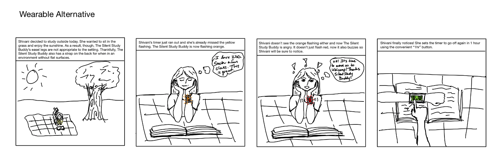
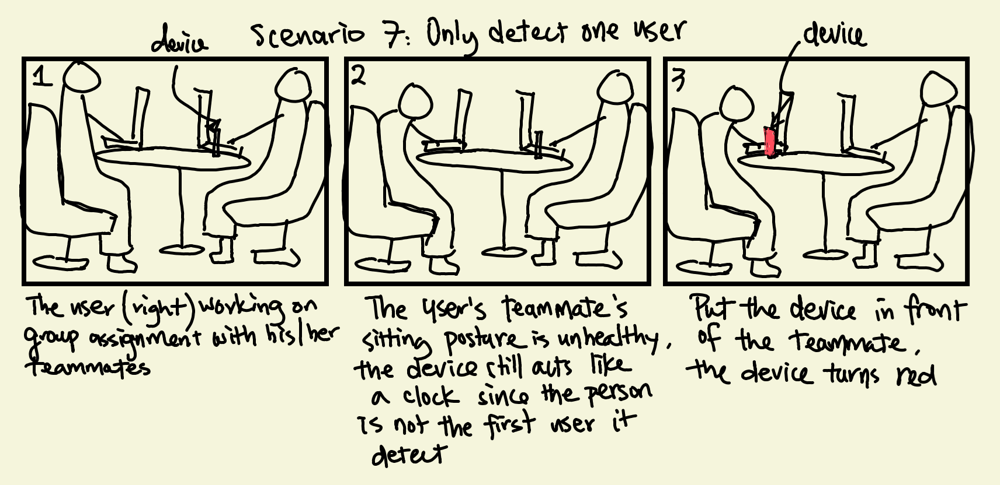

Present your ideas to the other people in your breakout room (or in small groups). You can just get feedback from one another or you can work together on the other parts of the lab.

\*\***Summarize feedback you got here.**\*\*

We all agreed that this idea of encouraging better sitting posture is great. However, we're aware that if the user becomes annoyed by the device and turns it aside, its value will diminish. Additionally, we recognize that this device is more suitable for private spaces without others present. Exploring a more compact design that enhances portability could widen its applicability. We also think it would be better to not only remind users of their improper posture but also provide guidance on correct posture and potential exercises to help maintain their health.
>>>>>>> 9da52b82651b8398438900b0b78bae99c5f8c30a

## Part B. Act out the Interaction

Try physically acting out the interaction you planned. For now, you can just pretend the device is doing the things you’ve scripted for it. 

\*\***Are there things that seemed better on paper than acted out?**\*\*
At first, we plan to use text to display all the information needed by the user. However, when we acted out displaying text on screen, we figured that text is not intuitive and hard for people to read on such a device. Therefore, we started to think about more interactive ways of showing that information by using light and voice. This finding guides our future design of the device.

When we actually acted out the scenario, we noticed that users might ignore the device when they're really focused on their tasks. The phone screen might not be bright enough to get their attention. We thought that adding some kind of sound or haptic feedback could help to make sure they notice the device's cues.

\*\***Are there new ideas that occur to you or your collaborators that come up from the acting?**\*\*
 
We realized that since the device is designed to be a food advisor, it should also have the capability to provide food recommendations. With this idea in mind, we expanded the device's functionality to turn it into an at-home chef and nutritionist.
=======

While acting out the scenario, we realized that there's potential to add more interactive elements to the device. The brief role-play also made me personally aware of how bad posture could lead to discomfort, like back pain. I even felt the need to stand up and stretch. This experience sparked the idea of incorporating a timer function into the device. This function could remind users to take breaks if they've been sitting for too long, which could be really helpful.
>>>>>>> 9da52b82651b8398438900b0b78bae99c5f8c30a

## Part C. Prototype the device

\*\***Feedback on Tinkerbelle.**\*\*
The user experience of Tinkerbelle is user-friendly and trouble-free. It could be improved if additional functionalities could be incorporated. For instance, while using the phone as a lighting tool, a full-screen mode that exclusively showcases the color without any buttons would be desirable. In addition, adding the feature that users can manually input RGB numbers can increase the flexibility of Tinkerbelle. 

The setup instructions are simple and easy to follow. However, we encountered difficulty using it with the campus WiFi (so we used a hotspot instead). Additionally, when an additional device joined, it displayed the default color instead of the color currently selected by the remote control. An improvement could involve incorporating a feature to manually enter RGB numbers.

## Part D. Wizard the device

\*\***Include your first attempts at recording the set-up video here.**\*\*

[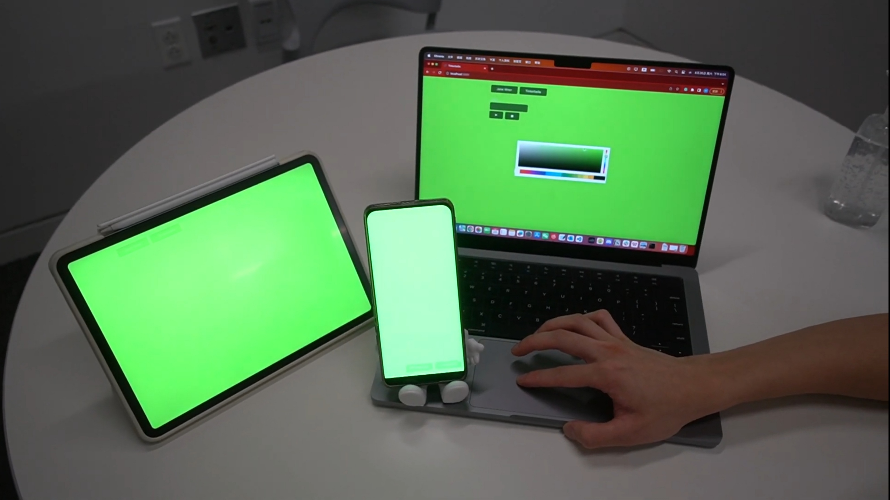](https://www.youtube.com/watch?v=TdZUB5HhaLk)

Now, hange the goal within the same setting, and update the interaction with the paper prototype. 

\*\***Show the follow-up work here.**\*\*
 
See part F for details.

=======
- Device turns on/user presents in front of device: Black color (so user only see the clock)
- User's sitting posture changes: The worser the posture, the redder the device
- User corrects his/her posture: The device becomes black again to act like a clock
>>>>>>> 9da52b82651b8398438900b0b78bae99c5f8c30a

## Part E. Costume the device 

\*\***Include sketches of what your devices might look like here.**\*\*

 
Minimalism Design

Our first design is a coin-sized, portable device designed for effortless convenience. This tiny attachment seamlessly affixes to your phone, you can carry this device around and make evaluation of the food.

Wearable Design

Our second design is a sleek, glass-like device that instantly scans food, analyzing its nutritional quality, freshness, and safety. It then illuminates the results in vibrant colors, making it effortless to distinguish between good and bad food choices, ensuring your health and well-being with just a glance.

Seamlessly Household Design

Our third is a fridge-sticker-sized smart device that blends into your kitchen. It identifies the quality of the food in your fridge, categorizing it as fresh, near expiry, or spoiled, and offers personalized meal suggestions based on what's available. It's like having a nutritionist right in your kitchen, ensuring you make the best food choices while minimizing waste.

\*\***What concerns or opportunities are influencing the way you've designed the device to look?**\*\*

By designing the device, a few concerns might influence the way to design our product. Firstly, the device can be carried to different places; therefore, accessibility and flexibility have to be carefully considered. The design of the device should be simple and portable. Secondly, the size of the product needs to be very reasonable to adapt to every situation. For example, we have designed three different formats of the product to provide alternative ways of accessing the device. 
=======
Costume 1: Analog Style Clock

Costume 2: Digital Style Clock
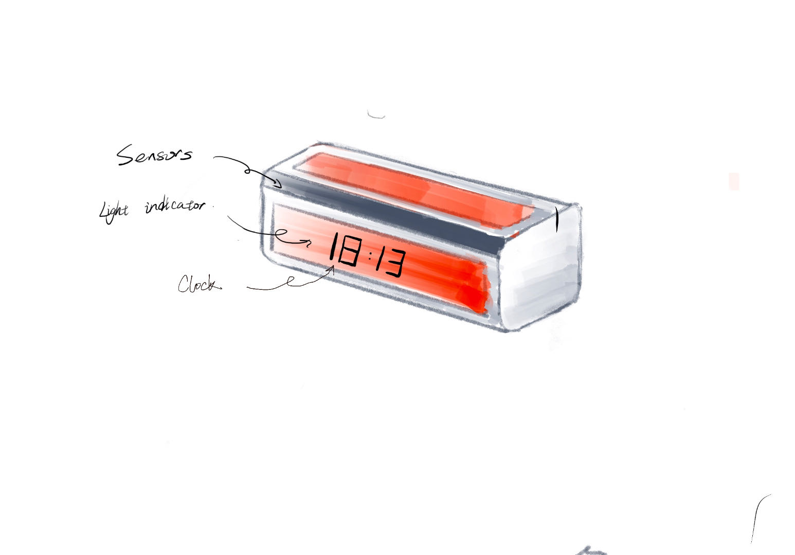

Costume 3: Cute Style Clock
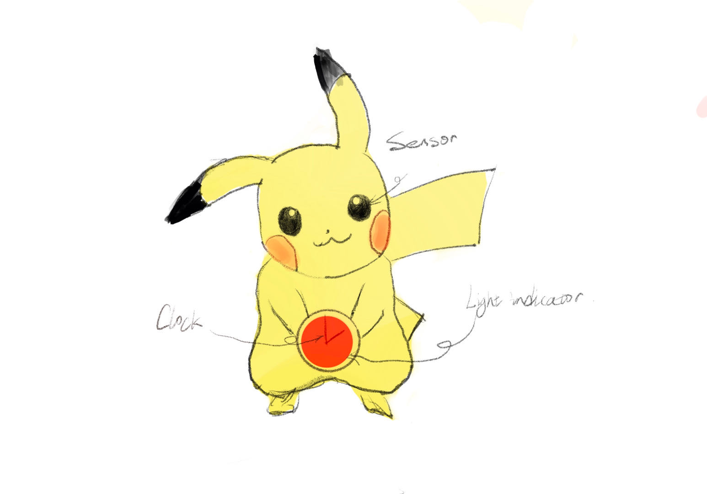

\*\***What concerns or opportunitities are influencing the way you've designed the device to look?**\*\*
>>>>>>> 9da52b82651b8398438900b0b78bae99c5f8c30a

Since our device acts like a clock when the user's sitting posture is correct, we designed the device to resemble a traditional timepiece. We've provided users with the choice between an analog-style clock and a digital-style clock, catering to varying preferences in time display. Moreover, we've taken into account the needs of children who also spend extended periods studying. As a result, we've introduced a cute-style clock option tailored for this audience.

## Part F. Record

\*\***Take a video of your prototyped interaction.**\*\*

[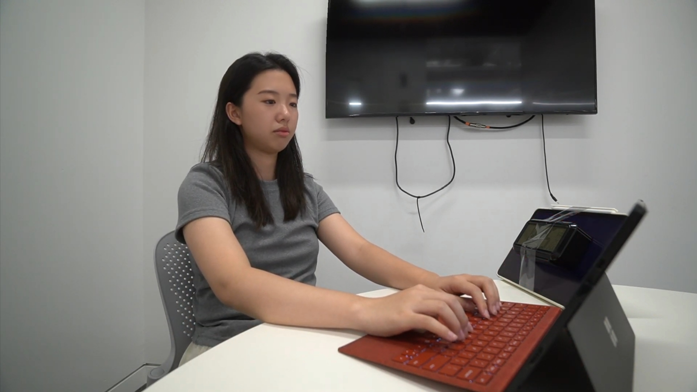](https://www.youtube.com/watch?v=ZG3003kTD5I&feature=youtu.be)

\*\***Please indicate anyone you collaborated with on this Lab.**\*\*
Be generous in acknowledging their contributions! And also recognizing any other influences (e.g. from YouTube, Github, Twitter) that informed your design. 

_Collaborator_: Shiying Wu (Sophie), Mingzhe Sun (Allen)

# Staging Interaction, Part 2 

\*\***NAME OF COLLABORATORS HERE**\*\*
John Li (jl4239), Shiying Wu (sw2298), Mingze Gao (mg2454), Crystal Chong (cc2795), Qianxin(Carl) Gan (qg72), Mingzhe Sun (ms3636)

## Prep

You will be assigned three partners from another group. Go to their github pages, view their videos, and provide them with reactions, suggestions & feedback: explain to them what you saw happening in their video. Guess the scene and the goals of the character. Ask them about anything that wasn’t clear. 

\*\***Summarize feedback from your partners here.**\*\*

Gloria: I like how you drew the storyboard, helping users to understand your different scenarios in detail. I also love the logic of design space where you guys started with how lights react when users have bad sitting posture and followed up with scenarios that correct sitting posture, providing practical solutions and intuitive interaction. One thing great to notice was that you consider this device's potential pros and cons by incentivizing users with guidance on better postures and exercises. How will you guide users to recognize what specific body level or height section to adjust their posture? Many people probably have different posture issues, and my question is how to make one convincing and professional guideline with knowledge support when users interact with the lights. I like your presentation in the video; your set-up looked great. If there could be a quick intro note of your testing or a few demonstrations while doing the task, that might be helpful for more users to perceive your concept! Overall, it's a cool project, and it could bring awareness to more students about their body postures and health!

Qianxin(Carl) Gan: The concept of a posture correction indicator is brilliant and very meaningful. The illustration of the idea is very clear and straightforward, and we would like to see it becoming a real product. It would be very beneficial for people nowadays, as we are sitting down using electronic devices more than ever - which also become one of the leading factors of people having spinal issues and musculoskeletal illnesses. I would imagine that this will save people a ton of pain and effort trying to treat this by doing things as trivial as just keeping an eye on your posture.

Yifan Yu: I really like your designs for the products (the different costumes), of which the Pikachu costume is very cute! And I think your product concept is especially good. Since many people in the modern era do spend a lot of time sitting at their desks every day, it's important to pay attention to your sitting posture, which firstly helps with cervical spine health, and also relieves the fatigue brought about by incorrect sitting posture. However, I think there is still room for improvement in the video, maybe add some explanations in the video (also in the form of subtitles), so that the viewers can understand the role of this product more intuitively when watching the video.

Gilberto: I really enjoyed your project idea, I found it very funny the alarm clock taped on to the Ipad for the final video. The questions were properly answered but the only thing I can really say about it is the formatting of your ReadMe page, it was a bit difficult to find your team’s specific answer

John Li: Wow, Interesting ideas! I really like your concept. Your design is very mature there is not much to change, I would recommend adding a range of functionalities to your current device. Maybe consider adding an earthquake or weather reminder to expand the use of scenarios.

Kenneth: I liked the sketches, especially for costuming the device, they are very high quality and great drawings that get your idea across. The responses to the questions in the write up are also thorough. I thought the video was good but it could have some subtitles or voice-over describing what is going on, otherwise you have to infer what is going on as the viewer.

## Part A. Plan 
**_Setting:_** The interaction takes place in a kitchen, where the device is typically affixed to the refrigerator door, though it is also detachable. The interaction initiates when a user stands within the range where the device can detect their presence. The interaction can be triggered through either touch or voice commands.

**_Players:_** Anyone standing in front of the device can interact with it. Voice commands are not tied to specific users; in other words, anyone saying the keyword 'Hi, <device\>' can activate it.

**_Activity:_** 7 different activities are provided by the device:

**1. Dietary Guardian:** This device scans the food items provided by the user and assesses whether this combination is healthy or not, taking into account the user's health records, dietary restrictions, and current medications. It conveys this information through a color-coded system: red for unsafe and green for safe. Additionally, it provides further details through both audio and text projected onto the fridge.

**2. Food Compatibility Advisor:** When the user is uncertain about a specific food combination, they can invoke the device through an audio command, and the device will respond with a color-coded system: red for unsafe and green for safe. Furthermore, it provides additional details through both audio and text projected onto the fridge.

**3. Ingredient Checker:** Upload your grocery shopping list from your phone or let the device scan the receipt, allowing our system to check for potential food safety concerns before your purchase. Additionally, it will remind you of items already in the fridge, displaying their last purchase date to prevent duplicate purchases.

**4. Interactive Educational Helper:** Users can engage with the device in quiz mode to test their knowledge of food combinations.

**5. Fridge Inventory Condition Checker:** When the user brings in new groceries, they can activate the grocery loading mode to monitor the freshness of their food. As items are placed in the fridge, the device identifies them, verbally confirming the food name and storage date with the user. If the device detects that the food is likely spoiled, it turns red and emits a warning sound to alert the user when they approach the fridge.

**6. Drink & Beverage Tracker:** For bartenders, keeping tabs on drink and beverage inventory is essential to avoid running out of supplies. Each time the user adds a new drink to the fridge, the device updates the inventory count accordingly. Users can also set a minimum threshold for each drink while loading them into the fridge. If the quantity of a drink falls below the set threshold, the device turns red and emits a warning sound.

**7. Monsieur le Chef:** Stumped about dinner options? This device suggests potential meals based on your current fridge inventory and provides recipes to help you decide.

**_Goals:_** The goal of the player is to maintain a healthy diet.

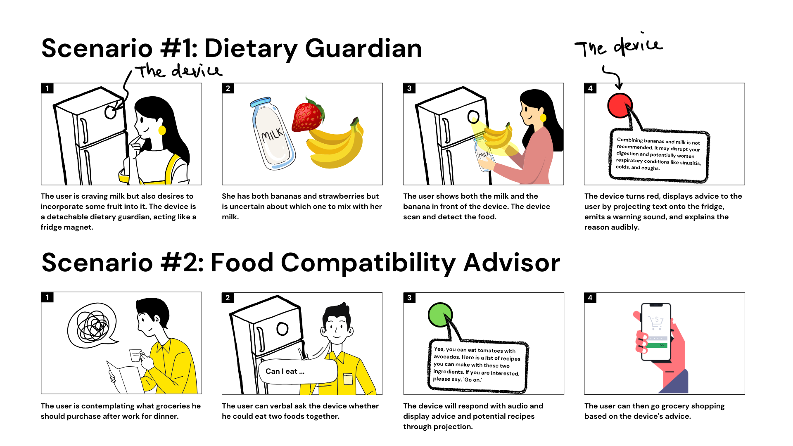
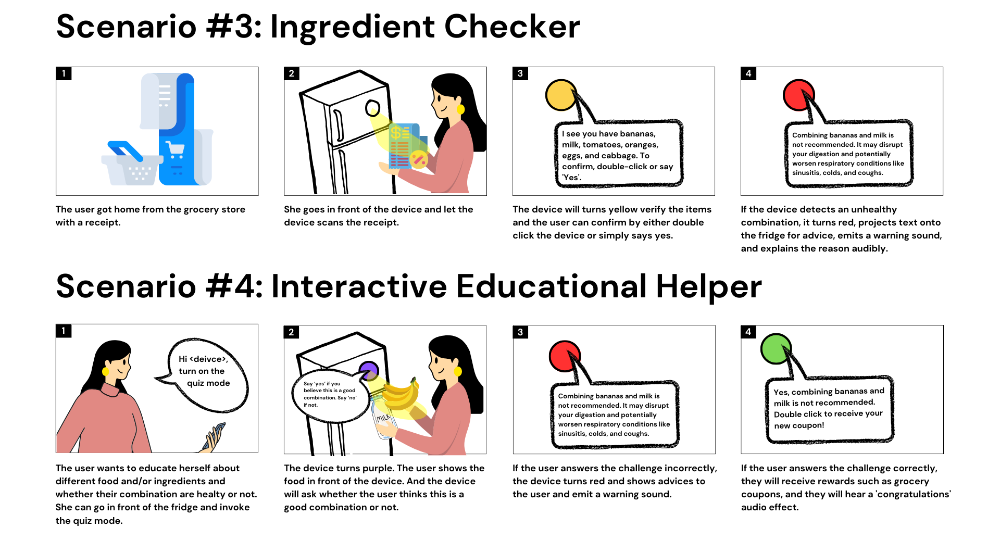
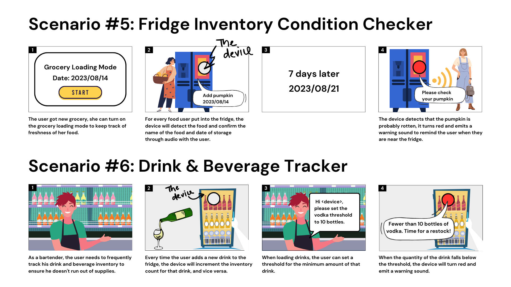
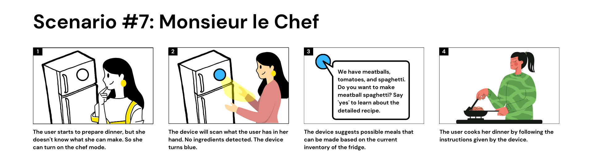

\*\***Summarize feedback you got here.**\*\*

Overall, the feedback for our design concepts is very positive: our design concepts are well-thought-out and offer a variety of functionalities aimed at different needs and scenarios. At the same time, we were advised to use simpler language, as readability is also a key factor in addition to professionalism for our design. One of the suggestions is to provide users with a guide to what they can expect from the product. Lastly, We were advised to consider enhancing user experience by adding more feedback in addition to light. For example, we can incorporate sound cues and vibrations into our design to facilitate the users. In addition, it is possible to empower Learning Algorithms in the device that interfaces with a Smart Phone Application. This application holds the capability to assist the device in sending timely reminders and facilitating orders initiated by the user. It could also use data from the household to provide more personalized advice and further optimize the user experience.

## Part B. Act out the Interaction

Try physically acting out the interaction you planned. For now, you can just pretend the device is doing the things you’ve scripted for it. 

\*\***Are there things that seemed better on paper than acted out?**\*\*
At first, we plan to use text to display all the information needed by the user. However, when we acted out displaying text on screen, we figured that text is not intuitive and hard for people to read on such a device. Therefore, we started to think about more interactive ways of showing that information by using light and voice. This finding guides our future design of the device.

\*\***Are there new ideas that occur to you or your collaborators that come up from the acting?**\*\*
We realized that since the device is designed to be a food advisor, it should also have the capability to provide food recommendations. With this idea in mind, we expanded the device's functionality to turn it into an at-home chef and nutritionist.

## Part C. Prototype the device

\*\***Feedback on Tinkerbelle.**\*\*
The user experience of Tinkerbelle is user-friendly and trouble-free. It could be improved if additional functionalities could be incorporated. For instance, while using the phone as a lighting tool, a full-screen mode that exclusively showcases the color without any buttons would be desirable. In addition, adding the feature that users can manually input RGB numbers can increase the flexibility of Tinkerbelle. 

## Part D. Wizard the device

\*\***Include your first attempts at recording the set-up video here.**\*\*

Now, hange the goal within the same setting, and update the interaction with the paper prototype. 

\*\***Show the follow-up work here.**\*\*
See part F for details.

## Part E. Costume the device 

\*\***Include sketches of what your devices might look like here.**\*\*

Minimalism Design

Our first design is a coin-sized, portable device designed for effortless convenience. This tiny attachment seamlessly affixes to your phone, you can carry this device around and make evaluation of the food.
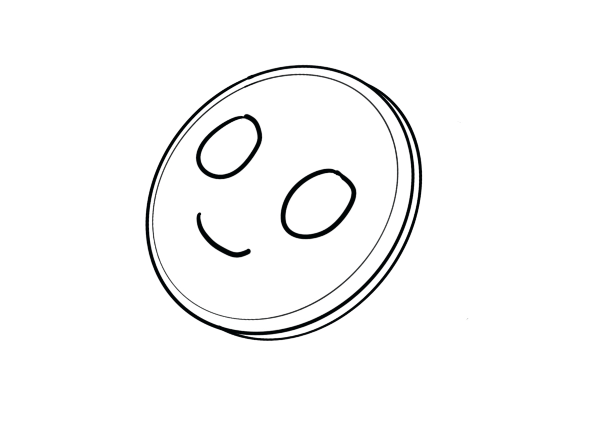

Wearable Design

Our second design is a sleek, glass-like device that instantly scans food, analyzing its nutritional quality, freshness, and safety. It then illuminates the results in vibrant colors, making it effortless to distinguish between good and bad food choices, ensuring your health and well-being with just a glance.
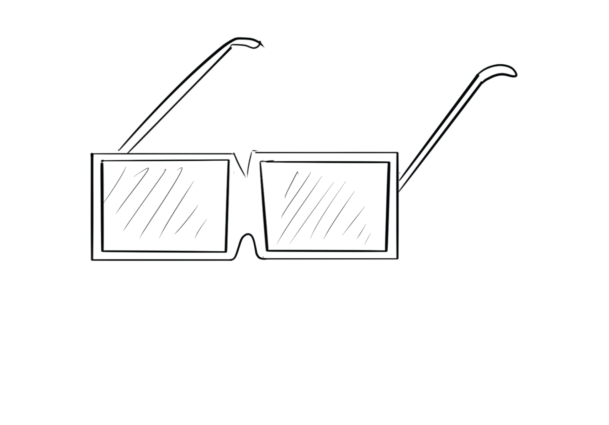

Seamlessly Household Design

Our third is a fridge-sticker-sized smart device that blends into your kitchen. It identifies the quality of the food in your fridge, categorizing it as fresh, near expiry, or spoiled, and offers personalized meal suggestions based on what's available. It's like having a nutritionist right in your kitchen, ensuring you make the best food choices while minimizing waste.
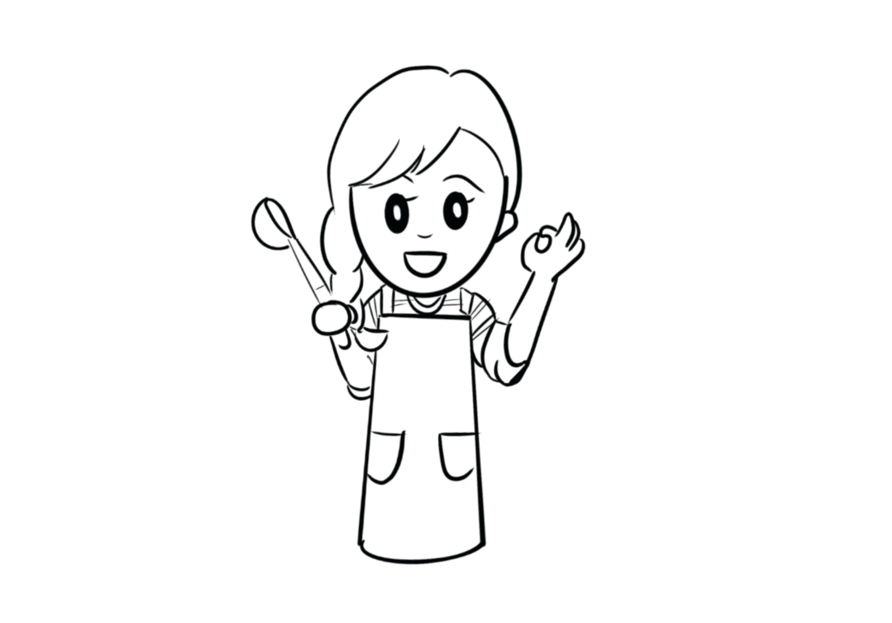

\*\***What concerns or opportunities are influencing the way you've designed the device to look?**\*\*

By designing the device, a few concerns might influence the way to design our product. Firstly, the device can be carried to different places; therefore, accessibility and flexibility have to be carefully considered. The design of the device should be simple and portable. Secondly, the size of the product needs to be very reasonable to adapt to every situation. For example, we have designed three different formats of the product to provide alternative ways of accessing the device. 

## Part F. Record

\*\***Take a video of your prototyped interaction.**\*\*

 
 
 
[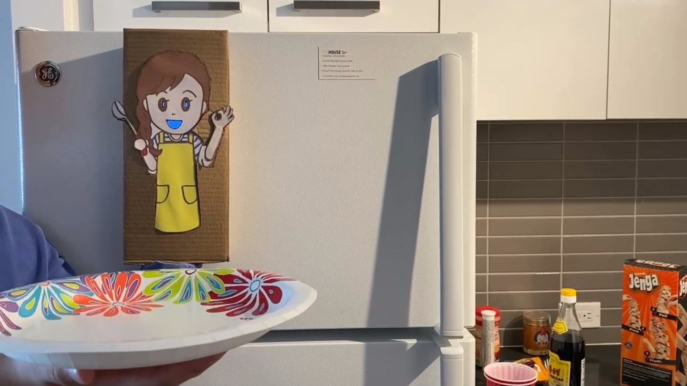](https://youtu.be/kUUe0X8RDBg?si=FGWo7o_-pEecAE_G)
=======

>>>>>>> CarlQGan-Fall2023

 
[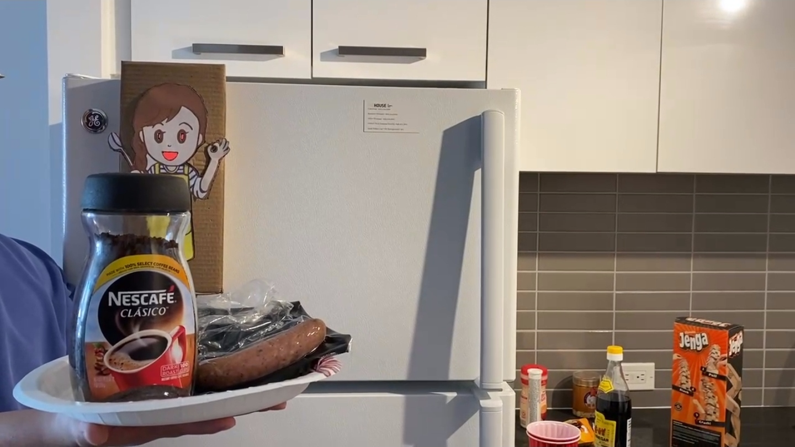](https://youtu.be/SsefpLb3oVo?si=knwxaKX2xwUP7Si2)
=======

 
=======

>>>>>>> CarlQGan-Fall2023
=======

[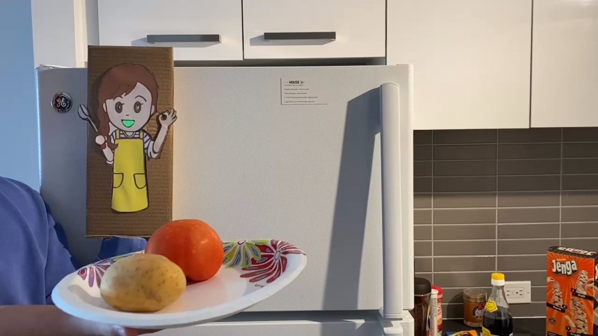](https://youtu.be/qtcV7ecHLRY?si=ChWoWfhIzqL5sroH)

>>>>>>> 9da52b82651b8398438900b0b78bae99c5f8c30a

\*\***Please indicate anyone you collaborated with on this Lab.**\*\*
John Li (jl4239), Shiying Wu (sw2298), Mingze Gao (mg2454), Crystal Chong (cc2795), Qianxin(Carl) Gan (qg72), Mingzhe Sun (ms3636)
 
=======

>>>>>>> 9da52b82651b8398438900b0b78bae99c5f8c30a
