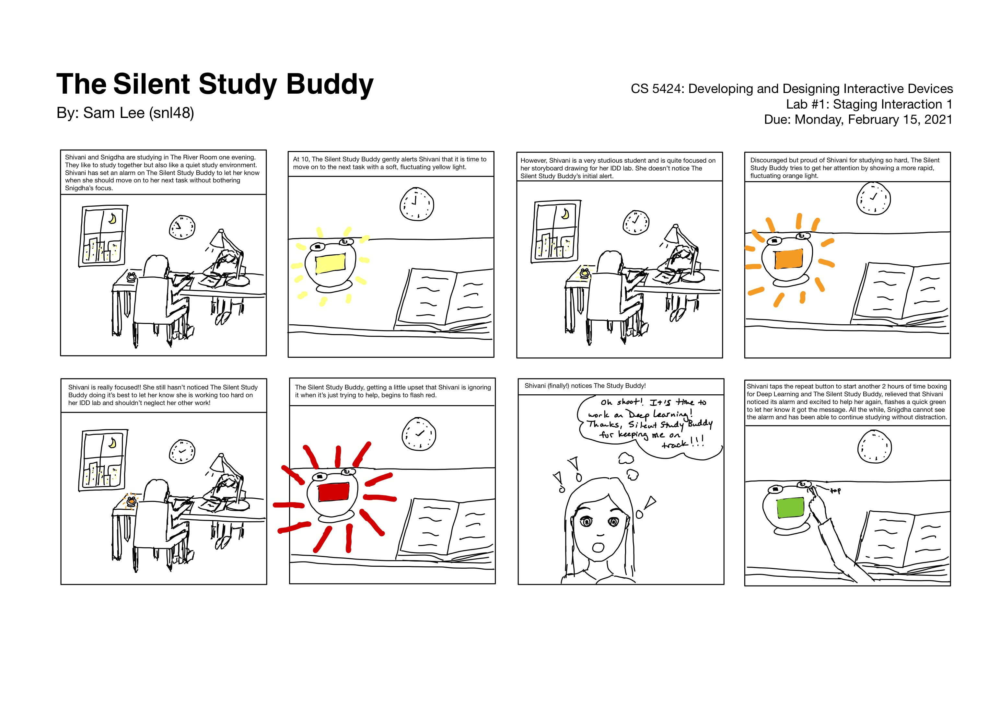
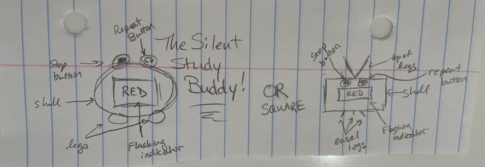
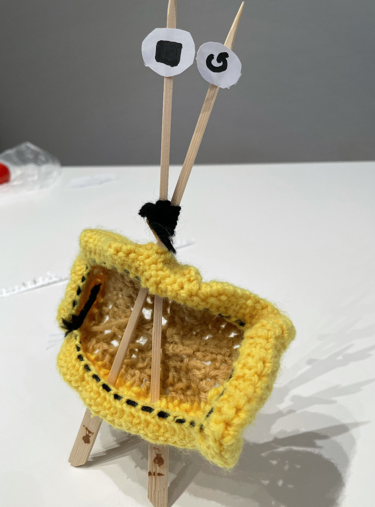

# Staging Interaction

In the original stage production of Peter Pan, Tinker Bell was represented by a darting light created by a small handheld mirror off-stage, reflecting a little circle of light from a powerful lamp. Tinkerbell communicates her presence through this light to the other characters. See more info [here](https://en.wikipedia.org/wiki/Tinker_Bell). 

There is no actor that plays Tinkerbell--her existence in the play comes from the interactions that the other characters have with her.

### Deliverables for this lab are: 
1. Sketches/photos of costumed device
1. Any reflections you have on the process.
1. Video sketch of the prototyped interaction.
1. Submit these in the lab1 folder of your class [Github page], either as links or uploaded files. Each group member should post their own copy of the work to their own Lab Hub, even if some of the work is the same for each person in the group.

## Overview
For this assignment, you are going to 

A) [Plan](#part-a-plan) 

B) [Act out the interaction](#part-b-act-out-the-interaction) 

C) [Prototype the device](#part-c-prototype-the-device)

D) [Wizard the device](#part-d-wizard-the-device) 

E) [Costume the device](#part-e-costume-the-device)

F) [Record the interaction](#part-f-record)

## The Report
This readme.md page in your own repository should be edited to include the work you have done. You can delete everything but the headers and the sections between the **stars**. Write the answers to the questions under the starred sentences. Include any material that explains what you did in this lab hub folder, and link it in the readme.

Labs are due on Mondays. Make sure this page is linked to on your main class hub page.

## Part A. Plan 

### Prompt
To stage the interaction with your interactive device, think about:

_Setting:_ Where is this interaction happening? (e.g., a jungle, the kitchen) When is it happening?

_Players:_ Who is involved in the interaction? Who else is there? If you reflect on the design of current day interactive devices like the Amazon Alexa, it’s clear they didn’t take into account people who had roommates, or the presence of children. Think through all the people who are in the setting.

_Activity:_ What is happening between the actors?

_Goals:_ What are the goals of each player? (e.g., jumping to a tree, opening the fridge). 

The interactive device can be anything *except* a computer, a tablet computer or a smart phone, but the main way it interacts needs to be using light. 

Sketch a storyboard of the interactions you are planning. It does not need to be perfect, but must get across the behavior of the interactive device and the other characters in the scene.

Present your idea to the other people in your breakout room. You can just get feedback from one another or you can work together on the other parts of the lab.

### Scenario

**Shivani and Snigdha are studying together in The River Room late one night. They are both hard-working students who want to get good grades and so they are working together for motivation to work harder. However, both like a quiet environment when they study and have made a pact to study in as much silence as possible. Shivani, though, likes to timebox her work to keep herself from going down rabbit holes. She usually sets an alarm to help her keep on track but, with the Pact of Silence, she needs a new way to alert her to move on from working on her IDD lab to her Deep Learning assignment.**

**This is where The Silent Study Buddy comes in. The Silent Study Buddy is an un-obtrusive alarm which gently flashes yellow light to let the user know it is time to move on to their next task. If they do not see the light and stop the alarm, The Silent Study Buddy begins to get a little peeved that it is being ignored and begins to flash orange. If the student STILL doesn't notice, The Silent Study Buddy gets angry and begins to flash red.**

**The student is able to turn off the alarm by pressing the "STOP" button on the top of the alarm. (The alarm is set via an app on their phone and so will not be depicted in this scenario.) If they want to repeat the alarm, they can do so easily with the "REPEAT" button on the top of the alarm.**

**When the alarm is stopped, The Silent Study Buddy briefly flashes green to tell Shivani thank you for listening to it and to encourage her good study habits.**

**When the alarm is repeated, The Silent Study Buddy also briefly flashes green to let Shivani know it got the message and to help encourage her to keep up the good work.**

### Storyboard

**I made my storyboard on my iPad because I find that easier to draw on and don't have markers.**

### Feedback from Idea Presentation
Snigdha and Shivani both said they liked the idea and thought is was "so cute". Snigdha asked "is REPEAT when you put a timer for the same duration as before? If so, maybe you could use 'timer' rather than an 'alarm'." 

This is a really good point on appropriate wording for the Silent Study Buddy and I'm going to try to call it a timer rather than an alarm from now on. 

## Part B. Act out the Interaction

### Prompt

Try physically acting out the interaction you planned. For now, you can just pretend the device is doing the things you’ve scripted for it. 

### Interaction Acted Out

**I acted out the interaction while typing this actually. I set my phone up so I could see it and imagined it flashing different colors to let me know it was time to work on something else.**

**While acting this out with a friend, too, she said she'd probably notice bright colors more easily than dark colors so thought the Silent Study Buddy's color ordering should be switched.**

### Reflection on Acting it Out

**I found myself looking at my phone a lot. This may have been because it still looked like my phone and I'm used to looking at my phone to see if I have notifications. This is good to know though, because I'll want to design The Silent Study Buddy to not resemble a phone as much as possible. It should not reward constant checking behavior because that would be just as disruptive, if not more so, as an actual timer alarm going off.**

**After acting it out with a friend, it seems like it would be better for the Silent Study Buddy to start by flashing red, then get progressively lighter since the brighter colors will actually be more noticeable.**

## Part C. Prototype the device

### Prompt

You will be using your smartphone as a stand-in for the device you are prototyping. You will use the browser of your smart phone to act as a “light” and use a remote control interface to remotely change the light on that device. 

Code for the "Tinkerbelle" tool, and instructions for setting up the server and your phone are [here](https://github.com/FAR-Lab/tinkerbelle).

We invented this tool for this lab! 

### Feedback on Tinkerbelle

**I like how easy it is to use Tinkerbelle for changing colors on my phone. However, when I jump from one color to another, it is very jarring and I have little control over the starting point within that color (lighter shades vs darker shades). I would have appreciated more choice in say what shade of yellow it shows first when I jump to yellow. In addition, it's hard to know what sounds Tinkerbelle can make. You have to know what words to type for what sounds to make without a list of options. If there was a list, it would be easier to use the sounds features on the tool.**

## Part D. Wizard the device

### Prompt

Take a little time to set up the wizarding set-up that allows for someone to remotely control the device while someone acts with it. Hint: You can use Zoom to record videos, and you can pin someone’s video feed if that is the scene which you want to record. 

### Setup Video Showing Using Tinkerbelle

  
**Link in case the video doesn't render above: https://drive.google.com/file/d/1LCEHFCxbQVZjnDqnddyOjnTcjMUeSFBD/view?usp=sharing**

 

### Prompt

Now, change the goal within the same setting, and update the interaction with the paper prototype. 

### Follow-Up Work

**First, I show an actress using the paper prototype with the goal of studying for a specified time and then stopping the timer when it goes off so that she can take a break from studying after it goes off:**

  

**Link in case the render doesn't work: https://drive.google.com/file/d/1mWCRBtBNoYpJ-U0cgC91wQHfbZ2rPSTc/view?usp=sharing**

**Then, I changed the goal so that the actress is studying for a long period of time and wants to switch from one subject to another after a specified time. Rather than stopping the timer, she restarts it for the same time as the last one and switches to her new subject.**

  

**Link in case the render doesn't work: https://drive.google.com/file/d/1d1eYBRDmpCmJ4629NWPAE7aCIBkX9rwm/view?usp=sharing**

## Part E. Costume the device

### Prompt

Only now should you start worrying about what the device should look like. Develop a costume so that you can use your phone as this device.

Think about the setting of the device: is the environment a place where the device could overheat? Is water a danger? Does it need to have bright colors in an emergency setting?

### Sketches of the Device

**I imagine that the device will resemble the following:**

### Design Choices and Implications

**The Silent Study Buddy will need to be designed in a way which is quiet, as non-bothersome to non-users as possible, and also be clearly visible for the user. In order to achieve the quiet design, The Silent Study Buddy will not have any motorized parts. It will be stationary and solid. In order to be non-bothersome to non-users, The Silent Study Buddy will actually be a brighter color so that any bright colors it is emitting is less obvious for non-users while still viewable for the primary user. If it is a bright color, the bright screen color will have less contrast and the hope is that others will be less likely to see the light flashing out of the corner of their eyes. However, as the device will be pointed at the user, they will still be able to see the colors as a large screen is unidirectional pointed towards them.**

**In addition, the Silent Study Buddy will need to flash lights in a way which is not triggering for those with epilepsy. Thus, it will be designed to have a gradual increase and decrease in lights rather than rapid bursts.**

### Final Costume

**I ended up crocheting the outer shell for The Silent Study Buddy. I had some marshmallow skewers for camping and s'mores that I was able to use as the legs in the square easel leg design. My buttons were circles of paper with the stop and repeat logos drawn on them. However, these buttons could not easily be taped to the shell itself and so were taped to the top of the easel legs.**

## Part F. Record

### Video of Prototype

**My prototype can be seen fully costumed and in action here: https://drive.google.com/file/d/1J_7SJKMBSACLZPYl8Jkx1uOoK8oXduqK/view?usp=sharing**

### Acknowledgements

I co-worked with Snigdha Singhania (ss4224) and Shivani Doshi (sgd73) for this project while building my prototypes and costume. We also received feedback from each other during the planning phase and acting phases. We also feature in each others' devices and prototype videos.

# Staging Interaction, Part 2 

This describes the second week's work for this lab activity.

## Prep (to be done before Lab on Wednesday)

You will be assigned three partners from another group. Go to their github pages, view their videos, and provide them with reactions, suggestions & feedback: explain to them what you saw happening in their video. Guess the scene and the goals of the character. Ask them about anything that wasn’t clear. 

**Summarize feedback from your partners here.**

## Make it your own

Do last week’s assignment again, but this time: 
1) It doesn’t have to (just) use light, 
2) You can use any modality (e.g., vibration, sound) to prototype the behaviors, 
3) We will be grading with an emphasis on creativity. 

**Document everything here.**
