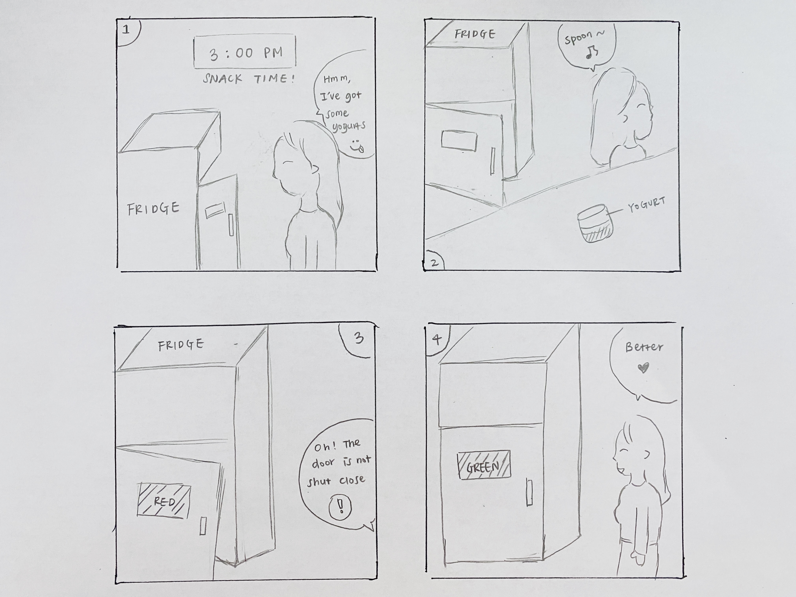

# Staging Interaction

In the original stage production of Peter Pan, Tinker Bell was represented by a darting light created by a small handheld mirror off-stage, reflecting a little circle of light from a powerful lamp. Tinkerbell communicates her presence through this light to the other characters. See more info [here](https://en.wikipedia.org/wiki/Tinker_Bell). 

There is no actor that plays Tinkerbell--her existence in the play comes from the interactions that the other characters have with her.

For lab this week, we draw on this and other inspirations from theatre to stage interactions with a device where the main mode of display/output for the interactive device you are designing is lighting. You will plot the interaction with a storyboard, and use your computer and a smartphone to experiment with what the interactions will look and feel like. 

_Make sure you read all the instructions and understand the whole of the laboratory activity before starting!_

### Deliverables for this lab are: 
1. Storyboard
1. Sketches/photos of costumed device
1. Any reflections you have on the process
1. Video sketch of the prototyped interaction
1. Submit the items above in the lab1 folder of your class [Github page], either as links or uploaded files. Each group member should post their own copy of the work to their own Lab Hub, even if some of the work is the same from each person in the group.

### The Report
This README.md page in your own repository should be edited to include the work you have done (the deliverables mentioned above). Following the format below, you can delete everything but the headers and the sections between the **stars**. Write the answers to the questions under the starred sentences. Include any material that explains what you did in this lab hub folder, and link it in your README.md for the lab.

## Lab Overview
For this assignment, you are going to:

A) [Plan](#part-a-plan) 

B) [Act out the interaction](#part-b-act-out-the-interaction) 

C) [Prototype the device](#part-c-prototype-the-device)

D) [Wizard the device](#part-d-wizard-the-device) 

E) [Costume the device](#part-e-costume-the-device)

F) [Record the interaction](#part-f-record)

Labs are due on Mondays. Make sure this page is linked to on your main class hub page.

## Part A. Plan 

\*\***Describe your setting, players, activity and goals here.**\*\*  
The interaction with my interactive device would take place in the kitchen as the device I'm designing is a fridge door alarm. When a fridge door is not properly shut close, the door alarm would be triggered and start flashing to alert the user. I believe this tool is especially useful for people who live alone where there isn't a second person to remind them and/or close the fridge door for them. Like other alarm systems, this device would help people living solo to be more attentive to their living spaces. It surely would help ensure food preservation is maximized by signaling if the fridge door is left open.

\*\***Include a picture of your storyboard here**\*\*  

\*\***Summarize feedback you got here.**\*\*  
People thought this device would be useful as an add-on to smart home appliances. Something they suggested is to include sounds in the next stage as it may be more alarming than pure flashing lights -- "Users could miss the light signal if they leave the kitchen right after grabbing food from the fridge."

## Part B. Act out the Interaction

\*\***Are there things that seemed better on paper than acted out?**\*\*  
On paper, it seemed like the fridge is right next to the user, and therefore, a simple color change (green > red) could catch the user's attention. However, when acting it out, I discovered that the static color signal wasn't alarming enough. You could barely notice it if your back is against the fridge or if you are far away from the fridge.

\*\***Are there new ideas that occur to you or your collaborators that come up from the acting?**\*\*  
To address the concern stated above, I decided to have the light flashing on and off to make it more noticeable and alarming. Inspired by the microwave beeping, I also considered flashing speed. If the door is left open for 1 minute, the light would flash quickly, and when it reaches 3-minute mark, the speed would even get accelerated to provide a sense of urgency.

## Part C. Prototype the device

\*\***Give us feedback on Tinkerbelle.**\*\*  
I have to say I like how easy it is to set up Tinkerbelle and use it to mirror and change colors on my phone. Many of my friends had problems setting it up and getting the servers connected, so I was a bit intimidated before setting it up on my own. But the process of hooking it up was smooth and the mirroring between my laptop and my phone wasn't choppy or lagging at all. Overall, it was a positive experience using Tinkerbelle.

## Part D. Wizard the device 

\*\***Include your first attempts at recording the set-up video here.**\*\*  
Video: https://drive.google.com/file/d/1AJ7H48xXZtXWF-TzNpZcJAjpKj6va-LB/view?usp=sharing

Now, hange the goal within the same setting, and update the interaction with the paper prototype. 

\*\***Show the follow-up work here.**\*\*

## Part E. Costume the device

Only now should you start worrying about what the device should look like. Develop a costume so that you can use your phone as this device.

Think about the setting of the device: is the environment a place where the device could overheat? Is water a danger? Does it need to have bright colors in an emergency setting?

\*\***Include sketches of what your device might look like here.**\*\*

\*\***What concerns or opportunitities are influencing the way you've designed the device to look?**\*\*

## Part F. Record

\*\***Take a video of your prototyped interaction.**\*\*

\*\***Please indicate anyone you collaborated with on this Lab.**\*\*
Be generous in acknowledging their contributions! And also recognizing any other influences (e.g. from YouTube, Github, Twitter) that informed your design. 

# Staging Interaction, Part 2 

This describes the second week's work for this lab activity.

## Prep (to be done before Lab on Wednesday)

You will be assigned three partners from another group. Go to their github pages, view their videos, and provide them with reactions, suggestions & feedback: explain to them what you saw happening in their video. Guess the scene and the goals of the character. Ask them about anything that wasn’t clear. 

\*\***Summarize feedback from your partners here.**\*\*

## Make it your own

Do last week’s assignment again, but this time: 
1) It doesn’t have to (just) use light, 
2) You can use any modality (e.g., vibration, sound) to prototype the behaviors! Again, be creative!
3) We will be grading with an emphasis on creativity. 

\*\***Document everything here. (Particularly, we would like to see the storyboard and video, although photos of the prototype are also great.)**\*\*
