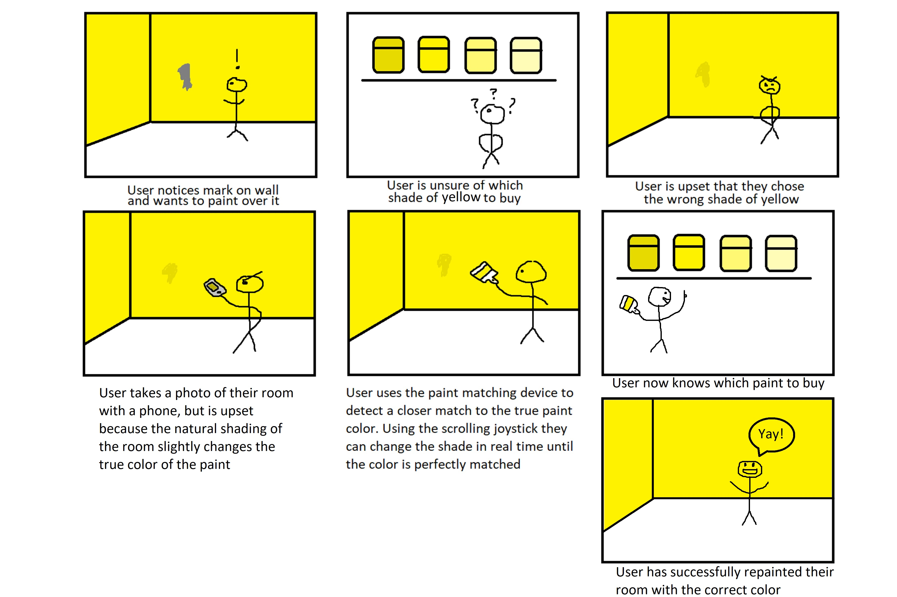
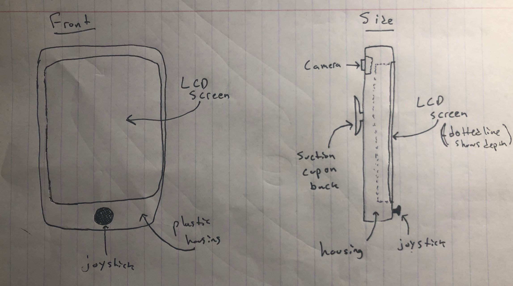
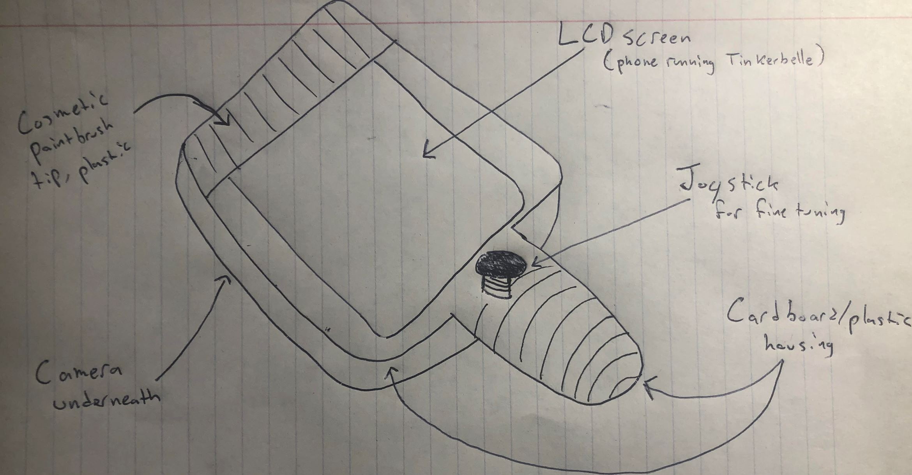
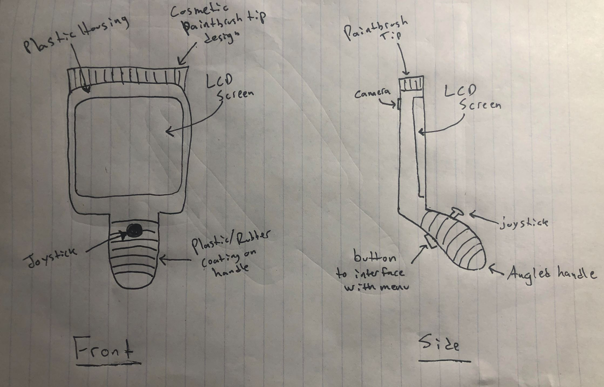

# Staging Interaction

In the original stage production of Peter Pan, Tinker Bell was represented by a darting light created by a small handheld mirror off-stage, reflecting a little circle of light from a powerful lamp. Tinkerbell communicates her presence through this light to the other characters. See more info [here](https://en.wikipedia.org/wiki/Tinker_Bell). 

There is no actor that plays Tinkerbell--her existence in the play comes from the interactions that the other characters have with her.

For lab this week, we draw on this and other inspirations from theatre to stage interactions with a device where the main mode of display/output for the interactive device you are designing is lighting. You will plot the interaction with a storyboard, and use your computer and a smartphone to experiment with what the interactions will look and feel like. 

_Make sure you read all the instructions and understand the whole of the laboratory activity before starting!_

## Prep

### To start the semester, you will need:
1. Read about Git [here](https://git-scm.com/book/en/v2/Getting-Started-What-is-Git%3F).
2. Set up your own Github "Lab Hub" repository to keep all you work in record by [following these instructions](https://github.com/FAR-Lab/Developing-and-Designing-Interactive-Devices/blob/2021Fall/readings/Submitting%20Labs.md).
3. Set up the README.md for your Hub repository (for instance, so that it has your name and points to your own Lab 1) and [learn how to](https://guides.github.com/features/mastering-markdown/) organize and post links to your submissions on your README.md so we can find them easily.

### For this lab, you will need:
1. Paper
2. Markers/ Pens
3. Scissors
4. Smart Phone -- The main required feature is that the phone needs to have a browser and display a webpage.
5. Computer -- We will use your computer to host a webpage which also features controls.
6. Found objects and materials -- You will have to costume your phone so that it looks like some other devices. These materials can include doll clothes, a paper lantern, a bottle, human clothes, a pillow case, etc. Be creative!

### Deliverables for this lab are: 
1. 7 Storyboards
1. 3 Sketches/photos of costumed devices
1. Any reflections you have on the process
1. Video sketch of 3 prototyped interactions
1. Submit the items above in the lab1 folder of your class [Github page], either as links or uploaded files. Each group member should post their own copy of the work to their own Lab Hub, even if some of the work is the same from each person in the group.

### The Report
This README.md page in your own repository should be edited to include the work you have done (the deliverables mentioned above). Following the format below, you can delete everything but the headers and the sections between the **stars**. Write the answers to the questions under the starred sentences. Include any material that explains what you did in this lab hub folder, and link it in your README.md for the lab.

## Lab Overview
For this assignment, you are going to:

A) [Plan](#part-a-plan) 

B) [Act out the interaction](#part-b-act-out-the-interaction) 

C) [Prototype the device](#part-c-prototype-the-device)

D) [Wizard the device](#part-d-wizard-the-device) 

E) [Costume the device](#part-e-costume-the-device)

F) [Record the interaction](#part-f-record)

Labs are due on Mondays. Make sure this page is linked to on your main class hub page.

## Part A. Plan 

My interactive device is a tool for close color matching of walls and natural objects. It can be a frustrating process to go to a store to buy paint only to come back home and realize your color is slightly off. When taking a picture of the color of a wall, cameras can slightly distort the shade of a color. There is nothing you can do to change the shade even if you realize it is slightly off. With this device a user can hold up the device directly to the wall, and make sure the color they see is the actual color of the wall. The device will include a camera, LCD screen, and joystick. The camera will detect a rough estimate for the RBG value of the color in question. The LCD will display this color. The joystick will allow the user to finely tune the color to their liking. Users can also use this device to match the color of natural objects like the color of a favorite shirt, the color of a coke can, the color of a flower, etc.

To stage an interaction with your interactive device, think about:

_Setting:_ In any building: bedroom, kitchen, office space, etc.

_Players:_ Residents of apertment buildings, houses, and office spaces

_Activity:_ Users hold up the device to a wall that needs to be repainted. They use the paint matching device to either match the current paint color of a wall for touch ups, or to save a color of someting natural for inspiration to repaint an entire wall.

_Goals:_ Improving the color selection process during painting. To acquire the true color of a wall or natural objects.

\*\***Describe your setting, players, activity and goals here.**\*\*

Storyboards are a tool for visually exploring a users interaction with a device. They are a fast and cheap method to understand user flow, and iterate on a design before attempting to build on it. Take some time to read through this explanation of [storyboarding in UX design](https://www.smashingmagazine.com/2017/10/storyboarding-ux-design/). Sketch seven storyboards of the interactions you are planning. **It does not need to be perfect**, but must get across the behavior of the interactive device and the other characters in the scene. 

Present your ideas to the other people in your breakout room (or in small groups). You can just get feedback from one another or you can work together on the other parts of the lab.

\*\***Summarize feedback you got here.**\*\*

The size of the device will make it diffucult to take outside of a home

## Part B. Act out the Interaction

Try physically acting out the interaction you planned. For now, you can just pretend the device is doing the things you’ve scripted for it. 

\*\***Are there things that seemed better on paper than acted out?**\*\*

The shape of the device: when holding up the device to a wall there was nothing to make the device ergonomic. The handle needs to be slightly angled to allow the device to sit flush against a wall.

\*\***Are there new ideas that occur to you or your collaborators that come up from the acting?**\*\*

A folder of saved colors can be helpful for remembering your past scans.

I realized that my initial prototype was not very interactive, it required the use of a computer to fine tune the colors. My next design incorporated a joystick, though it is not connected yet, so the user can use the device as a standalone object and not have to interface with a computer to use the product.

## Part C. Prototype the device

You will be using your smartphone as a stand-in for the device you are prototyping. You will use the browser of your smart phone to act as a “light” and use a remote control interface to remotely change the light on that device. 

Code for the "Tinkerbelle" tool, and instructions for setting up the server and your phone are [here](https://github.com/FAR-Lab/tinkerbelle).

We invented this tool for this lab! 

If you run into technical issues with this tool, you can also use a light switch, dimmer, etc. that you can can manually or remotely control.

\*\***Give us feedback on Tinkerbelle.**\*\*

The Tinkerbelle tool was very convenient for my device. Because my device's main feature is color selection, having the entire color wheel at my disposal was very helpful. This will make it easier to incorporate a joystick into the device for fine tuning of color selection.

## Part D. Wizard the device
Take a little time to set up the wizarding set-up that allows for someone to remotely control the device while someone acts with it. Hint: You can use Zoom to record videos, and you can pin someone’s video feed if that is the scene which you want to record. 

\*\***Include your first attempts at recording the set-up video here.**\*\*

https://user-images.githubusercontent.com/54602750/187322706-6b468924-b7a7-4829-ac78-d8a8e2b285e4.MOV

Now, hange the goal within the same setting, and update the interaction with the paper prototype. 

https://user-images.githubusercontent.com/54602750/187330335-6ed623a9-e227-4d05-a48c-7ea4a9d505cb.mp4

\*\***Show the follow-up work here.**\*\*

## Part E. Costume the device

Only now should you start worrying about what the device should look like. Develop three costumes so that you can use your phone as this device.

Think about the setting of the device: is the environment a place where the device could overheat? Is water a danger? Does it need to have bright colors in an emergency setting?

\*\***Include sketches of what your devices might look like here.**\*\*

First Iteration:

This design was a good jumping off point, but it uses a suction cup which I realized was not the best method for comparing the LCD screen to a wall.

Second Iteration:

This design improved on my first design however there are still flaws. I added a handle for easier usage, but I realized that the handle needs to be set at an angle so that the user can put the device flush against the wall.

Third Iteration:

This design is my best iteration. It incorporates a tilted handle as well as a button. This button can be programmed to have a different function depending on length of button presses, and can be used for saving color templates and sending saved colors to an email address.

\*\***What concerns or opportunitities are influencing the way you've designed the device to look?**\*\*

I have decided to design the device to look like a paintbrush to remind the user what the device is actually used for. However I do have concerns about the size of the device, to be truly useful it has to be small enough to be convenient to use.

## Part F. Record

\*\***Take a video of your prototyped interaction.**\*\*

https://user-images.githubusercontent.com/54602750/187329744-b08ed758-ce1c-475a-8833-556d581013d7.mov

\*\***Please indicate anyone you collaborated with on this Lab.**\*\*
Be generous in acknowledging their contributions! And also recognizing any other influences (e.g. from YouTube, Github, Twitter) that informed your design. 

# Staging Interaction, Part 2 

This describes the second week's work for this lab activity.

## Prep (to be done before Lab on Wednesday)

You will be assigned three partners from another group. Go to their github pages, view their videos, and provide them with reactions, suggestions & feedback: explain to them what you saw happening in their video. Guess the scene and the goals of the character. Ask them about anything that wasn’t clear. 

\*\***Summarize feedback from your partners here.**\*\*

## Make it your own

Do last week’s assignment again, but this time: 
1) It doesn’t have to (just) use light, 
2) You can use any modality (e.g., vibration, sound) to prototype the behaviors! Again, be creative! Feel free to fork and modify the tinkerbell code! 
3) We will be grading with an emphasis on creativity. 

\*\***Document everything here. (Particularly, we would like to see the storyboard and video, although photos of the prototype are also great.)**\*\*
