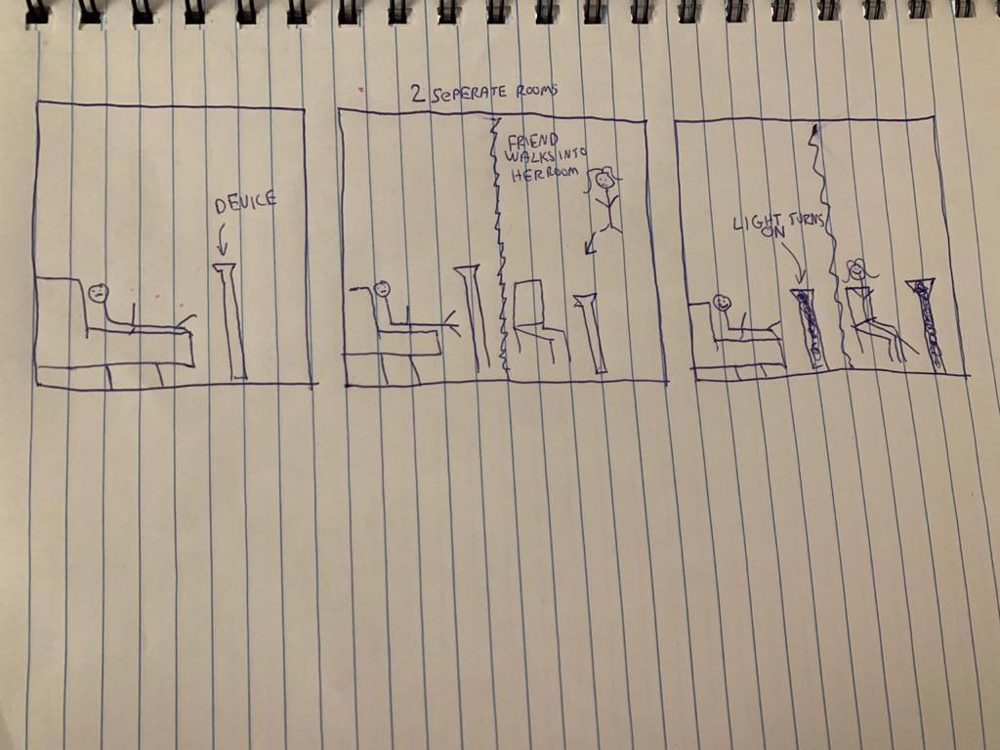
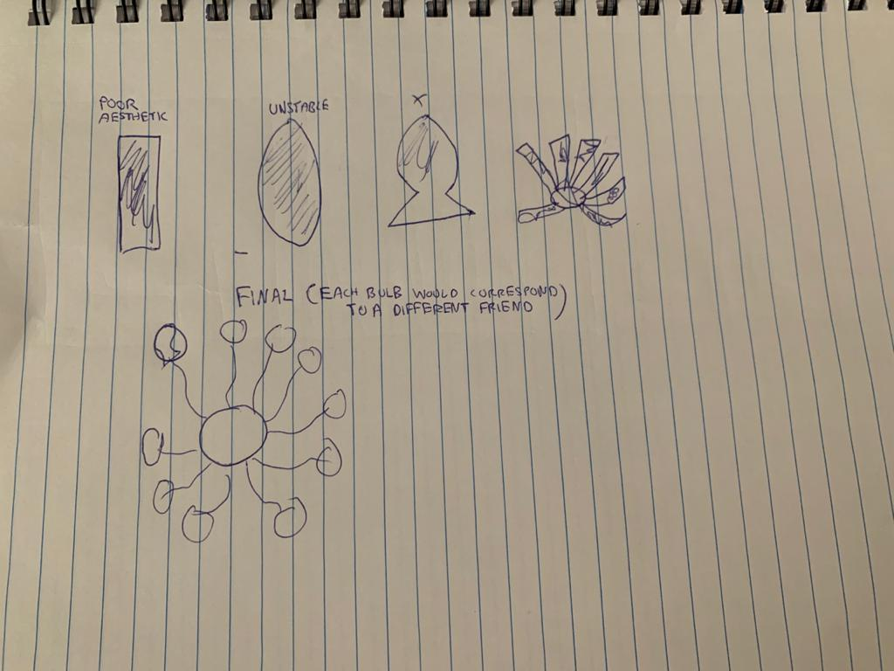

# Ahaan Parekh's-Lab-Hub
for [Interactive Device Design](https://github.com/FAR-Lab/Developing-and-Designing-Interactive-Devices/)

Please place links here to the README.md's for each of your labs here:

[Lab 1. Staging Interaction](Lab%201/)

# Staging Interaction

In the original stage production of Peter Pan, Tinker Bell was represented by a darting light created by a small handheld mirror off-stage, reflecting a little circle of light from a powerful lamp. Tinkerbell communicates her presence through this light to the other characters. See more info [here](https://en.wikipedia.org/wiki/Tinker_Bell). 

There is no actor that plays Tinkerbell--her existence in the play comes from the interactions that the other characters have with her.

For lab this week, we draw on this and other inspirations from theatre to stage interactions with a device where the main mode of display/output for the interactive device you are designing is lighting. You will plot the interaction with a storyboard, and use your computer and a smartphone to experiment with what the interactions will look and feel like. _Make sure you read all the instructions and understand the whole of the laboratory activity before starting!_

## Prep

1. Set up [your Github "Lab Hub" repository](../../../) by [following these instructions](https://github.com/FAR-Lab/Developing-and-Designing-Interactive-Devices/blob/2021Spring/readings/Submitting%20Labs.md).
2. Set up the README.md for your Hub repository (for instance, so that it has your name and points to your own Lab 1) and [learn how](https://guides.github.com/features/mastering-markdown/) to post links to your submissions on your readme.md so we can find them easily.

### For lab, you will need:

1. Paper
1. Markers/ Pen
1. Smart Phone--Main required feature is that the phone needs to have a browser and display a webpage.
1. Computer--we will use your computer to host a webpage which also features controls
1. Found objects and materials--you’ll have to costume your phone so that it looks like some other device. These materials can include doll clothes, a paper lantern, a bottle, human clothes, a pillow case. Be creative!
1. Scissors

### Deliverables for this lab are: 
1. Storyboard
1. Sketches/photos of costumed device
1. Any reflections you have on the process.
1. Video sketch of the prototyped interaction.
1. Submit these in the lab1 folder of your class [Github page], either as links or uploaded files. Each group member should post their own copy of the work to their own Lab Hub, even if some of the work is the same for each person in the group.

## Overview
For this assignment, you are going to 

A) [Plan](#part-a-plan) 

B) [Act out the interaction](#part-b-act-out-the-interaction) 

C) [Prototype the device](#part-c-prototype-the-device)

D) [Wizard the device](#part-d-wizard-the-device) 

E) [Costume the device](#part-e-costume-the-device)

F) [Record the interaction](#part-f-record)

## The Report
This readme.md page in your own repository should be edited to include the work you have done. You can delete everything but the headers and the sections between the **stars**. Write the answers to the questions under the starred sentences. Include any material that explains what you did in this lab hub folder, and link it in the readme.

Labs are due on Mondays. Make sure this page is linked to on your main class hub page.

## Part A. Plan 

To stage the interaction with your interactive device, think about:

_Setting:_ Where is this interaction happening? (e.g., a jungle, the kitchen) When is it happening?

_Players:_ Who is involved in the interaction? Who else is there? If you reflect on the design of current day interactive devices like the Amazon Alexa, it’s clear they didn’t take into account people who had roommates, or the presence of children. Think through all the people who are in the setting.

_Activity:_ What is happening between the actors?

_Goals:_ What are the goals of each player? (e.g., jumping to a tree, opening the fridge). 

The interactive device can be anything *except* a computer, a tablet computer or a smart phone, but the main way it interacts needs to be using light.
**Describe your setting, players, activity and goals here.**

Setting: The device is stationary and can be put in any place/room the user visits. 

Players: The interaciton involves 2 people or more. 

Activity: The decive passivley connects people through light. When 2 people are near their device, both will light up letting each person know the other is also next to it. This can be extended to multiple people where a user can choose a specifc colour for a specific person. 

Goals: The goal of a player is passive. It is to feel connected to family/friends/colleagues. 

Sketch a storyboard of the interactions you are planning. It does not need to be perfect, but must get across the behavior of the interactive device and the other characters in the scene. 
**Include a picture of your storyboard here**

Present your idea to the other people in your breakout room. You can just get feedback from one another or you can work together on the other parts of the lab.
**Summarize feedback you got here.**

The feedback I got was that the device looked too large and that it was too big for someone to place in their room. Additionally that it was unclear how the device would interact with multiple people involved. 

## Part B. Act out the Interaction

Try physically acting out the interaction you planned. For now, you can just pretend the device is doing the things you’ve scripted for it. 

**Are there things that seemed better on paper than acted out?**

I think my expectations for how it would work were matched when I acted it out because the device itself is stationary. Thus, acting out the interaction does not seem to give much information on its use.m 

**Are there new ideas that occur to you or your collaborators that come up from the acting?**

While acting it out I did realise that the device cannot tell who specifically is next to it. So it could, for example, be your roommate that's next to the device, which would might still result in the device of your family/friend lighting up. 

## Part C. Prototype the device

You will be using your smartphone as a stand-in for the device you are prototyping. You will use the browser of your smart phone to act as a “light” and use a remote control interface to remotely change the light on that device. 

Code for the "Tinkerbelle" tool, and instructions for setting up the server and your phone are [here](https://github.com/FAR-Lab/tinkerbelle).

We invented this tool for this lab! 

If you run into technical issues with this tool, you can also use a light switch, dimmer, etc. that you can can manually or remotely control.

**Give us feedback on Tinkerbelle.**

I was very impressed by tinkerbelle's audio feature and its ability to search for noises associated with a wide range of words. The existence of a shared screen between two devices allowing 1 to control the output of both is very helpful in mimicking an input without the use of actual specifc sensors.  

## Part D. Wizard the device
Take a little time to set up the wizarding set-up that allows for someone to remotely control the device while someone acts with it. Hint: You can use Zoom to record videos, and you can pin someone’s video feed if that is the scene which you want to record. 

**Include your first attempts at recording the set-up video here.**

Now, hange the goal within the same setting, and update the interaction with the paper prototype. 

**Show the follow-up work here.**

## Part E. Costume the device

Only now should you start worrying about what the device should look like. Develop a costume so that you can use your phone as this device.

Think about the setting of the device: is the environment a place where the device could overheat? Is water a danger? Does it need to have bright colors in an emergency setting?

**Include sketches of what your device might look like here.**

**What concerns or opportunitities are influencing the way you've designed the device to look?**

The device needs to be placed in a room somwhere, so I think its necessarry that ot not too big. However, at the same it also needs to be big enough that it is easily noticable to the user. I also want the device to have a visually appealing design; at the same time it needs to be sturdy and balanced enough to be placed in a different locations. 

## Part F. Record

**Take a video of your prototyped interaction.**

**Please indicate anyone you collaborated with on this Lab.**
Be generous in acknowledging their contributions! And also recognizing any other influences (e.g. from YouTube, Github, Twitter) that informed your design. 

# Staging Interaction, Part 2 

This describes the second week's work for this lab activity.

## Prep (to be done before Lab on Wednesday)

You will be assigned three partners from another group. Go to their github pages, view their videos, and provide them with reactions, suggestions & feedback: explain to them what you saw happening in their video. Guess the scene and the goals of the character. Ask them about anything that wasn’t clear. 

**Describe your setting, players, activity and goals here.**

Setting: The device is stationary and can be put in any place/room the user visits. 

Players: The interaciton involves 2 people or more. 

Activity: The decive passivley connects people through light and sound. When 2 people are near their device, both will light up letting each person know the other is also next to it. This can be extended to multiple people where a user can choose a specifc colour for a specific person. The device is also composed of several rods so that each one is assigned to a different person for a user. Additionally the device plays a specific sound chosen by the user when another person is also close to the device alerting them of the proximity. The device can also play/sync music between the user and one specific friend.  

Goals: The goal of a player is passive. It is to feel connected to family/friends/colleagues. 

Sketch a storyboard of the interactions you are planning. It does not need to be perfect, but must get across the behavior of the interactive device and the other characters in the scene. 

## Part B. Act out the Interaction

Try physically acting out the interaction you planned. For now, you can just pretend the device is doing the things you’ve scripted for it. 

**Are there things that seemed better on paper than acted out?**

I think my expectations for how it would work were mostly matched when I acted it out because the device itself is stationary. Thus, acting out the interaction does not seem to give much information on its use. One thing that I did realise was that the sound alert could be annoying/ distracting if the user was busy with some work

**Are there new ideas that occur to you or your collaborators that come up from the acting?**

While acting it out I did realise that the device cannot tell who specifically is next to it. So it could, for example, be your roommate that's next to the device, which would might still result in the device of your family/friend lighting up. That led to the idea of having seprate parts (rods) of the device be assigned to different people - which coudl extended to different colours and sounds. 

## Part D. Wizard the device
Take a little time to set up the wizarding set-up that allows for someone to remotely control the device while someone acts with it. Hint: You can use Zoom to record videos, and you can pin someone’s video feed if that is the scene which you want to record. 

**Include your first attempts at recording the set-up video here.**

Now, hange the goal within the same setting, and update the interaction with the paper prototype. 

**Show the follow-up work here.**

"https://player.vimeo.com/video/515091958?badge=0&amp;autopause=0&amp;player_id=0&amp;app_id=58479" 

"https://player.vimeo.com/video/515092117?title=0&amp;byline=0&amp;portrait=0&amp;badge=0&amp;autopause=0&amp;player_id=0&amp;app_id=58479" 

## Part E. Costume the device

Only now should you start worrying about what the device should look like. Develop a costume so that you can use your phone as this device.

Think about the setting of the device: is the environment a place where the device could overheat? Is water a danger? Does it need to have bright colors in an emergency setting?

**Include sketches of what your device might look like here.**

**What concerns or opportunitities are influencing the way you've designed the device to look?**

The device needs to be placed in a room somwhere, so I think its necessarry that ot not too big. However, at the same it also needs to be big enough that it is easily noticable to the user. I also want the device to have a visually appealing design; at the same time it needs to be sturdy and balanced enough to be placed in a different locations. 

An additonal concern now was that the device neader a speaker to play music and give alerts. So the sound sytem has to be integreated in a way as to not make the device appear to bulky and retain a sleek appearance. 

**Summarize feedback from your partners here.**

The feedback I got was that the device looked too large and that it was too big for someone to place in their room. Additionally that it was unclear how the device would interact with multiple people involved. 

## Part F. Record

**Take a video of your prototyped interaction.**

"https://player.vimeo.com/video/515092252?title=0&amp;byline=0&amp;portrait=0&amp;badge=0&amp;autopause=0&amp;player_id=0&amp;app_id=58479" width="400" height="300" frameborder="0" allow="autoplay; fullscreen; picture-in-picture" allowfullscreen title="IDD_HW1_P2_video3.mp4"></iframe>

**Please indicate anyone you collaborated with on this Lab.**
Be generous in acknowledging their contributions! And also recognizing any other influences (e.g. from YouTube, Github, Twitter) that informed your design. 

## Make it your own

Do last week’s assignment again, but this time: 
1) It doesn’t have to (just) use light, 
2) You can use any modality (e.g., vibration, sound) to prototype the behaviors, 
3) We will be grading with an emphasis on creativity. 

**Document everything here.**
