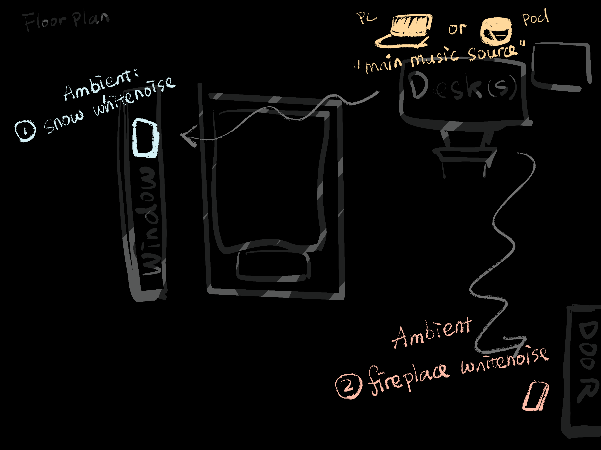

# Staging Interaction

\*\***Yuewen Yang**\*\*

In the original stage production of Peter Pan, Tinker Bell was represented by a darting light created by a small handheld mirror off-stage, reflecting a little circle of light from a powerful lamp. Tinkerbell communicates her presence through this light to the other characters. See more info [here](https://en.wikipedia.org/wiki/Tinker_Bell). 

There is no actor that plays Tinkerbell--her existence in the play comes from the interactions that the other characters have with her.

For lab this week, we draw on this and other inspirations from theatre to stage interactions with a device where the main mode of display/output for the interactive device you are designing is lighting. You will plot the interaction with a storyboard, and use your computer and a smartphone to experiment with what the interactions will look and feel like. 

## Prep

### To start the semester, you will need:
1. Read about Git [here](https://git-scm.com/book/en/v2/Getting-Started-What-is-Git%3F).
2. Set up your own Github "Lab Hub" repository to keep all you work in record by [following these instructions](https://github.com/FAR-Lab/Developing-and-Designing-Interactive-Devices/blob/2021Fall/readings/Submitting%20Labs.md).
3. Set up the README.md for your Hub repository (for instance, so that it has your name and points to your own Lab 1) and [learn how to](https://guides.github.com/features/mastering-markdown/) organize and post links to your submissions on your README.md so we can find them easily.

### For this lab, you will need:
1. Paper
2. Markers/ Pens
3. Scissors
4. Smart Phone -- The main required feature is that the phone needs to have a browser and display a webpage.
5. Computer -- We will use your computer to host a webpage which also features controls.
6. Found objects and materials -- You will have to costume your phone so that it looks like some other devices. These materials can include doll clothes, a paper lantern, a bottle, human clothes, a pillow case, etc. Be creative!

### Deliverables for this lab are: 
1. 7 Storyboards
1. 3 Sketches/photos of costumed devices
1. Any reflections you have on the process
1. Video sketch of 3 prototyped interactions
1. Submit the items above in the lab1 folder of your class [Github page], either as links or uploaded files. Each group member should post their own copy of the work to their own Lab Hub, even if some of the work is the same from each person in the group.

### The Report
This README.md page is edited to include the work I have done (the deliverables mentioned above)

## Lab Overview
For this assignment, I am going to:

A) [Plan](#part-a-plan) 

B) [Act out the interaction](#part-b-act-out-the-interaction) 

C) [Prototype the device](#part-c-prototype-the-device)

D) [Wizard the device](#part-d-wizard-the-device) 

E) [Costume the device](#part-e-costume-the-device)

F) [Record the interaction](#part-f-record)

Labs are due on Mondays. Make sure this page is linked to on your main class hub page.

## Part A. Plan 

\*\***Topic: Ideation toward environment music and human-centric ambient lighting in home office.**\*\*

In the brainstorming storyboards, I am exploring scenarios that happen around my desk at home, where I spend quite a bit of time everyday working, reading, or simply relaxing. A desired experience is that my surroundings can reflect or help with my mental state at that moment. 

Setting: desk or working station at home

Activity: the specific person has various needs for the surrounding environment when conducting different tasks that require different levels of productivity and focus.

Goals: the contributing modules - lighting and music - are responding to individual emotional needs. For feasibility and time’s sake, in this lab, the lighting bulb is mocked by my monitor screen. Music will come from Spotify music lists.

\*\***Storyboards**\*\*

1. Workstation setup 

   
2. Many interesting articles and research papers studied the relationship and dynamics between lighting, mood, and acoustic environments. For lighting, the main two dimensions are brightness and warmness. Usually it’s agreed upon that colder lighting is more helpful for focus, while warmer lighting is more helpful for forming a relaxing atmosphere.

3. Writing a paper is hard! Calm me down. I need to think.
   

4. I am getting tired now. Cheer me up.
   

5. I am just relaxing. Make the room’s lighting cozy.
   

6. I need some music that accompanies the lighting that helps my productivity.
   

7. Now give me my favorite jazz piano kind of music so that I can finish reading this novel and go to sleep.
   

## Part B. Act out the Interaction

I am sitting at my desk doing some routine activities such as reading, writing, and roaming on the internet. I use the color panel to control my surroundings (i.e. lighting and music) that ususally largely influence my emotion at that moment.

## Part C. Prototype the device

I used "Tinkerbelle" as the remote control medium. I am using both mobile and web app to present the connections. I used my monitor to mock the ambient light effect.

\*\***Give us feedback on Tinkerbelle.**\*\*

## Part D. Wizard the device

\*\***Include your first attempts at recording the set-up video here.**\*\*

[Set up the device](https://drive.google.com/file/d/157xPfE7pw92zmc6tsob7avzLjFEKHsQj/view?usp=sharing)

\*\***Show the follow-up work here.**\*\*

\*\***Future work**\*\*
Now the music part is just manual and is a mock-up. It would worth exploring the mappings between music, emotion, and lighting and how these connections and controls can be automated by intelligent systems.

## Part E. Costume the device

\*\***Include sketches of what your devices might look like here.**\*\*

\*\***The actual setup:**\*\*

\*\***What concerns or opportunitities are influencing the way you've designed the device to look?**\*\*
I want to make this controller have properties of some sort of "companionship". Therefore, I fake the controller's appearance with Cony rabbit from the LINE Friends.

## Part F. Record

\*\***[Interaction video link](https://drive.google.com/file/d/1rJHmeJ353lNJMUyzZKbrzPGJBMsmHybW/view?usp=drive_link)**\*\*

# Staging Interaction, Part 2 

This describes the second week's work for this lab activity.

## Prep (to be done before Lab on Wednesday)

\*\***Summarize feedback from your partners here.**\*\*

Hauke: maybe it can be a good idea to borrow inspiration from promodoro timer in terms of designing devices and interactions that keep people in flow.

Annetta: a current product like a intelligent multi-functioning can be a good inspiration. Make the companion "stuffed animal" personalized virtual avatar. Can be voice-controlled. Think in the IoT scope. 
Timer to turn on/off.

William: think about power (how do you charge). Also, think about is it always on? (Good question!) People have different perceptions. How can the mapping be personlized?

## Make it my own

1) **Compare with Lab 1.a:**
   - Similar idea! Make your everyday environment more "wellness-friendly".
   - Goal: intelligently match the ambient light and music (if the user chooses to have) with the user's desired mental state, which helps **productivity as well as relaxing**.
2) **Wizarding the device:** instead of using mobile phone as a controller, I used a Nintendo Switch as the inspiration to my prototype controller. (It has the Animal Crossing characters on it!! So still has the "companionship" flavor. In Lab 1.a this role was played by Rabbit Cony.)
   - 
   - 
3) **Two more to share!**
   - **Pomodoro  🍅:** users can start a "pomodoro" session (which cannot be stopped manually) by clicking on the "R" button on the top of the controller.
   - 
   - **Color Panel 🎨:** similar as in Lab1.a, this is the main input from users, where they will choose "the color of the moment" that describes their desired internal state (mood). For example, when I am reading something relaxing before going to bed, I wish to have a "peaceful" state of mind and I feel yellow light matches and helps me to reach that state. The **two dimensions of the color scheme** are 1) brightness v.s. darkness (vertical) and 2)cold v.s. warm (horizontal).
   - 
   - **DJBots 🎵:** "Ambient" music shouldn't only have the "main" music source (i.e. songs or melodies) but also the other "white noises" that come from different corners of your space. For example, from the direction of the window, the user can hear sound of snow, and there's a sound of fireplace from the baseboard of your wall.
   - More on the DJBots: users are given a set of 3 sound sources: **the Main, Ambient No.1, and Ambient No2**. The static Main will play the melody song. And the moving "DJBots" has **two main functions**: 1) once the "mood" is set and the user chooses to have her music on, DJBots navigate to their target destination and 2) play their respective sound sources. (e.g. Ambient No.1 moves to the window and play the "snow" sound, while Ambient No.2 moves to a corner and play the "fireplace" sound). Altogether, they **collaboratively** create a "cozy" environment. They also has **one "nice-to-have"**: display the corresponding sound source. (e.g. animation of fireplace).
   - 
   - 
   - 
4) 
   [Interaction Video]()
5) Futurework:
   - (A lot...)
   
   - **Match visual perception with internal state (mood, etc.)**
   - It's highly subjective and individualized when it comes to people's imagniary image about a certain state of their mood. Example assumption could be "warm yellow light are cozy and relaxing" or "cold color like blue makes you more concentrated on your task". But that varies across individuals.
   - **Match listening experience with internal state**
   - Similar challenges apply when it comes to music recommendation. To make the DJBots create a good listening experience, they will need to 1) select the right piece of melody and 2) find the matching white noises. And the quality of choices also highly depend on individual flavor. However, this doesn't mean there's no generalization. My intuition is to look into research in the affective computing or recommender systems to see their promising algorithms.
   - **Modularized and adaptive tangible UI** 
   - How can the moving blocks with straightforward functions provide individualized experience for the users? How are they going to navigate the space (with a known scope)?
   - **Ambient Light:** need to actually get to change the light color.

\*\***Document everything here. (Particularly, we would like to see the storyboard and video, although photos of the prototype are also great.)**\*\*
