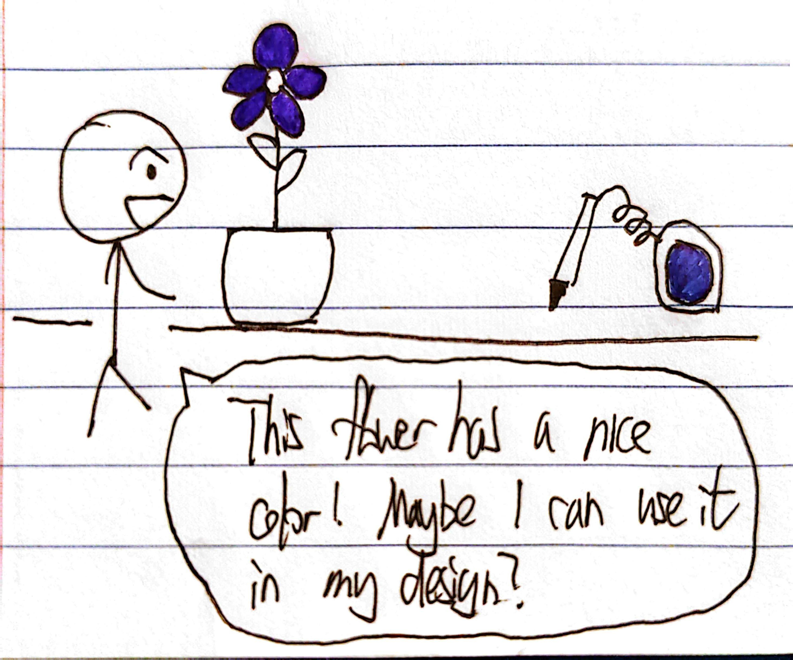

# Staging Interaction

\*\***Sissel Sun (individual)**\*\*

In the original stage production of Peter Pan, Tinker Bell was represented by a darting light created by a small handheld mirror off-stage, reflecting a little circle of light from a powerful lamp. Tinkerbell communicates her presence through this light to the other characters. See more info [here](https://en.wikipedia.org/wiki/Tinker_Bell). 

There is no actor that plays Tinkerbell--her existence in the play comes from the interactions that the other characters have with her.

For lab this week, we draw on this and other inspirations from theatre to stage interactions with a device where the main mode of display/output for the interactive device you are designing is lighting. You will plot the interaction with a storyboard, and use your computer and a smartphone to experiment with what the interactions will look and feel like. 

_Make sure you read all the instructions and understand the whole of the laboratory activity before starting!_

## Prep

### To start the semester, you will need:
1. Read about Git [here](https://git-scm.com/book/en/v2/Getting-Started-What-is-Git%3F).
2. Set up your own Github "Lab Hub" repository to keep all you work in record by [following these instructions](https://github.com/FAR-Lab/Developing-and-Designing-Interactive-Devices/blob/2021Fall/readings/Submitting%20Labs.md).
3. Set up the README.md for your Hub repository (for instance, so that it has your name and points to your own Lab 1) and [learn how to](https://guides.github.com/features/mastering-markdown/) organize and post links to your submissions on your README.md so we can find them easily.

### For this lab, you will need:
1. Paper
2. Markers/ Pens
3. Scissors
4. Smart Phone -- The main required feature is that the phone needs to have a browser and display a webpage.
5. Computer -- We will use your computer to host a webpage which also features controls.
6. Found objects and materials -- You will have to costume your phone so that it looks like some other devices. These materials can include doll clothes, a paper lantern, a bottle, human clothes, a pillow case, etc. Be creative!

### Deliverables for this lab are: 
1. 7 Storyboards
1. 3 Sketches/photos of costumed devices
1. Any reflections you have on the process
1. Video sketch of 3 prototyped interactions
1. Submit the items above in the lab1 folder of your class [Github page], either as links or uploaded files. Each group member should post their own copy of the work to their own Lab Hub, even if some of the work is the same from each person in the group.

### The Report
This README.md page in your own repository should be edited to include the work you have done (the deliverables mentioned above). Following the format below, you can delete everything but the headers and the sections between the **stars**. Write the answers to the questions under the starred sentences. Include any material that explains what you did in this lab hub folder, and link it in your README.md for the lab.

## Lab Overview
For this assignment, you are going to:

A) [Plan](#part-a-plan) 

B) [Act out the interaction](#part-b-act-out-the-interaction) 

C) [Prototype the device](#part-c-prototype-the-device)

D) [Wizard the device](#part-d-wizard-the-device) 

E) [Costume the device](#part-e-costume-the-device)

F) [Record the interaction](#part-f-record)

Labs are due on Mondays. Make sure this page is linked to on your main class hub page.

## Part A. Plan 

To stage an interaction with your interactive device, think about:

_Setting:_ Where is this interaction happening? (e.g., a jungle, the kitchen) When is it happening?

_Players:_ Who is involved in the interaction? Who else is there? If you reflect on the design of current day interactive devices like the Amazon Alexa, it’s clear they didn’t take into account people who had roommates, or the presence of children. Think through all the people who are in the setting.

_Activity:_ What is happening between the actors?

_Goals:_ What are the goals of each player? (e.g., jumping to a tree, opening the fridge). 

The interactive device can be anything *except* a computer, a tablet computer or a smart phone, but the main way it interacts needs to be using light.

\*\***Describe your setting, players, activity and goals here.**\*\*

My idea for the device is a (somewhat magical) color picker that converts physical colors percieved to RGB lights. Colors that cannot be represented digitally will be converted to the nearest RGB color. The interaction happens when the user discovers an interesting color in the real world and would like to visualize it digitally. Typical players are people who do creative graphical work, such as UI/UX designers and digital artists. They can utilize this device to pick up colors from the real world and test it out in their graphical design conveniently, without having to match the digital color with the physical color. 

Storyboards are a tool for visually exploring a users interaction with a device. They are a fast and cheap method to understand user flow, and iterate on a design before attempting to build on it. Take some time to read through this explanation of [storyboarding in UX design](https://www.smashingmagazine.com/2017/10/storyboarding-ux-design/). Sketch seven storyboards of the interactions you are planning. **It does not need to be perfect**, but must get across the behavior of the interactive device and the other characters in the scene. 

\*\***Include pictures of your storyboards here**\*\*

I designed two scenarios in my storyboard. The first one is picking the color of a flower and utilizing it in UI design. The second one involves interacting with other people and utlizing the colors picked in digital reconstruction. 

Present your ideas to the other people in your breakout room (or in small groups). You can just get feedback from one another or you can work together on the other parts of the lab.

\*\***Summarize feedback you got here.**\*\*

1. The size of the color picker needs to be convenient enough to carry around.
2. Besides RGB values, maybe it can export colors in other format like HSV or CMYK?
3. The environmental light might affect the percieved color of an object, making the color picker not accurate.

## Part B. Act out the Interaction

Try physically acting out the interaction you planned. For now, you can just pretend the device is doing the things you’ve scripted for it. 

\*\***Are there things that seemed better on paper than acted out?**\*\*

I used my phone with Tinkerbelle to act as the device's screen and used a pen to act as its color sensor. When storyboarding on paper, I did not realize the device might cause social awkwardness. Only after acting out did I notice that it is a little weird to carry a phone-sized device and point the sensor to whatever physical object, especially when others are around. I also realized that the device cannot pick the color of a transparent device.

\*\***Are there new ideas that occur to you or your collaborators that come up from the acting?**\*\*

 A new idea occured to my that instead of a pen-like sensor, I can use a camera-like sensor for scanning the color. This makes it less awkard to use the device in front of others, because interacting with the device now looks like taking a picture or scanning a QR code. 

## Part C. Prototype the device

You will be using your smartphone as a stand-in for the device you are prototyping. You will use the browser of your smart phone to act as a “light” and use a remote control interface to remotely change the light on that device. 

Code for the "Tinkerbelle" tool, and instructions for setting up the server and your phone are [here](https://github.com/FAR-Lab/tinkerbelle).

We invented this tool for this lab! 

If you run into technical issues with this tool, you can also use a light switch, dimmer, etc. that you can can manually or remotely control.

\*\***Give us feedback on Tinkerbelle.**\*\*

Tinkerbelle is great! It would be nicer if a line of RGB values can be added along the colored light, and we can choose whether to display it. 

## Part D. Wizard the device
Take a little time to set up the wizarding set-up that allows for someone to remotely control the device while someone acts with it. Hint: You can use Zoom to record videos, and you can pin someone’s video feed if that is the scene which you want to record. 

Now, hange the goal within the same setting, and update the interaction with the paper prototype. 

\*\***Include your first attempts at recording the set-up video here.**\*\*

\*\***Show the follow-up work here.**\*\*

[Wizard Video](https://drive.google.com/file/d/1qCNZkamydy5mUNDtXdhQ51kBbusqlxOz/view?usp=sharing)

The video showed the setup as well as the interaction where the user pick up various physical colors from page markers.

## Part E. Costume the device

Only now should you start worrying about what the device should look like. Develop three costumes so that you can use your phone as this device.

Think about the setting of the device: is the environment a place where the device could overheat? Is water a danger? Does it need to have bright colors in an emergency setting?

\*\***Include sketches of what your devices might look like here.**\*\*

\*\***What concerns or opportunitities are influencing the way you've designed the device to look?**\*\*

The first costume is my original idea where the color sensor is placed at the tip of a pen. The user can point the pen to physical objects and get their digital color. However, after acting out the interaction, I found it's a little awkward to use the pen and point to physical objects, especially when others are around. This leads me to develop the next costume, where the pen is replaced by a camera-like sensor at the back of device. Users who interact with this device and scan the color will look as if they are taking a picture, which is less awkward. In addition, based on the feedback that ambient light can change percieved color, I added a light torch at the back with adjustable light. Users are able to get the desired color by playing around with the torch. My third costume comes to me with the idea that the device can be more portable, because users would probably be inspired by color outdoors. So I designed the device as a keychain that's much smaller, allowing users to hang it on bags and backpacks. 

## Part F. Record

\*\***Take a video of your prototyped interaction.**\*\*

[Interaction Video](https://drive.google.com/file/d/1fOmkb0cyqtEIg8FXdxwP0cFWlJMzdvEh/view?usp=sharing)

\*\***Please indicate anyone you collaborated with on this Lab.**\*\*
Be generous in acknowledging their contributions! And also recognizing any other influences (e.g. from YouTube, Github, Twitter) that informed your design. 

Thanks to everyone who I sat with during the lab session for the valuable feedback. Please bear with my sketches and acting :P

# Staging Interaction, Part 2 

This describes the second week's work for this lab activity.

## Prep (to be done before Lab on Wednesday)

You will be assigned three partners from another group. Go to their github pages, view their videos, and provide them with reactions, suggestions & feedback: explain to them what you saw happening in their video. Guess the scene and the goals of the character. Ask them about anything that wasn’t clear. 

\*\***Summarize feedback from your partners here.**\*\*

## Make it your own

Do last week’s assignment again, but this time: 
1) It doesn’t have to (just) use light, 
2) You can use any modality (e.g., vibration, sound) to prototype the behaviors! Again, be creative! Feel free to fork and modify the tinkerbell code! 
3) We will be grading with an emphasis on creativity. 

\*\***Document everything here. (Particularly, we would like to see the storyboard and video, although photos of the prototype are also great.)**\*\*

Storyboards:

Storyboard 1: Color gradient picker  
This idea is an extension to my color picker idea for part a. Besides picking the physical color, the device would also generate the color gradient from white to that color and display corresponding RGB values. Users can find the most suitable color in the gradient. 

Storyboard 2: Color theme generator  
This idea is also based on my color picker idea. It's different than my first storyboard by generating color themes rather than color gradients. Users can apply the generated themes when designing products like icons or clothes.

Storyboard 3: Party Music Visualizer  
In this idea, the device plays music in a party setting and visualizes it via dynamic light. Different colors of light correspond to different music genres, and the brightness of light can change dynamically according music volume.

Storyboard 4: Temperature Visualizer  
The device visualizes temperature in this setting. It also informs the user about temperature via sound. The temperature will be visualized based on a gradient from blue to red, where blue is cold and red is hot.

Storyboard 5: Interactive Art Device  
This is an interactive art device that can be placed in the museum. It is modularized, where each small piece can display different color individually. Visitors can interact with the device by waving hands or walking pass. The device can also change the color slowly if there are no interactions.

Storyboard 6: Stronger Alarm  
This is an alarm that's stronger than regular ones. In addition to beeping, the alarm will gradually change its color to red when the time is up. After time's up, the light will also flash to attract the user's attention.

Storyboard 7: Healthy Diet Helper  
This device helps the user maintain a good diet by reminding them whether the food or drink is healthy. Green indicates healthy, yellow indicates not very healthy, and red indicates unhealthy. 

Device idea:

My new idea for the device is a color theme generator, which is an extension to my color picker from part a. Besides converting physical colors to RGB lights, it can also generate color themes based on measured colors for design purposes. The interaction happens when one discovers an interesting color of a physical object would like to explore color themes around that color. Typical players are people who do creative graphical work, such as UI/UX designers and digital artists. They can utilize this device to pick up colors from the real world, generate color themes and apply them in their digital design.

Costumes:

The costumes are similar as the ones from lab1a, but there's an additional button for color theme generation.

Videos: 

[Wizard Video](https://drive.google.com/file/d/1Gb2VjFC2RPx4l-p9GNC-JcFtQCV08NKm/view?usp=sharing) 
For sake of convenience, I wizard the device using Figma this time by manually generating some color themes and hard-coding them into the prototype.

[Interaction Video](https://drive.google.com/file/d/1dSbwrB4JdmOVZkS8WHnVznpIgnGCIhy_/view?usp=drive_link) 
The video shows three interactions of generating color themes based on different number of colors. There are also interactions of picking up physical colors and exporting themes to laptop.