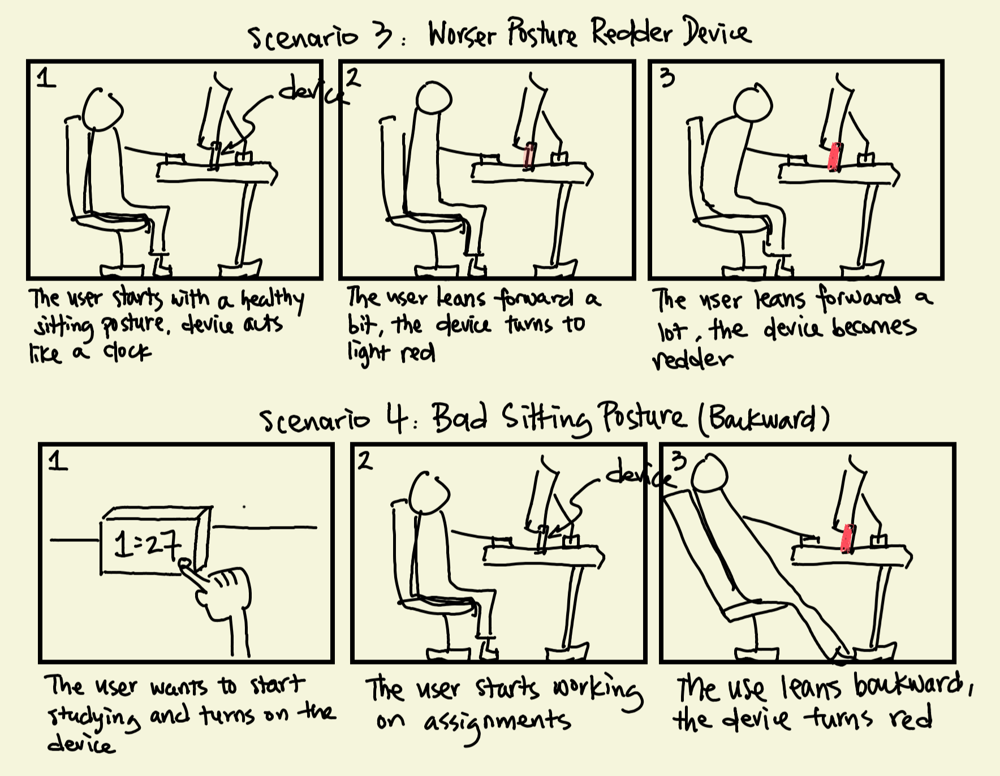
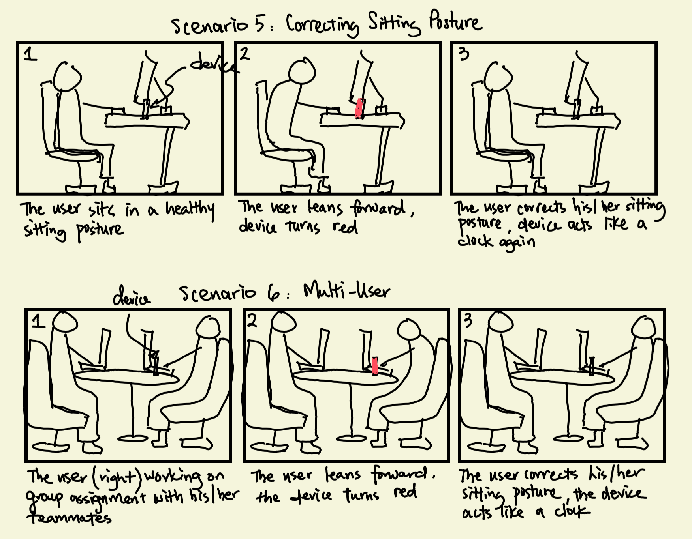

# Staging Interaction

In the original stage production of Peter Pan, Tinker Bell was represented by a darting light created by a small handheld mirror off-stage, reflecting a little circle of light from a powerful lamp. Tinkerbell communicates her presence through this light to the other characters. See more info [here](https://en.wikipedia.org/wiki/Tinker_Bell). 

There is no actor that plays Tinkerbell--her existence in the play comes from the interactions that the other characters have with her.

This project aims to create a device which communicates primarily via light. In this way, our "Tinker Bell" should be able to clearly convey meaning and purpose.

## Table of Contents
This project includes the following sections:

A) [Initial Prototype](#a.-staging-interaction,-part-1)  
1) [Plan](#1.-plan)  
2) [Act out the interaction](#2.-act-out-the-interaction)  
3) [Prototype the device](#3.-prototype-the-device)  
4) [Wizard the device](#4.-wizard-the-device)  
5) [Costume the device](#5.-costume-the-device)  
6) [Record the interaction](#6.-record)  

B) [Improved Prototype](#b.-staging-interaction,-part-2)  
1) [Prep](#1.-prep)  
2) [Brainstorming](#2.-brainstorming)  
3) [Plan](#3.-plan)  
4) [Process](#4.-process)  
5) [Final Result](#5.-final-result)

## A. Staging Interaction, Part 1

### 1. Plan

#### Scenario

Shivani and Snigdha are studying together in The River Room late one night. They are both hard-working students who want to get good grades and so they are working together for motivation to work harder. However, both like a quiet environment when they study and have made a pact to study in as much silence as possible. Shivani, though, likes to timebox her work to keep herself from going down rabbit holes. She usually sets an alarm to help her keep on track but, with the Pact of Silence, she needs a new way to alert her to move on from working on her IDD lab to her Deep Learning assignment.

This is where The Silent Study Buddy comes in. The Silent Study Buddy is an un-obtrusive alarm which gently flashes yellow light to let the user know it is time to move on to their next task. If they do not see the light and stop the alarm, The Silent Study Buddy begins to get a little peeved that it is being ignored and begins to flash orange. If the student STILL doesn't notice, The Silent Study Buddy gets angry and begins to flash red.

The student is able to turn off the alarm by pressing the "STOP" button on the top of the alarm. (The alarm is set via an app on their phone and so will not be depicted in this scenario.) If they want to repeat the alarm, they can do so easily with the "REPEAT" button on the top of the alarm.

When the alarm is stopped, The Silent Study Buddy briefly flashes green to tell Shivani thank you for listening to it and to encourage her good study habits.

When the alarm is repeated, The Silent Study Buddy also briefly flashes green to let Shivani know it got the message and to help encourage her to keep up the good work.

#### Storyboard

I made my storyboard on my iPad because I find that easier to draw on and don't have markers.

#### Feedback from Idea Presentation
Snigdha and Shivani both said they liked the idea and thought is was "so cute". Snigdha asked "is REPEAT when you put a timer for the same duration as before? If so, maybe you could use 'timer' rather than an 'alarm'." 

This is a really good point on appropriate wording for the Silent Study Buddy and I'm going to try to call it a timer rather than an alarm from now on. 

### 2. Act out the Interaction

I acted out the interaction while typing this actually. I set my phone up so I could see it and imagined it flashing different colors to let me know it was time to work on something else.

While acting this out with a friend, too, she said she'd probably notice bright colors more easily than dark colors so thought the Silent Study Buddy's color ordering should be switched.

#### Reflection on Acting it Out

I found myself looking at my phone a lot. This may have been because it still looked like my phone and I'm used to looking at my phone to see if I have notifications. This is good to know though, because I'll want to design The Silent Study Buddy to not resemble a phone as much as possible. It should not reward constant checking behavior because that would be just as disruptive, if not more so, as an actual timer alarm going off.

### 3. Prototype the device

#### Feedback on Tinkerbelle

I like how easy it is to use Tinkerbelle for changing colors on my phone. However, when I jump from one color to another, it is very jarring and I have little control over the starting point within that color (lighter shades vs darker shades). I would have appreciated more choice in say what shade of yellow it shows first when I jump to yellow. In addition, it's hard to know what sounds Tinkerbelle can make. You have to know what words to type for what sounds to make without a list of options. If there was a list, it would be easier to use the sounds features on the tool.

### 4. Wizard the device

The setup video can be found here: https://drive.google.com/file/d/1LCEHFCxbQVZjnDqnddyOjnTcjMUeSFBD/view?usp=sharing 

First, I show an actress using the paper prototype with the goal of studying for a specified time and then stopping the timer when it goes off so that she can take a break from studying after it goes off:

This interaction can be seen here: https://drive.google.com/file/d/1mWCRBtBNoYpJ-U0cgC91wQHfbZ2rPSTc/view?usp=sharing

Then, I changed the goal so that the actress is studying for a long period of time and wants to switch from one subject to another after a specified time. Rather than stopping the timer, she restarts it for the same time as the last one and switches to her new subject.

This interaction can be seen here: https://drive.google.com/file/d/1d1eYBRDmpCmJ4629NWPAE7aCIBkX9rwm/view?usp=sharing

### 5. Costume the device

I imagine that the device will resemble the following:

#### Design Considerations

The Silent Study Buddy will need to be designed in a way which is quiet, as non-bothersome to non-users as possible, and also be clearly visible for the user. In order to achieve the quiet design, The Silent Study Buddy will not have any motorized parts. It will be stationary and solid. In order to be non-bothersome to non-users, The Silent Study Buddy will actually be a brighter color so that any bright colors it is emitting is less obvious for non-users while still viewable for the primary user. If it is a bright color, the bright screen color will have less contrast and the hope is that others will be less likely to see the light flashing out of the corner of their eyes. However, as the device will be pointed at the user, they will still be able to see the colors as a large screen is unidirectional pointed towards them.

In addition, the Silent Study Buddy will need to flash lights in a way which is not triggering for those with epilepsy. Thus, it will be designed to have a gradual increase and decrease in lights rather than rapid bursts.

#### Final Costume Design

I ended up crocheting the outer shell for The Silent Study Buddy. I had some marshmallow skewers for camping and s'mores that I was able to use as the legs in the square easel leg design. My buttons were circles of paper with the stop and repeat logos drawn on them. However, these buttons could not easily be taped to the shell itself and so were taped to the top of the easel legs.

### 6. Record

#### Video of Prototype

My prototype can be seen fully costumed and in action here: https://drive.google.com/file/d/1J_7SJKMBSACLZPYl8Jkx1uOoK8oXduqK/view?usp=sharing

#### Acknowledgements

I co-worked with Snigdha Singhania (ss4224) and Shivani Doshi (sgd73) for this project while building my prototypes and costume. We also received feedback from each other during the planning phase and acting phases. We also feature in each others' devices and prototype videos.

## B. Staging Interaction, Part 2 

### 1. Prep 

I received feedback from my breakout room group: Snigdha Singhania, Shivani Doshi, and Anam Tahir. Their feedback included:
* It wasn't clear how the timer could be set. While I specified that this was done via a phone app, this feedback makes it clear that there should be a method for setting the timer in the device interface, as well.
* The reset button implies the timer only sets for a single, defined time. Having a series of buttons with specific, common times might be a friendlier interface.
* I should consider how this interface could be used outdoors. Would the light still be noticeable in bright light?
* The device could incorporate vibration to make it more noticeable, as well. This might help if the light isn't as obvious in outdoor, bright settings.
* The button placement isn't super obvious. They expected the buttons to be on the screen itself rather than on the easel legs.
* Maybe consider making the device a wearable so it can vibrate and still be unobtrusive for fellow studiers.
* This would be really useful in a library setting or for people with hearing disabilities.
* LOVE the thumbs up at the end.
* Yellow is a brighter color and so may be more noticeable than red. It could be worth exploring having the colors reversed in order. I decided in the previous version to ignore this because I based the order on contrast and decided to make the device yellow. This would mean that red would contrast more and likely be more noticeable.

### 2. Brainstorming

For Part 2, based on the feedback I received and my experiences in Part 1, I'd like to test the following features for The Silent Study Buddy:
* Switching the color order and testing noticeability
* Adding vibration when the Silent Study Buddy reaches "angry" level
* Beeping when it is especially angry to bother others and shame the student into moving on
* Make it wearable in order to make the vibrations less obtrusive
* Explore options that will make the lights more noticeable in bright, outdoor settings
* Explore how to make the silent study buddy blend in/provide a better study space with study-centric music
* Adjust the interface to be more user friendly with a custom timer option, preset options, and buttons on the screen itself

### 3. Plan

#### Vibration

I will build the vibration module using a servo motor and a raspberry pi. Tinkerbelle will be hosted on the pi, as well, so that everything can be run at once.

#### Automation

I'd like to build out a full timer and UI so that these features can be automated and more easily used by the student.

#### Costume

The costume should be adjusted to ensure visibility and unobtrusiveness. This means making it a wearable so vibration will not bother other students. In addition, it will need to be adjusted to ensure visibility and/or alternative alert methods for bright environments.

#### Beeping

I have a Lilypad Buzzer that I'd like to incorporate for this portion. I need to do some user testing to actually get feedback on whether users would find this helps them to stay accountable to using the device or if it would hinder adoption.

### 4. Process

#### Storyboard

As with part 1, I began the iteration on this device's design with a storyboard as seen below:

#### Feature Addition
I began first by enabling the vibration feature and did so by putting a servo motor on the costume and enabling the servo to shake when a button was pressed on the WoZ UI. This meant transitioning the code over to my Raspberry Pi, hooking up the servo to the Pi and the costume, doing some front end work on the UI, and coding up the servo action with RPi.GPIO. I first attached the servo motor to one of the easel legs on The Silent Study Buddy as seen below.
Here you can also clearly see the easel leg setup and how yarn was used to support the legs.

I ended up deciding against adding beeping or changing the color order after drawing my second story board. The beeping felt detrimental to the purpose of the device's function and in an outdoor setting, yellow light would likely be less obvious than red light. Thus, red light, besides the urgency the color generally communicates, would be more noticeable and thus should be considered more "severe" than yellow light. 

In addition to the new vibration feature, the Silent Study Buddy was given a UI replacement to make usage more intuitive. Given the actress in Part 1's final video even tried to stop the alarm by touching the screen rather than the button on the easel leg, the stop button and other interactive features were simply added to the UI itself on the screen. This required some adjustment to the tinkerbelle HTML, main tinker.py file, and JS. To show these improvements, the tinkerbelle library was cloned into this Lab code base and the git connections removed so that the code could be included here. These UI changes are seen below:

Not only was the "Stop Timer" button added to the UI, but a way for the user to actually set the time length of their timer was added, as well. Finally, a "count down" clock was added for more visual feedback to the user. 

Finally, I made the WoZ setup a little easier to control by removing the color picker and setting up three buttons that automatically controlled the color variation for the three stages of alerts. Each state was triggered by a separate button (hidden above the buttons shown in the displayed UI) but after the button was pressed, all interactions were automated. You can see the full UI as viewed on my laptop's browser below:

#### Initial Acting it Out

Before altering the costume, I performed an initial acting out attempt to try to highlight any design challenges I may have missed with the new features. This interaction is shown at the link below. It is worth noting that I actually added the aforementioned "count down" clock after this interaction because of the challenge of lack of feedback from the device when I started a new timer: https://drive.google.com/file/d/1IRikKkOQ8g_JIW05ZVr6IMnaT_lw9p3h/view?usp=sharing

#### Costume Iteration

To make The Silent Study Buddy more convenient for usage away from locations with ample desk space, a strap was crocheted so that the device could be worn on the wrist like a watch. The crocheting process is shown below:

Once attached to the rest of the costume, the device could be worn like this:

### 5. Final Result

The final product can be seen in these final three videos. First, a close up demo of the screen shows the interaction with a focus on the device itself:
https://drive.google.com/file/d/1TIB0JOTIo0KnSF9dEGCZocSYiBfRski8/view?usp=sharing

Second, I act out the usage for this device with its table-top easel legs setup:
https://drive.google.com/file/d/1wrqh9DvtJ-AzwabyOBkTSvExXRzaLRb7/view?usp=sharing

And finally, the usage is demo'd once again in its wearable form:
https://drive.google.com/file/d/1hb9ZLQn7XwFG6csMmQxlGBWaQMr7NKq2/view?usp=sharing
