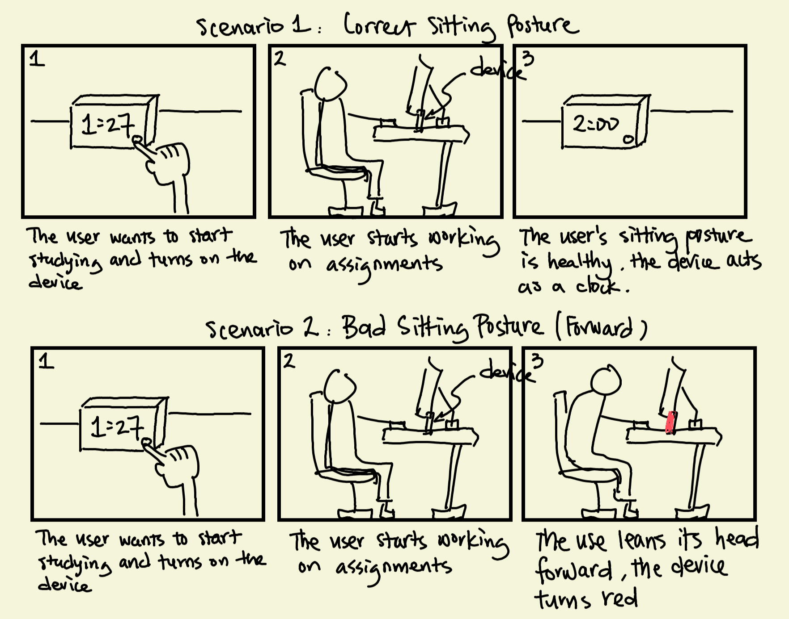

# Staging Interaction

\*\***Shiying Wu (Sophie), Mingzhe Sun (Allen)**\*\*

In the original stage production of Peter Pan, Tinker Bell was represented by a darting light created by a small handheld mirror off-stage, reflecting a little circle of light from a powerful lamp. Tinkerbell communicates her presence through this light to the other characters. See more info [here](https://en.wikipedia.org/wiki/Tinker_Bell). 

There is no actor that plays Tinkerbell--her existence in the play comes from the interactions that the other characters have with her.

For lab this week, we draw on this and other inspirations from theatre to stage interactions with a device where the main mode of display/output for the interactive device you are designing is lighting. You will plot the interaction with a storyboard, and use your computer and a smartphone to experiment with what the interactions will look and feel like. 

_Make sure you read all the instructions and understand the whole of the laboratory activity before starting!_

## Prep

### To start the semester, you will need:
1. Read about Git [here](https://git-scm.com/book/en/v2/Getting-Started-What-is-Git%3F).
2. Set up your own Github "Lab Hub" repository to keep all you work in record by [following these instructions](https://github.com/FAR-Lab/Developing-and-Designing-Interactive-Devices/blob/2021Fall/readings/Submitting%20Labs.md).
3. Set up the README.md for your Hub repository (for instance, so that it has your name and points to your own Lab 1) and [learn how to](https://guides.github.com/features/mastering-markdown/) organize and post links to your submissions on your README.md so we can find them easily.

### For this lab, you will need:
1. Paper
2. Markers/ Pens
3. Scissors
4. Smart Phone -- The main required feature is that the phone needs to have a browser and display a webpage.
5. Computer -- We will use your computer to host a webpage which also features controls.
6. Found objects and materials -- You will have to costume your phone so that it looks like some other devices. These materials can include doll clothes, a paper lantern, a bottle, human clothes, a pillow case, etc. Be creative!

### Deliverables for this lab are: 
1. 7 Storyboards
1. 3 Sketches/photos of costumed devices
1. Any reflections you have on the process
1. Video sketch of 3 prototyped interactions
1. Submit the items above in the lab1 folder of your class [Github page], either as links or uploaded files. Each group member should post their own copy of the work to their own Lab Hub, even if some of the work is the same from each person in the group.

### The Report
This README.md page in your own repository should be edited to include the work you have done (the deliverables mentioned above). Following the format below, you can delete everything but the headers and the sections between the **stars**. Write the answers to the questions under the starred sentences. Include any material that explains what you did in this lab hub folder, and link it in your README.md for the lab.

## Lab Overview
For this assignment, you are going to:

A) [Plan](#part-a-plan) 

B) [Act out the interaction](#part-b-act-out-the-interaction) 

C) [Prototype the device](#part-c-prototype-the-device)

D) [Wizard the device](#part-d-wizard-the-device) 

E) [Costume the device](#part-e-costume-the-device)

F) [Record the interaction](#part-f-record)

Labs are due on Mondays. Make sure this page is linked to on your main class hub page.

## Part A. Plan 

To stage an interaction with your interactive device, think about:

_Setting:_ Where is this interaction happening? (e.g., a jungle, the kitchen) When is it happening?

_Players:_ Who is involved in the interaction? Who else is there? If you reflect on the design of current day interactive devices like the Amazon Alexa, it’s clear they didn’t take into account people who had roommates, or the presence of children. Think through all the people who are in the setting.

_Activity:_ What is happening between the actors?

_Goals:_ What are the goals of each player? (e.g., jumping to a tree, opening the fridge). 

The interactive device can be anything *except* a computer, a tablet computer or a smart phone, but the main way it interacts needs to be using light.

\*\***Describe your setting, players, activity and goals here.**\*\*

As a student, we sit for a long time for lectures and completing assignments and tasks. Long periods of sitting without proper breaks and posture adjustments can lead to various negative consequences for our health and well-being.

_Setting:_ The device is strategically placed within a student's study space or workspace, positioned on the desk where the user sits to engage in their work or study activities. The interaction occurs when the device detects the user and provides a real-time sitting posture response.

_Players:_ The user of the device is the person who sits in front of the device. The device is purposefully designed to center its attention on this specific user, disregarding any other individuals who might be sharing the same workspace.

_Activity:_ The device's colors change in real-time, shifting towards red tones as the user's sitting posture becomes less healthy. This prompts the user to adjust their posture for improved ergonomics during their tasks.

_Goals:_ The goal of the user is to obtain a healthy sitting posture during work or study. The goal of the device is to successfully prompt and promote healthier sitting through real-time color feedback.

Storyboards are a tool for visually exploring a users interaction with a device. They are a fast and cheap method to understand user flow, and iterate on a design before attempting to build on it. Take some time to read through this explanation of [storyboarding in UX design](https://www.smashingmagazine.com/2017/10/storyboarding-ux-design/). Sketch seven storyboards of the interactions you are planning. **It does not need to be perfect**, but must get across the behavior of the interactive device and the other characters in the scene. 

\*\***Include pictures of your storyboards here**\*\*

Present your ideas to the other people in your breakout room (or in small groups). You can just get feedback from one another or you can work together on the other parts of the lab.

\*\***Summarize feedback you got here.**\*\*

We all agreed that this idea of encouraging better sitting posture is great. However, we're aware that if the user becomes annoyed by the device and turns it aside, its value will diminish. Additionally, we recognize that this device is more suitable for private spaces without others present. Exploring a more compact design that enhances portability could widen its applicability. We also think it would be better to not only remind users of their improper posture but also provide guidance on correct posture and potential exercises to help maintain their health.

## Part B. Act out the Interaction

Try physically acting out the interaction you planned. For now, you can just pretend the device is doing the things you’ve scripted for it. 

\*\***Are there things that seemed better on paper than acted out?**\*\*

When we actually acted out the scenario, we noticed that users might ignore the device when they're really focused on their tasks. The phone screen might not be bright enough to get their attention. We thought that adding some kind of sound or haptic feedback could help to make sure they notice the device's cues.

\*\***Are there new ideas that occur to you or your collaborators that come up from the acting?**\*\*

While acting out the scenario, we realized that there's potential to add more interactive elements to the device. The brief role-play also made me personally aware of how bad posture could lead to discomfort, like back pain. I even felt the need to stand up and stretch. This experience sparked the idea of incorporating a timer function into the device. This function could remind users to take breaks if they've been sitting for too long, which could be really helpful.

## Part C. Prototype the device

You will be using your smartphone as a stand-in for the device you are prototyping. You will use the browser of your smart phone to act as a “light” and use a remote control interface to remotely change the light on that device. 

Code for the "Tinkerbelle" tool, and instructions for setting up the server and your phone are [here](https://github.com/FAR-Lab/tinkerbelle).

We invented this tool for this lab! 

If you run into technical issues with this tool, you can also use a light switch, dimmer, etc. that you can can manually or remotely control.

\*\***Give us feedback on Tinkerbelle.**\*\*

The setup instructions are simple and easy to follow. However, we encountered difficulty using it with the campus WiFi (so we used a hotspot instead). Additionally, when an additional device joined, it displayed the default color instead of the color currently selected by the remote control. An improvement could involve incorporating a feature to manually enter RGB numbers.

## Part D. Wizard the device
Take a little time to set up the wizarding set-up that allows for someone to remotely control the device while someone acts with it. Hint: You can use Zoom to record videos, and you can pin someone’s video feed if that is the scene which you want to record. 

\*\***Include your first attempts at recording the set-up video here.**\*\*

Now, hange the goal within the same setting, and update the interaction with the paper prototype. 

\*\***Show the follow-up work here.**\*\*
- Device turns on/user presents in front of device: Black color (so user only see the clock)
- User's sitting posture changes: The worser the posture, the redder the device
- User corrects his/her posture: The device becomes black again to act like a clock

## Part E. Costume the device

Only now should you start worrying about what the device should look like. Develop three costumes so that you can use your phone as this device.

Think about the setting of the device: is the environment a place where the device could overheat? Is water a danger? Does it need to have bright colors in an emergency setting?

\*\***Include sketches of what your devices might look like here.**\*\*

Costume 1: Analog Style Clock

Costume 2: Digital Style Clock

Costume 3: Cute Style Clock

\*\***What concerns or opportunitities are influencing the way you've designed the device to look?**\*\*

Since our device acts like a clock when the user's sitting posture is correct, we designed the device to resemble a traditional timepiece. We've provided users with the choice between an analog-style clock and a digital-style clock, catering to varying preferences in time display. Moreover, we've taken into account the needs of children who also spend extended periods studying. As a result, we've introduced a cute-style clock option tailored for this audience.

## Part F. Record

\*\***Take a video of your prototyped interaction.**\*\*

\*\***Please indicate anyone you collaborated with on this Lab.**\*\*
Be generous in acknowledging their contributions! And also recognizing any other influences (e.g. from YouTube, Github, Twitter) that informed your design. 

_Collaborator_: Shiying Wu (Sophie), Mingzhe Sun (Allen)

# Staging Interaction, Part 2 

This describes the second week's work for this lab activity.

## Prep (to be done before Lab on Wednesday)

You will be assigned three partners from another group. Go to their github pages, view their videos, and provide them with reactions, suggestions & feedback: explain to them what you saw happening in their video. Guess the scene and the goals of the character. Ask them about anything that wasn’t clear. 

\*\***Summarize feedback from your partners here.**\*\*

## Make it your own

Do last week’s assignment again, but this time: 
1) It doesn’t have to (just) use light, 
2) You can use any modality (e.g., vibration, sound) to prototype the behaviors! Again, be creative! Feel free to fork and modify the tinkerbell code! 
3) We will be grading with an emphasis on creativity. 

\*\***Document everything here. (Particularly, we would like to see the storyboard and video, although photos of the prototype are also great.)**\*\*
