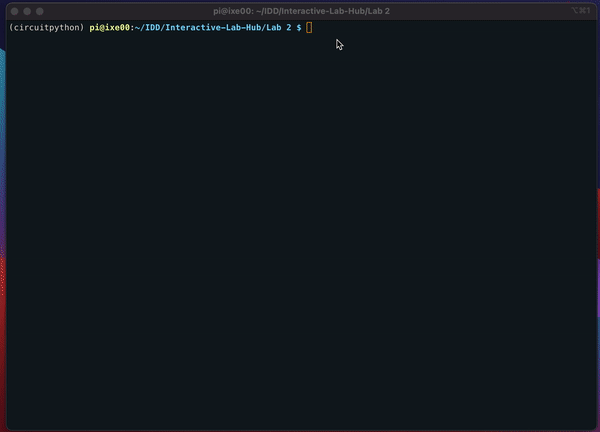

# The Clock of Pi

Does it feel like time is moving strangely during the pandemic?

For our first Pi project, we will pay homage to the [timekeeping devices of old](https://en.wikipedia.org/wiki/History_of_timekeeping_devices) by making simple clocks.

It is worth spending a little time thinking about how you mark time, and what would be useful in a clock of your own design.

## Acknowledgements and References

For this lab, I worked with Snigdha Singhania (ss4224). We worked in tandem on this project with group brainstorming as well as the actual building. 

A good deal of the images for our project were taken from external sources. These are credited below:
* [Sunrise Graphics](https://www.youtube.com/watch?v=JEEbmkDEQek)
* [Cheers Animation](https://www.youtube.com/watch?v=Gkb6bFdgSvM)
* [Soccer Animation](https://www.youtube.com/watch?v=TagGzVe1Xw0)
* Adafruit and Sparkfun API References were incredibly helpful for this lab
* [Goodnight Image](https://www.google.com/search?q=goodnight+cartoon&sxsrf=ALeKk00TRoLfzl6wrEQYCmJiSuwhtad6rA:1614306188304&tbm=isch&source=iu&ictx=1&fir=xyADWpXBPSBtmM%252CuYH3SdyNITyyeM%252C_&vet=1&usg=AI4_-kTyeizyNUFpTTtxMwJAu9keo2MQ6Q&sa=X&ved=2ahUKEwiKjKaXv4bvAhVJmuAKHclaDgUQ9QF6BAgTEAE&biw=1066&bih=1593#imgrc=xyADWpXBPSBtmM)
* [Go to Work Arrow](https://www.google.com/search?q=arrow+cartoon&sxsrf=ALeKk02MVPbAEMSeTQAq3d-l9WY6AJrikg:1614308797507&source=lnms&tbm=isch&sa=X&ved=2ahUKEwiAlLvzyIbvAhXiUd8KHeLfBzoQ_AUoAXoECCgQAw&biw=1066&bih=1593#imgrc=ksTzXuZQQdDHGM)
* [Wine Time Image](https://www.google.com/search?q=wine+time&tbm=isch&ved=2ahUKEwjtl-LNlY7vAhWcC98KHasIB7kQ2-cCegQIABAA&oq=wine+time&gs_lcp=CgNpbWcQAzIECAAQQzICCAAyAggAMgIIADICCAAyAggAMgIIADICCAAyAggAMgIIADoFCAAQsQM6BAgjECc6CggAELEDEIMBEEM6BwgAELEDEEM6CAgAELEDEIMBUJqMAViPmAFgtZkBaABwAHgAgAFRiAHzBJIBATmYAQCgAQGqAQtnd3Mtd2l6LWltZ8ABAQ&sclient=img&ei=smE8YO32CJyX_AarkZzICw&bih=1593&biw=1600#imgrc=hLPWJJV5Y7elWM)

## Inventory List

The [parts list](partslist.md) lists all of the items I have received for this course and what things I am still missing.

## Overview

A) [Connect to the Pi](#part-a)  

B) [Try out cli_clock.py](#part-b) 

C) [Set up your RGB display](#part-c)

D) [Try out clock_display_demo](#part-d) 

E) [Modify the code to make the display your own](#part-e)

F) [Make a short video of your modified barebones PiClock](#part-f)

G) [Sketch and brainstorm further interactions and features you would like for your clock for Part 2](#part-g)

## Part A. 
## Connect to the Raspberry Pi
Connecting to the pi and activating my working environment is achieved via the following commands:

```
sam@Sams-MacBook-Air ~ % ssh pi@100.64.4.253
pi@raspberrypi:~/Documents/Interactive-Lab-Hub$ cd Documents/Interactive-Lab-Hub
pi@raspberrypi:~/Documents/Interactive-Lab-Hub$ source circuitpython/bin/activate
(circuitpython) pi@raspberrypi:~/Documents/Interactive-Lab-Hub$ cd Lab\ 2
```

## Part B. 
## Command Line Clock
The [command line clock](cli_clock.py) is run via the following command: 

```
(circuitpython) pi@raspberrypi:~/Documents/Interactive-Lab-Hub/Lab 2$ python cli_clock.py 
02/24/2021 11:20:49
```
and simply writes the current time on the command line (exited via CTRL+C) with update.

This functionality is shown below:



## Part C. 
## Set up the RGB Display
The [Adafruit MiniPiTFT](https://www.adafruit.com/product/4393) is connected to the Raspberry Pi via the GPIO pins. <br>
<p float="center">

</b>

### IO Options on the Raspberry Pi

The Raspberry Pi 4 has a variety of interfacing options. When you plug the pi in the red power LED turns on. Any time the SD card is accessed the green LED flashes. It has standard USB ports and HDMI ports. Less familiar it has a set of 20x2 pin headers that allow you to connect a various peripherals.


To learn more about any individual pin and what it is for go to [pinout.xyz](https://pinout.xyz/pinout/3v3_power) and click on the pin. 

### Installing the MiniPiTFT

Line up the screen and press it on the headers. The hole in the screen should match up with the hole on the raspberry pi.

<p float="center">


</p>

### Testing the Screen

The display uses a communication protocol called [SPI](https://www.circuitbasics.com/basics-of-the-spi-communication-protocol/) to speak with the raspberry pi. The port on the bottom of the display connects to the SDA and SCL pins used for the I2C communication protocol. GPIO (General Purpose Input/Output) pins 23 and 24 are connected to the two buttons on the left. GPIO 22 controls the display backlight.

We can test it with the following command: 
```
(circuitpython) pi@raspberrypi:~/Documents/Interactive-Lab-Hub/Lab 2$ python screen_test.py
```

You can type the name of a color then press the top button to see the color you typed or the bottom button to see the color white. This functionality is shown below:


### Displaying Info
By running the following command:
```
(circuitpython) pi@raspberrypi:~/Documents/Interactive-Lab-Hub/Lab 2$ python stats.py
```
we can see a list of the Raspberry Pi's statistics such as the hardware's temperature.

### Displaying an image

You can look in `image.py` for an example of how to display an image on the screen. Can you make it switch to another image when you push one of the buttons?

## Part D. 
## Set up the Display Clock Demo

In `screen_clock.py`. Show the time by filling in the while loop. You can use the code in `cli_clock.py` and `stats.py` to figure this out.


## Part E.
## Modify the barebones clock to make it your own

Does time have to be linear?  How do you measure a year? [In daylights? In midnights? In cups of coffee?](https://www.youtube.com/watch?v=wsj15wPpjLY)

Can you make time interactive? You can look in `screen_test.py` for examples for how to use the buttons.

**A copy of your code should be in your Lab 2 Github repo.**

you can push to your personal github repo by adding the files here, commiting and pushing.

```
git add .
git commit -m'your message here'
git push
```

After that git will ask you to login to your github account to upload.

## Part F. 
## Make a short video of your modified barebones PiClock

Initial Demo (not completed): https://drive.google.com/file/d/1Wuj0UpV53kowGBfO9HtKEnyqDiX15kOf/view?usp=sharing

## Part G. 
## Sketch and brainstorm further interactions and features you would like for your clock for Part 2.


