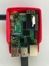

# Lab 2 Prep

### Get Kit and Inventory Parts
Prior to the lab session on Thursday, taken inventory of the kit parts that you have, and note anything that is missing:

***Update your [parts list inventory](partslist.md)***

### To finish this prelab, you will need:

- [Raspberry Pi 4](https://www.adafruit.com/product/4296)
- [Power Supply](https://www.adafruit.com/product/4298)
- [SD card + Reader](https://www.digikey.com/en/products/detail/seeed-technology-co-ltd/112990066/10290294)
- [Adafruit MiniPiTFT](https://www.adafruit.com/product/4393)

<!--Done this part for all the students already so no needs (Fall2021)
### Burn your Pi image to your SD card
#### On your computer download
- [Raspberry Pi Imager](https://www.raspberrypi.org/software/)
- Our Copy of Raspbian at [this dropbox link](https://www.dropbox.com/sh/2jt06jka7lg5z70/AAB6XnRWWais0wP5bOZ93upSa?dl=0), or use our ftp server here: ftp://farlab.infosci.cornell.edu/IXE_20210224.img.xz .
Download and use the ``.xz`` file in the Raspberry Pi Imager.

- If using windows: [Windows 10 SSH Client](https://docs.microsoft.com/en-us/windows/terminal/tutorials/ssh) or [PuTTY](https://www.putty.org/)

#### Setting up your OS
1. Plug the SD card into your computer using the card reader
2. Choose the downloaded file for "Choose OS" and the SD card for "Choose SD card" then hit write.
-->

### Setting up your OS for the Pi
1. The teaching team should have already burnt the required Pi image to your SD card for you to use on Pi directly. If not, go download and install the [Raspberry Pi Imager](https://www.raspberrypi.org/software/) on your laptop, download the the customed [image file](https://www.dropbox.com/sh/2jt06jka7lg5z70/AAB6XnRWWais0wP5bOZ93upSa?dl=0) we made for the class. Open the Raspberry Pi Imager and choose the downloaded image file from "Choose OS" and the SD card from "Choose SD card" then hit write.
2. When plugging the SD card reader (with SD card loaded) into your computer, you should be able to see a disk named "boot".
3. Locate the file ```wpa_supplicant.conf``` in the "boot" disk, you should be able to open it with any text editing programs. This file is meant for setting up the Pi to <a href=https://www.raspberrypi.org/documentation/configuration/wireless/headless.md>headless mode</a>.
4. The file contents should have the following text:

	````
	update_config=1
	country=US

	ctrl_interface=DIR=/var/run/wpa_supplicant GROUP=netdev
	network={
	    ssid="The House"
	    key_mgmt=NONE
	}
	
	ctrl_interface=DIR=/var/run/wpa_supplicant GROUP=netdev
	network={
	    ssid="DeviceFarm"
	    psk="device@theFarm"
	    key_mgmt=WPA-PSK
	}
	
	ctrl_interface=DIR=/var/run/wpa_supplicant GROUP=netdev
	network={
	    ssid="RedRover"
	    key_mgmt=NONE
	}
	````
    The listed network information will be searched by your Raspberry Pi in sequence when it boots up and tryies to connect to available network. If the network you are planning to use is not listed, make sure to update the above contents with your own network information, that is, you should change the contents of ```ssid``` and ```psk``` or just add an additional one. Make sure your laptop is on the same network you are planning to use so that later you can access to your Raspberry Pi.

3. Eject or unmount the microSD card reader, and then remove the SD card from the reader and reinsert it into SD card slot on the Pi: it is located on the bottom (silver rectangle on the right).


4. Take and connect the Adafruit MiniPiTFT to your pi with the configuration shown below, the MiniPiTFT should be on the top left corner of your Pi.



5. Boot the Pi by connecting it to a power source with USB-C connector.

### Setting up your Pi to run in headless mode

#### Connecting to your Pi remotely

Unlike your laptop, the Pi doesn't come with its own keyboard or mouse. While you could plug in a monitor, keyboard, and mouse we will be connecting to your Pi over [SSH](https://en.wikipedia.org/wiki/Secure_Shell). You can do this in [Mac Terminal](https://blog.teamtreehouse.com/introduction-to-the-mac-os-x-command-line) or [Windows 10 SSH Client](https://docs.microsoft.com/en-us/windows/terminal/tutorials/ssh). Make sure you connect your laptop to the same network as you entered in your `wpa_supplicant.conf` above.

1. When you boot up your Pi, the MiniPiTFT should have the following information shown:
	
	````
	IP: xxx.xxx.xxx.xxx
	MAC: xx:xx:xx:xx:xx:xx
	NET: [YourWifiNetwork]
	````
	
	The IP address is what you will need to SSH your Pi later through the same network. The media access control address (MAC address) is a unique identifier assigned to a network interface controller, you will need it later for registering the device if you are using Cornell network (e.g. RedRover). The NET shows which WiFi network your Pi is connected to.
	
	For MAC address: If you are planning to use Cornell network (e.g. RedRover and eduroam), you will have to register the device (your Pi) to the Cornell System to get it online. Please follow the instructions [here](https://it.cornell.edu/wifi-wired/register-device-doesnt-have-browser) from Cornell. If you are using the House network, you will need to register the device (your Pi) through [Boingo](https://support.boingo.com/s/article/How-do-I-add-and-remove-devices-from-my-account). You might need to wait for a few minutes for your Pi to actually get online after registering it.

2. Verify your Pi is online. In the terminal of your laptop, type `ping <Your Pi's IP Address shown on the MiniPiTFT>` and press enter. If your Pi is online, you should get similar messages as below (with different IP address):
    	
	```shell
	$ ping 192.168.1.131
	PING 192.168.1.131 (192.168.1.131): 56 data bytes
	64 bytes from 192.168.1.131: icmp_seq=0 ttl=64 time=252.118 ms
	64 bytes from 192.168.1.131: icmp_seq=1 ttl=64 time=10.331 ms
	64 bytes from 192.168.1.131: icmp_seq=2 ttl=64 time=10.209 ms
	64 bytes from 192.168.1.131: icmp_seq=3 ttl=64 time=14.816 ms
	^C
	--- 192.168.1.131 ping statistics ---
	4 packets transmitted, 4 packets received, 0.0% packet loss
	round-trip min/avg/max/stddev = 10.209/71.868/252.118/104.084 ms
	```
	
	You can use `control-C` to interrupt and exit the ping (press the `control` key, and while holding it down, also press the `C` key, then let go of both together--this looks like `^C` in the terminal).

3. Once your Pi is online, you can go ahead and SSH into the Pi. In the terminal of your laptop, type in the command
	
	```
	$ ssh pi@<Your Pi's IP Address shown on the MiniPiTFT>
	```
	
	When you first log in it, the terminal will show you a "fingerprint" and ask you whether you want to continue connecting. Type `yes` and press enter. 
	
	````
	```shell
	$ ssh pi@192.168.1.131
	The authenticity of host '192.168.1.131' can't be established.
	ECDSA key fingerprint is SHA256:Y9S4oMH2H70fz3K/L42Kw39k+zkpyfr0DmGdzBx7SKk.
	Are you sure you want to continue connecting (yes/no)? yes
	```
	After you authorize the SSH, you should get the following message asking you to provide the Pi's password.
	```
	Warning: Permanently added '10.58.130.183' (ECDSA) to the list of known hosts.
	pi@192.168.1.131's password:
	```
	````
	
	The initial setting of your Pi's password is `raspberry`, type it and press enter. Note: the terminal will not show what you type for security so do not worry about it and just make sure you type the correct password. After that, you should see something similar to this:	
	
	````
	```shell
	pi@192.168.1.131's password:
	Linux ixe00 4.9.59-v7+ #1047 SMP Sun Oct 29 12:19:23 GMT 2017 armv7l
	
	The programs included with the Debian GNU/Linux system are free software;
	the exact distribution terms for each program are described in the
	individual files in /usr/share/doc/*/copyright.
	
	Debian GNU/Linux comes with ABSOLUTELY NO WARRANTY, to the extent
	permitted by applicable law.
	Last login: Wed Jan 17 10:42:03 2018
	
	SSH is enabled and the default password for the 'pi' user has not been changed.
	This is a security risk - please log
	
	in as the 'pi' user and type 'passwd' to set a new password.
	
	pi@ixe00:~ $ 
	```
	````
	
	This means you are signed in and your terminal is now connected directly to the 'terminal' on your Pi, via `ssh`. You can tell this by looking at the user and hostname at the beginning of each line, which should now look like:

	```shell
	pi@ixe00 ~ $
	```


### Change the password of your Pi

Because the Pi asked you to! Also to keep your Pi from getting hacked. Write it down somewhere because we do not know how to recover lost passwords on the Pi. In the terminal on your Pi, type `sudo raspi-config` and press enter, you should be able to see the manual of your Pi:


Choose '1. System Options' and 'S3 Password', they terminal will then ask you to enter your new password. Again, the terminal will not show what you type for security so do not worry about it and just make sure you type the correct new password twice. After you change the password successfully, you will have to use the new password next time you SSH to your Pi.


### Refresh your knowledge of command line interfaces: 

The command line/terminal is a powerful way to interact with your computer without using a Graphical User Interface (GUI). When you SSH onto your Pi, you have a prompt you can enter commands. In your terminal there is a shell, there are many shells but for this class we will use one of the most common **bash**

	````
	pi@ixe00:~ $ echo $SHELL
	/bin/bash
	````
In the code above we've typed `echo $SHELL`. The `echo` tells it to print something to the screen. You could try typing `echo 'hello'` to see how that works for strings. The `$` at the front of `$SHELL` tells bash we are referring to a variable. In this case it is a variable the OS is using to store the shell program. In a folder `/bin` is a program called bash that we are currently using. The up arrow with show the most recent command.


#### Navigation in the command line

There are many commands you can use in the command line, they can take a variety of options that change how they are used. You can look these up online to learn more. Many commands have a manual page with documentation that you can see directly in the terminal by typing `man [command]`. For example:

	```shell
	pi@ixe00:~ $ man echo
	ECHO(1)                           User Commands                          ECHO(1)
	
	NAME
	       echo - display a line of text
	SYNOPSIS
	       echo [SHORT-OPTION]... [STRING]...
	       echo LONG-OPTION
	DESCRIPTION
	       Echo the STRING(s) to standard output.
	       -n     do not output the trailing newline
	       -e     enable interpretation of backslash escapes
	       -E     disable interpretation of backslash escapes (default)
	       --help display this help and exit
	       --version
	Manual page echo(1) line 1 (press h for help or q to quit)
	```	
These are some useful commands. Read the manual pages for advanced usage.
	
* `pwd` - print working directory, tells us where on the computer we are
* `ls` - list the things in the current directory. 
* `cd` - change directory. This lets you move to another folder on your machine.
* `mkdir` - make directory. You can create directories with this command
*  `cp` - copy a file. You can copy from one place to any other place
*  `mv` - move a file, also used to rename a file
*  `rm` -  delete a file. To delete a folder you need the recursive flag `rm -r [folder]`
*  `cat` - view a file
*  `nano` - this is a text editor (there are many) that will let you edit files in terminal.
 
There is plenty more to learn about using the terminal to navigate a computer but this should give a good start for getting around the raspberry pi.


### Using VNC to see your Pi desktop
Another convenient way to remotely connect to your Pi is using VNC (Virtual Network Computing), it essentially is remote login. The easiest client to use is [VNC Connect](https://www.realvnc.com/en/connect/download/viewer/). Download and install it. Once that's done type the IP address of your Pi in the text-box at the top. 


After that a login window should appear, use your normal logins (originally: Account=pi, Password=raspberry).


At that point the normal RPi desktop should appear and you can start and stop programs from here. 


