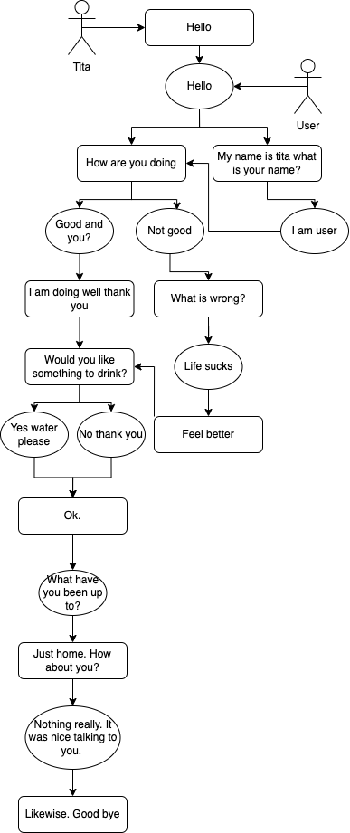

# Chatterboxes
**Carlos Ponce**
[](https://www.youtube.com/embed/Q8FWzLMobx0?start=19)

In this lab, we want you to design interaction with a speech-enabled device--something that listens and talks to you. This device can do anything *but* control lights (since we already did that in Lab 1).  First, we want you first to storyboard what you imagine the conversational interaction to be like. Then, you will use wizarding techniques to elicit examples of what people might say, ask, or respond.  We then want you to use the examples collected from at least two other people to inform the redesign of the device.

We will focus on **audio** as the main modality for interaction to start; these general techniques can be extended to **video**, **haptics** or other interactive mechanisms in the second part of the Lab.

## Prep for Part 1: Get the Latest Content and Pick up Additional Parts 

### Pick up Web Camera If You Don't Have One

Students who have not already received a web camera will receive their [IMISES web cameras](https://www.amazon.com/Microphone-Speaker-Balance-Conference-Streaming/dp/B0B7B7SYSY/ref=sr_1_3?keywords=webcam%2Bwith%2Bmicrophone%2Band%2Bspeaker&qid=1663090960&s=electronics&sprefix=webcam%2Bwith%2Bmicrophone%2Band%2Bsp%2Celectronics%2C123&sr=1-3&th=1) on Thursday at the beginning of lab. If you cannot make it to class on Thursday, please contact the TAs to ensure you get your web camera. 

### Get the Latest Content

As always, pull updates from the class Interactive-Lab-Hub to both your Pi and your own GitHub repo. There are 2 ways you can do so:

**\[recommended\]**Option 1: On the Pi, `cd` to your `Interactive-Lab-Hub`, pull the updates from upstream (class lab-hub) and push the updates back to your own GitHub repo. You will need the *personal access token* for this.

```
pi@ixe00:~$ cd Interactive-Lab-Hub
pi@ixe00:~/Interactive-Lab-Hub $ git pull upstream Fall2022
pi@ixe00:~/Interactive-Lab-Hub $ git add .
pi@ixe00:~/Interactive-Lab-Hub $ git commit -m "get lab3 updates"
pi@ixe00:~/Interactive-Lab-Hub $ git push
```

Option 2: On your your own GitHub repo, [create pull request](https://github.com/FAR-Lab/Developing-and-Designing-Interactive-Devices/blob/2022Fall/readings/Submitting%20Labs.md) to get updates from the class Interactive-Lab-Hub. After you have latest updates online, go on your Pi, `cd` to your `Interactive-Lab-Hub` and use `git pull` to get updates from your own GitHub repo.

## Part 1.

### Text to Speech 

In this part of lab, we are going to start peeking into the world of audio on your Pi! 

We will be using the microphone and speaker on your webcamera. In the home directory of your Pi, there is a folder called `text2speech` containing several shell scripts. `cd` to the folder and list out all the files by `ls`:

```
pi@ixe00:~/text2speech $ ls
Download        festival_demo.sh  GoogleTTS_demo.sh  pico2text_demo.sh
espeak_demo.sh  flite_demo.sh     lookdave.wav
```

You can run these shell files by typing `./filename`, for example, typing `./espeak_demo.sh` and see what happens. Take some time to look at each script and see how it works. You can see a script by typing `cat filename`. For instance:

```
pi@ixe00:~/text2speech $ cat festival_demo.sh 
#from: https://elinux.org/RPi_Text_to_Speech_(Speech_Synthesis)#Festival_Text_to_Speech

echo "Just what do you think you're doing, Dave?" | festival --tts
```

Now, you might wonder what exactly is a `.sh` file? Typically, a `.sh` file is a shell script which you can execute in a terminal. The example files we offer here are for you to figure out the ways to play with audio on your Pi!

You can also play audio files directly with `aplay filename`. Try typing `aplay lookdave.wav`.

\*\***Write your own shell file to use your favorite of these TTS engines to have your Pi greet you by name.**\*\*
(This shell file should be saved to your own repo for this lab.)
This file is named greeting.sh

Bonus: If this topic is very exciting to you, you can try out this new TTS system we recently learned about: https://github.com/rhasspy/larynx

### Speech to Text

Now examine the `speech2text` folder. We are using a speech recognition engine, [Vosk](https://alphacephei.com/vosk/), which is made by researchers at Carnegie Mellon University. Vosk is amazing because it is an offline speech recognition engine; that is, all the processing for the speech recognition is happening onboard the Raspberry Pi. 

In particular, look at `test_words.py` and make sure you understand how the vocab is defined. 
Now, we need to find out where your webcam's audio device is connected to the Pi. Use `arecord -l` to get the card and device number:
```
pi@ixe00:~/speech2text $ arecord -l
**** List of CAPTURE Hardware Devices ****
card 1: Device [Usb Audio Device], device 0: USB Audio [USB Audio]
  Subdevices: 1/1
  Subdevice #0: subdevice #0
```
The example above shows a scenario where the audio device is at card 1, device 0. Now, use `nano vosk_demo_mic.sh` and change the `hw` parameter. In the case as shown above, change it to `hw:1,0`, which stands for card 1, device 0.  

Now, look at which camera you have. Do you have the cylinder camera (likely the case if you received it when we first handed out kits), change the `-r 16000` parameter to `-r 44100`. If you have the IMISES camera, check if your rate parameter says `-r 16000`. Save the file using Write Out and press enter.

Then try `./vosk_demo_mic.sh`

\*\***Write your own shell file that verbally asks for a numerical based input (such as a phone number, zipcode, number of pets, etc) and records the answer the respondent provides.**\*\*
This file is named zipcode.sh

### Serving Pages

In Lab 1, we served a webpage with flask. In this lab, you may find it useful to serve a webpage for the controller on a remote device. Here is a simple example of a webserver.

```
pi@ixe00:~/Interactive-Lab-Hub/Lab 3 $ python server.py
 * Serving Flask app "server" (lazy loading)
 * Environment: production
   WARNING: This is a development server. Do not use it in a production deployment.
   Use a production WSGI server instead.
 * Debug mode: on
 * Running on http://0.0.0.0:5000/ (Press CTRL+C to quit)
 * Restarting with stat
 * Debugger is active!
 * Debugger PIN: 162-573-883
```
From a remote browser on the same network, check to make sure your webserver is working by going to `http://<YourPiIPAddress>:5000`. You should be able to see "Hello World" on the webpage.

### Storyboard

Storyboard and/or use a Verplank diagram to design a speech-enabled device. (Stuck? Make a device that talks for dogs. If that is too stupid, find an application that is better than that.) 

\*\***Post your storyboard and diagram here.**\*\*


Write out what you imagine the dialogue to be. Use cards, post-its, or whatever method helps you develop alternatives or group responses. 

\*\***Please describe and document your process.**\*\*





My idea came very quickly to me. My grandma does not speak english but luckily we both speak spanish.
This lead me to create a device that allows people to communicate to one another regardless of language.
Ideally the device would detect the language being spoken and then translate. It would make the conversation more seamless and less awkward.
I really wanted to work on this problem and didn't think about any other type of voice activated devices. 


### Acting out the dialogue

Find a partner, and *without sharing the script with your partner* try out the dialogue you've designed, where you (as the device designer) act as the device you are designing.  Please record this interaction (for example, using Zoom's record feature).
[](https://www.youtube.com/watch?v=CLEDTn4YBsM)

\*\***Describe if the dialogue seemed different than what you imagined when it was acted out, and how.**\*\*

I found it difficult nailing down what anyone might say to Tita. It is almost impossible to guess what someone might say to her. 
Depending on how well they know her they might come up with different things. Since she had recently gone to Florida that came up.
However I didn't think that would come up. Another thing I noticed was subtle reactions people had. Sometimes people had a little reaction 
before moving on to another topic. That could be difficult as the translator would have to account for that. Lastly, I am  not sure how 
to handle people who might speak a little of the other language. They might speak both languages in the same sentence which would throw off
the pi. 

### Wizarding with the Pi (optional)
In the [demo directory](./demo), you will find an example Wizard of Oz project. In that project, you can see how audio and sensor data is streamed from the Pi to a wizard controller that runs in the browser.  You may use this demo code as a template. By running the `app.py` script, you can see how audio and sensor data (Adafruit MPU-6050 6-DoF Accel and Gyro Sensor) is streamed from the Pi to a wizard controller that runs in the browser `http://<YouPiIPAddress>:5000`. You can control what the system says from the controller as well!

\*\***Describe if the dialogue seemed different than what you imagined, or when acted out, when it was wizarded, and how.**\*\*

# Lab 3 Part 2

For Part 2, you will redesign the interaction with the speech-enabled device using the data collected, as well as feedback from part 1.

## Prep for Part 2

1. What are concrete things that could use improvement in the design of your device? For example: wording, timing, anticipation of misunderstandings...

A major improvement my design needed was a way to regulate speech. Sometimes people can go on longer than the recording would allow. 
Because of this I wanted to find a way to let them know when to begin and when to stop. Another issue is knowing when to translate what. 
When i first imagine the device I pictured a conversation bouncing back and forth people. However sometimes this doesnt always happen and something would need to be done. 


2. What are other modes of interaction _beyond speech_ that you might also use to clarify how to interact?

I think making use of the buttons would be great so people can prepare themselves to talk. It also be helpful to see when the device is recoding and when it is not. 


3. Make a new storyboard, diagram and/or script based on these reflections.


## Prototype your system

The system should:
* use the Raspberry Pi 
* use one or more sensors
* require participants to speak to it. 

*Document how the system works*

*Include videos or screencaptures of both the system and the controller.*

[](https://www.youtube.com/watch?v=4T-vU5wmZLo)

## Test the system
Try to get at least two people to interact with your system. (Ideally, you would inform them that there is a wizard _after_ the interaction, but we recognize that can be hard.)

Answer the following:

### What worked well about the system and what didn't?
\*\**I think it helped having buttons allowing the user to pick the langue they were about to speak in. It solved the issue in which a person can say back to back things. The color changing screen is also very helpful in telling people when to stop talking. However capturing speech was difficult. It didn't give enough people to think as they talked since the recording would just stop. Another issue was the translations themselves. They were not very accurate.*\*\*


### What worked well about the controller and what didn't?
\*\**I think being able to press an actual button was better than a virtual prompt or typing something into console. I also liked how simple it was to use. It was just click and talk. It makes it very easy for anyone and everyone to use it. I wish I was able to have more support for other languages as well. The next iteration would most likely include this. *\*\*


### What lessons can you take away from the WoZ interactions for designing a more autonomous version of the system?

\*\**I think using some of the sensors provided might be a good idea. Using the LEDs instead of screen would've been another option to have considered. Another take away is creating a transcript of what was already said. This would let people quickly go back to what other people said.  *\*\*

### How could you use your system to create a dataset of interaction? What other sensing modalities would make sense to capture?

\*\**I think conversations had while using the device can be saved. The data of both what a person says and what is translated is already there. It just simply needs to be save elsewhere. That is really the only data that makes sense to capture. *\*\*

