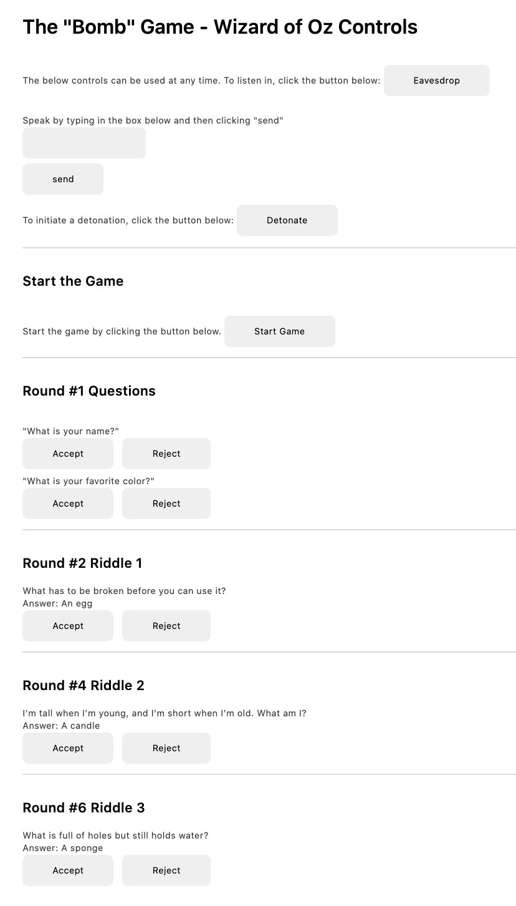
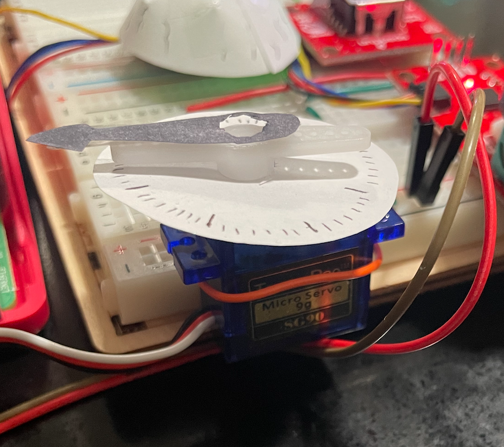
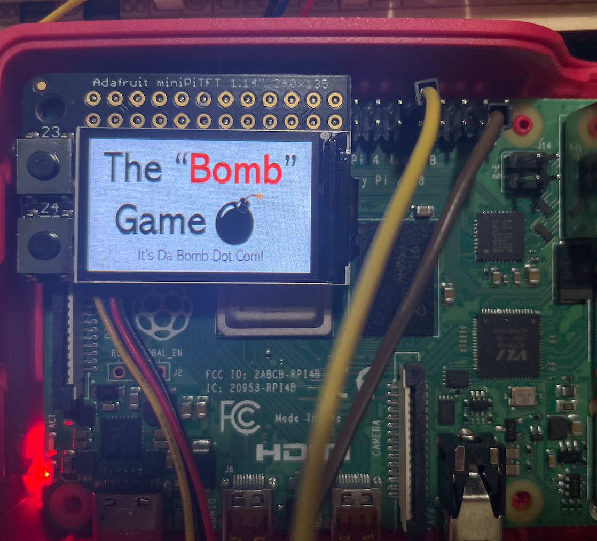
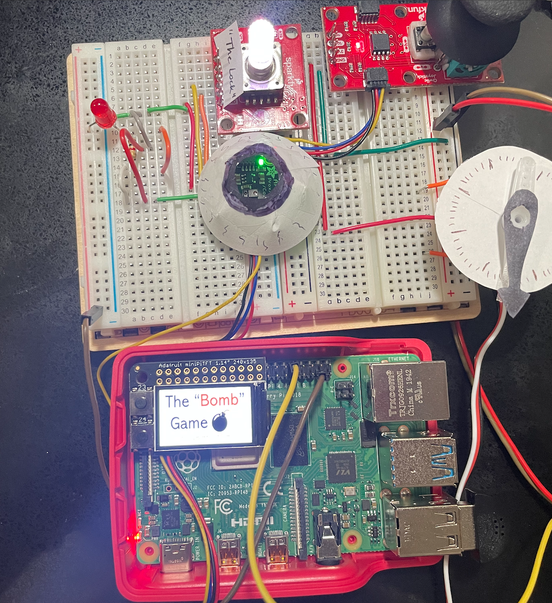
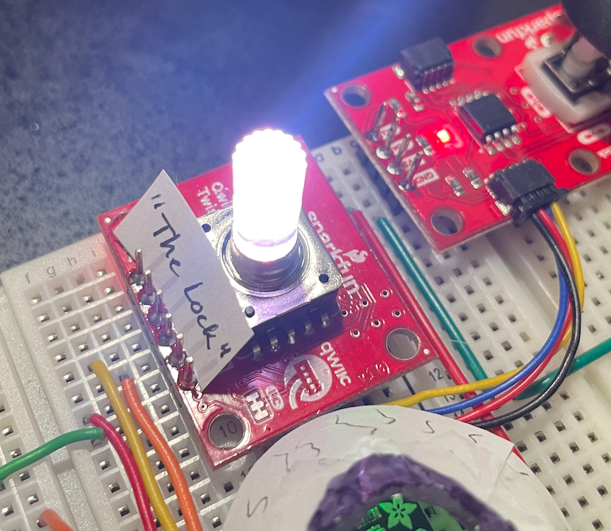
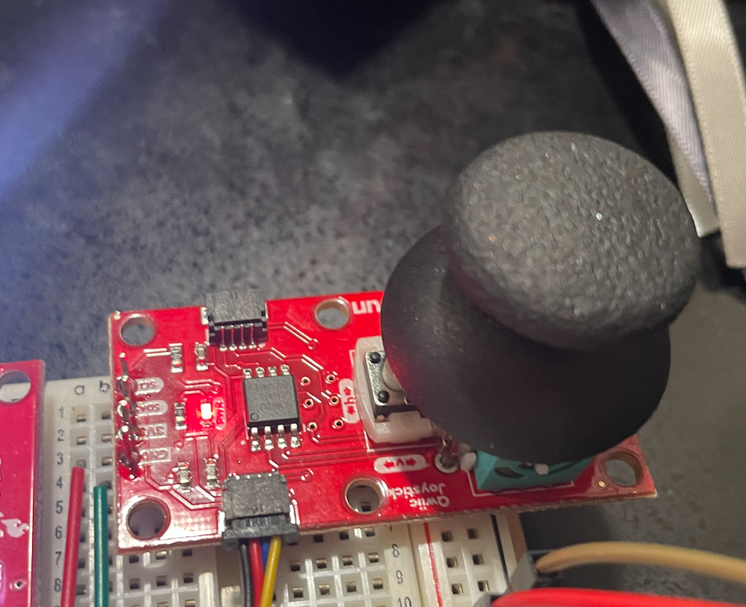
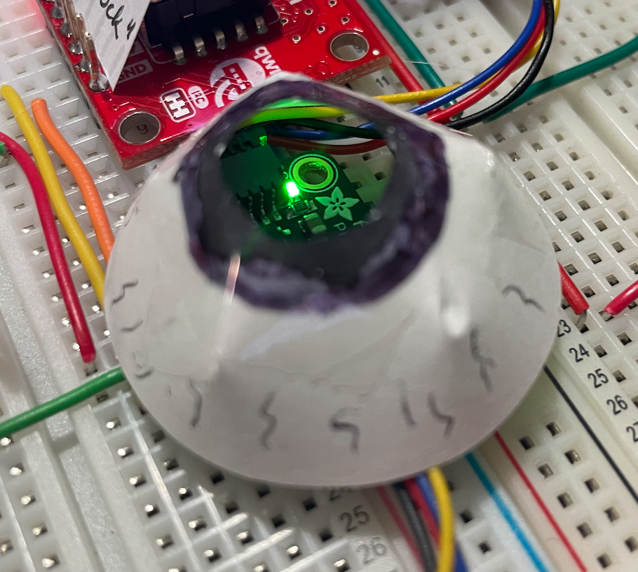
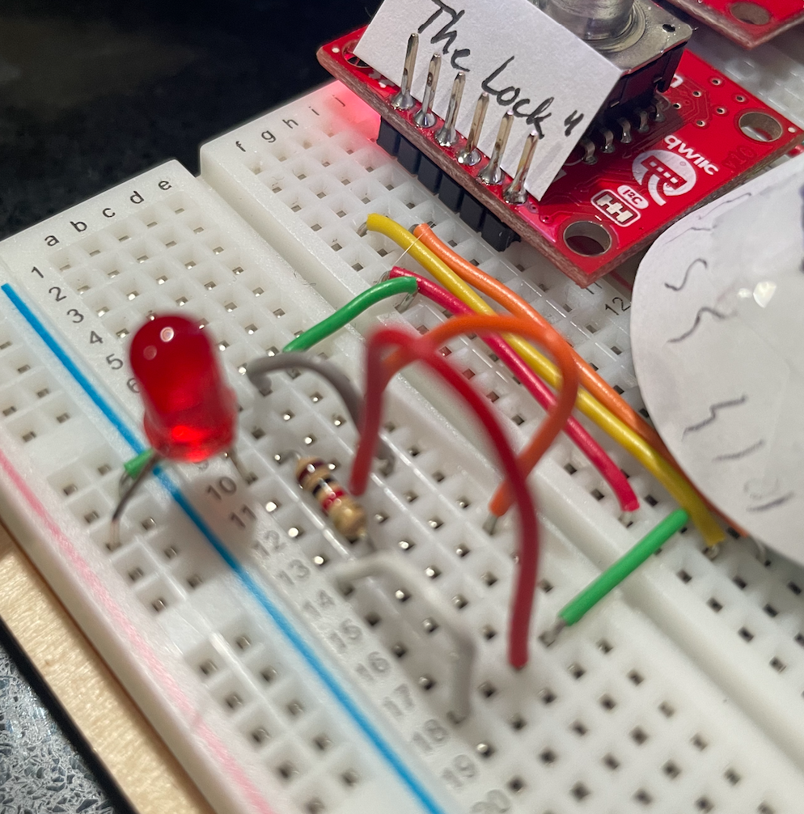

# You're a wizard, Sam


In this lab, we want you to practice wizarding an interactive device as discussed in class. We will focus on audio as the main modality for interaction but there is no reason these general techniques can't extend to video, haptics or other interactive mechanisms. In fact, you are welcome to add those to your project if they enhance your design.

## Acknowledgements
I would like to thank Shivani Doshi, Ritika Poddar, and Ilan Mandel for brainstorming with me and giving feedback on my project idea. The exact feedback is listed in Part 2 below.

Animations and images were taken from the following sources:
* Explosion video: https://www.youtube.com/watch?v=bhZs3ALdL7Y
* Game over image: https://www.jing.fm/iclipt/hoJxTT/

## Text to Speech and Speech to Text

The demo `text2speech` files:

```
pi@ixe00:~/text2speech $ ls
Download        festival_demo.sh  GoogleTTS_demo.sh  pico2text_demo.sh
espeak_demo.sh  flite_demo.sh     lookdave.wav

```

were run and resulted in the following:

[](https://drive.google.com/file/d/1V3xPS5feFjIEdYPoxQkmjCmJgabt5b9p/view?usp=sharing)

Similarly, running `./vosk_demo_mic.sh` and saying `One Two Three` resulted in the following printout from `speech2text`:
```
{
  "result" : [{
      "conf" : 1.000000,
      "end" : 2.340000,
      "start" : 1.980000,
      "word" : "one"
    }, {
      "conf" : 1.000000,
      "end" : 3.030000,
      "start" : 2.520000,
      "word" : "two"
    }, {
      "conf" : 1.000000,
      "end" : 3.600000,
      "start" : 3.090000,
      "word" : "three"
    }],
  "text" : "one two three"
}
```

Showing that Vosk was accurately hearing my words and interpreting them properly.

## Serving Pages

The simple webserver was called with the following command:

```
(idd_env) pi@ixe00:~/Documents/Interactive-Lab-Hub/Lab 3$ python server.py
```

Navigating to http://ixe00.local:5000]() resulted in a simple "Hello World" webpage:

[

## Demo

In the [demo directory](wizard_app), an example wizard of oz project template with the following command:

```
(idd_env) pi@ixe00:~/Documents/Interactive-Lab-Hub/Lab 3/demo $ python app.py
```

In that project, audio and sensor data is streamed from the Pi to a wizard controller that runs in the browser. You can control what system says from the controller as well. You can see the demo running below:


Where the top graph is showing an accelerometer's reading, the `Eavesdrop` button allows you to hear what a person is saying via the microphone, and the `Speak` box allows you to type in the box and have the pi say whatever you type.

## Optional

There is an included [dspeech](.dspeech) demo that uses [Mozilla DeepSpeech](https://github.com/mozilla/DeepSpeech) for speech to text. This is run with the following command:

```
(dspeech_env) pi@ixe00:~/Documents/Interactive-Lab-Hub/Lab 3/dspeech $ python deepspeech_demo.py -m deepspeech-0.9.3-models.tflite -s deepspeech-0.9.3-models.scorer
```

While the system consistently misses the first word that I say as it is just recognizing that I'm speaking then, it interprets my words fairly well. Here's the output from a test I ran:

```
Recognized: testing testing testing
Recognized: hello can you hear me i'm talking to you
Recognized: i am talking to you right now and you are interpreting everything that i say
```

# Lab 3 Part 2

Create a system that runs on the Raspberry Pi that takes in one or more sensors and requires participants to speak to it. Document how the system works and include videos of both the system and the controller

## Prep for Part 2
I've decided to make a "bomb" game. The user has to perform various tasks, including solving riddles, in order to "diffuse" the bomb and win the game. The process I've decided on is sketched below:


## Get feedback
I pitched this idea to four people: Shivani Doshi, Ritika Poddar, Dhanya Lakshmi, and Ilan Mandel. Their thoughts are mentioned below:

From Shivani:
```
Shivani thought it was a cool idea. She suggested some fun questions the bomb could ask the player and how animations could be shown on the miniPiTFT.
```

From Ritika:
```
She liked the idea and we spent some time talking about applications of the proximity sensor in both of our projects.
```

From Dhanya:
```
Lean into the Monty Python theme and have the system say "Ni!" everytime the user gets too close.
```

From Ilan:
```
Ilan thought it was a cool idea. He suggested also using the proximity sensor as a color sensor and sending the player on tasks to bring the bomb things of a specific color. I like this idea a lot and it will be incorporated into the task list.
```

## Prototype your system
The Bomb Game was built with the following stages of operation. With each stage listed below, the component(s) used and the wizarding technique applied are stated in detail. 

### Introduction

**Main Component(s):** speaker, servo motor, and pi screen
**Is Wizarded?:** Yes

To start, I click the "Start" button on the Wizard of Oz page which prompts the Bomb Game to begin its introduction. The wizarding page is shown below:



You'll notice that this page has a number of other controls above the start button including:
* "Eavesdrop": which was provided for this lab and allows me to hear what the user is saying via a mini USB microphone plugged into the pi
* "Speak": which allows me to type out a message and say anything to the user at anytime through the system
* "Detonate": which allows me to bypass any of the system's actions and initiate a "detonation" whenever I want

When the "Start" button is pressed, the servo motor also begins moving to emulate a count down clock and add suspense and the pi screen shows a logo for the game.





The entire view of the game is shown below:



### Round 1: Answer intro questions

**Main Component(s):** speaker and wizarding portal
**Is Wizarded?:** Yes

This round asks a couple questions that are referencing the one and only illustrious Monty Python and The Holy Grail. The logic for this round is as follows:
* Question 1: What is your name?
    * The user can reply in any way that they want. The system's response here is wizarded as I can choose on the wizarding page to either accept or reject their response.
    * If I accept their response, the system moves on to the next question.
    * If i reject their response, the system says "That is not your name. Name rejected." and begins the detonation sequence.
* Question 2: What is your favorite color?
    * Again, the system's response here is wizarded as I can choose to either accept or reject their response.
    * If I accept their response, the system moves on to round 2.
    * If I reject their response, the system says "How do you not know your favorite color? Color rejected." and begins the detonation sequence. 

### Round 2: Answer a riddle

**Main Component(s):** speaker and wizarding portal
**Is Wizarded?:** Yes

This round just asks the user to answer a single riddle: "What has to be broken before you can use it?" The answer is "an egg." While the system's response here is also wizarded here where I can accept or reject their answer through the wizarding portal. I only accept the user's answer when they answer correctly. When the answer is accepted, the system moves on to round 3. When the answer is rejected, the system says "That is incorrect. And that was the easy one...awkward" and the detonation sequence begins.

### Round 3: Crack the lock

**Main Component(s):** speaker, rotary encoder, and screen
**Is Wizarded?:** No

This round challenges the user's skills with basic algebra and asks them to "crack" the lock on the system (similar concept as cracking a safe). When the user is presented a math problem, they are also told which direction to turn the rotary encoder. The user should turn the rotary encoder in that direction as many times as is the answer to the problem presented. the math equations are also shown on the screen to make the task easier for the user. 



The four questions asked for this round are as follows:
* Question 1: Turn the lock clockwise 2 * 2 + 3 times
    * If the user turns the rotary encoder clockwise 7 times, the system automatically registers this and proceeds to the next question.
    * if the user fails to turn the rotary encoder clockwise exactly 7 times, the system alerts them to an incorrect answer and begins the detonation sequence.
* Question 2: Turn the lock counter-clockwise 6 % 2 + 2 times
    * If the user turns the rotary encoder counter-clockwise 2 times, the system automatically registers this and proceeds to the next question.
    * if the user fails to turn the rotary encoder counter-clockwise exactly 2 times, the system alerts them to an incorrect answer and begins the detonation sequence.
* Question 3: Turn the lock clockwise (10 * 2 + 4) / 8 times
    * If the user turns the rotary encoder clockwise 3 times, the system automatically registers this and proceeds to the next question.
    * if the user fails to turn the rotary encoder clockwise exactly 3 times, the system alerts them to an incorrect answer and begins the detonation sequence.
* Question 4: Turn the lock counter-clockwise 6 * 6 / 3 - 7 times
    * If the user turns the rotary encoder counter-clockwise 5 times, the system automatically registers this and proceeds to the next round.
    * if the user fails to turn the rotary encoder counter-clockwise exactly 5 times, the system alerts them to an incorrect answer and begins the detonation sequence.

### Round 4: Answer a riddle

**Main Component(s):** speaker and wizarding portal
**Is Wizarded?:** Yes

This round just asks the user to answer another riddle: "I’m tall when I’m young, and I’m short when I’m old. What am I?" The answer is "a candle." While the system's response here is again wizarded here where I can accept or reject their answer through the wizarding portal. I only accept the user's answer when they answer correctly. When the answer is accepted, the system moves on to round 5. When the answer is rejected, the system tells the user their response was incorrect and the detonation sequence begins.

### Round 5: Decode the system

**Main Component(s):** speaker, screen, and joystick
**Is Wizarded?:** No

For this round, the user is asked to mimic the arrows on the screen and the spoken commands with actions with the joystick. 



As the system tells the user a direction, an arrow appears on the screen. The joystick is aligned with the screen in order to ensure that the user simply has to move the joystick in the same direction as the arrows in order to proceed. The user is asked to push the joystick in 7 directions in the following order: up, down, left, up, down, right, up. If the user moves the joystick in the wrong direction for any of these movements, the system automatically tells them "You were unsuccessful at decoding the system" and begins the detonation sequence. Otherwise, the user is told they were successful and the system automatically moves on to round 6.

### Round 6: Answer a riddle

**Main Component(s):** speaker and wizarding portal
**Is Wizarded?:** Yes

This round just asks the user to answer one more riddle: "What is full of holes but still holds water?" The answer is "a sponge." While the system's response here is again wizarded here where I can accept or reject their answer through the wizarding portal. I only accept the user's answer when they answer correctly. When the answer is accepted, the system moves on to round 5. When the answer is rejected, the system tells the user their response was incorrect and the detonation sequence begins.

### Round 7: Show and tell

**Main Component(s):** speaker and color/proximity sensor
**Is Wizarded?:** No

For this round, the user is asked to "show" the system objects of the color it asks for. The adafruit proximity and color sensor has been given an "eye" costume to "see" with to make it more clear to the user how they should "show" the system an object. 



The system provides the user with the following tasks:
* Question 1: The system asks the user to show it a red object. If they show the system a red object, it continues on automatically to the next question. If the user shows the system an object that is not red or fails to show it an object before a timer runs out, the system will tell the user they have failed and the detonation sequence will begin.
* Question 2: The system asks the user to show it a blue object. If they show the system a blue object, it continues on automatically to the next question. If the user shows the system an object that is not blue or fails to show it an object before a timer runs out, the system will tell the user they have failed and the detonation sequence will begin.
* Question 3: The system asks the user to show it a green object. If they show the system a green object, it continues on automatically to the next round. If the user shows the system an object that is not green or fails to show it an object before a timer runs out, the system will tell the user they have failed and the detonation sequence will begin.

### Round 8: Cut the red wire

**Main Component(s):** LED, speaker, and custom circuitry
**Is Wizarded?:** No

In the final round of the system, a simple custom circuit with an LED and resistor is controlled with a digital output pin from the Pi's GPIO to make the LED flash to indicate what portion of the board the user should look at.



In this circuit, there are a number of different colored wire loops. The big red wire loop connects the ground pin from the color/proximity sensor (which is fully connected to the pi via Qwiic cables) to the LED circuit and the rotary encoder. The rotary encoder is wired up only via the pins from the color/proximity sensor and not connected via the Qwiic cables. The ground is only connected to the rotary encoder via this red cable between the LED circuit and the color/proximity sensor. 

For this round, the user is prompted to cut the red wire. Once cut, the system attmempts to connect to the rotary encoder. When it can't because the rotary coder no longer has a ground wire connected, a try/except clause catches the fail and alerts the user that they have succeeded in disconnecting the bomb. If the user takes too long to cut the red wire, the user will be told that they failed and the system will automatically begin the detonation sequence.

### Detonation Sequence

**Main Component(s):** LED, rotary encoder, speaker, and screen
**Is Wizarded?:** Sometimes

The detonation sequence is triggered in each of the above tasks via either an automatic response or a wizarded event. When the system "detonates," a number of actions occur:
* The system states "You have failed. Detonating in 3...2...1...Boom" over the speaker
* A thread spins up to simultaneously flash the red LED
* A thread spins up to simultaneously flash the rotary encoder red, as well
* An animation of an explosion begins after the message on the speaker ends
* After the animation, the system shows a "Game Over" image on the screen
* The system says over the speaker "Game Over. Would you like to play again?"
* The screen shows the game logo again after a brief pause

## Demo of the system
I created a demo of the entire game in action, shown below. Please note, there is a break in the middle of the video. I faced technical difficulties at one point and so decided to splice two videos together for ease of demoing. I attempted to make it as seamless with actual execution of the game as possible.

[](https://drive.google.com/file/d/1FSmnnmhw1-rah2tx-8aegU6jymN_i3bw/view?usp=sharing)

## Test the system
I'm currently quarantining in Los Angeles which means I don't have access to many friends to interact with the system. I did however recruit one friend to interact with it. (Note, I did not explain to him how it works beforehand but he did see me building it so it wasn't a perfectly novel system for him.) Note that I ended up telling him the answers to the riddles since he struggled with them and being able to solve riddles was not the point of this exercise. Thus, I provided the answers so as not to distract from the scope of the project. You will notice I have spliced the videos together a bit. Given he often ran into the "fail" state of the game, I thought it more useful for seeing his interactions with the game if I removed some of those portions (and to make the response video a reasonable length).

A video of his interaction with the game is shown below:

[](https://drive.google.com/file/d/1Xlywoy2NlePuZd2PQ1ODg2TCCBtiAS4R/view?usp=sharing)

My friend faced a few issues with the color sensor. With his permission, I've created a fun blooper video below:

[](https://drive.google.com/file/d/10DsB-8a_F33D3MnSrDmRjOZSGzsLULYl/view?usp=sharingg)

Finally, after explaining to my friend that some of the game was wizarded, I received the following feedback:
* Didn’t see the math problems on the screen
* Since voice comes out of the speaker, looks there instead of the device
* Thought the color sensor was too finnicky
* The rotary encoder was too fine/difficult to use. A push button would have been better
     - maybe: use the word ‘click’ rather than ‘turn’. Or if previously used the device
* Enjoyed cutting the red wire at the end
* Enjoyed the (too difficult) riddles
* Liked the servo, made it feel more realistic and suspenseful. Like an escape room
* Was surprised it could figure out he was lying about his favorite color (lol)
* Felt very deceived once found out WoZ
* Wish I had used parentheses for more of the math (even though not necessary with order of operations)

## Reflection
### What worked well about the system and what didn't?
Worked well:
* The detonation sequence
* The round involving the rotary encoder
* All of the wizarded verbal response rounds
* The custom circuit to cut the red wire for the final diffusing of the bomb (and the multithreading processes)
* The user liked the suspense the servo motor's movement added even if it wasn't believable.

Didn't work well:
* The servo motor acting like a clock was not perfect. The motor only had a 90 degree turn radius so couldn't move much and wasn't very "clock" like in its movement.
* The color sensor was VERY sensitive and often would misclassify everything as green...Should have wizarded this to get around these challenges.
* The joystick was also somewhat finnicky in that, if it wasn't perfectly aligned at the very beginning, it would fail.
* The user didn't see the math equations on the screen. The speaker should have told him to look there
* The user also found the rotary encoder to be confusing. He wasn't sure if a "turn" was a full twist 180 degrees or a single click. This could have been made clearer.
* If I attempted to interrupt a message while another message was being spoken by clicking another button on the wizarding portal, the messages would just get jumbled.

### What worked well about the controller and what didn't?
For my response here, I'm assuming "controller" here refers to the wizarding portal. 

Worked well:
* The user found the wizarding portal-initiated interactions to be very believable. In fact, he was very surprised to later find out I was wizarding quite a lot despite the fact that, if he'd looked over, he'd have seen me clicking on my laptop.
* The controls for accepting or rejecting a user's response were very helpful in certain circumstances. For example, after first answering the "What is your favorite color?" question with "green", when the user encountered the question again after a game over, they answered "blue" to test the system and I was able to reject their answer. They found this surprisingly intelligent for the game and were delighted by its ability to recognize they were lying.

Didn't work well:
* Message interruption didn't work super well and led to confusion in instructions. For example, if one message was playing on the speaker and I clicked on a button on the wizarding portal to interrupt it, the messages would get jumbled instead of actually cancelling the first message. I'm sure I could have coded the system differently to account for this.

### What lessons can you take away from the WoZ interactions for designing a more autonomous version of the system?
The riddles enabled the user to answer a single, expected word. This system could have been made more autonomous by using the speech to text solutions to recognize these common words and automate system response based upon whether or not the user's answer was correct or not.

In addition, the user often said "yes" after they received a prompt to play again after a game over. A speech to text solution could also recognize this word and automatically restart the game.

### How could you use your system to create a dataset of interaction? What other sensing modalities would make sense to capture?
I would record the timings of users' interactions with different components, their verbal responses, and the pass/fail status of the task.

In addition, I would record video footage of their facial expressions and change in body positioning in respones to different tasks in order to better interprest their understanding of the challenge. This would help for further seeing if users face more frustration with certain tasks and exactly when this frustration or confusion occurs.

Finally, I'd record the completion rate of users' interactions with the game. If the game is too difficult or buggy for users, it would be interesting to note how many decide to leave it unfinished and at what point in the game this occurs.
