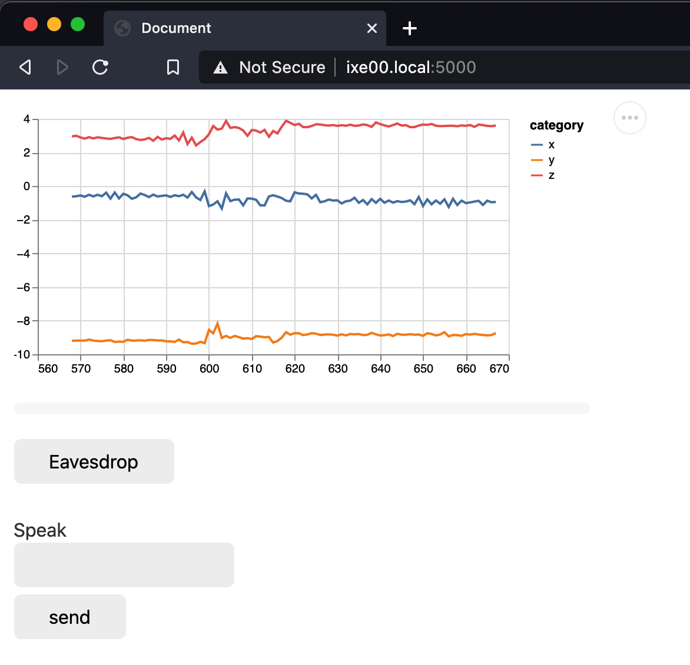

# Magic Ball WoZ

This is a Demo App for a Wizard of Oz interactive system where the wizard is playing a magic 8 ball


## Hardware Set-Up

For this demo, you will need: 
* your Raspberry Pi, 
* a Qwiic/Stemma Cable, 
* a speaker/aux cable or wired headphones, 
* the display (we are just using it for the Qwiic/StemmaQT port. Feel free to use the display in your projects), 
* your accelerometer, and 
* your USB microphone


<p float="left">

</p>

Plug the display in and connect the accelerometer to the port underneath with your Qwiic connector cable. Plug the aux cable into the raspberry pi and your speaker or connect your headphones. Plug the USB microphone into one of the usb ports on the Pi

## Software Setup

Sssh on to your Raspberry Pi as we've done previously

`ssh pi@yourHostname.local`

Ensure audio is playing through the aux connector by typing

`sudo raspi-config`

on `system options` hit enter. Go down to `s2 Audio` and hit enter. Select `1 Headphones` and hit enter. Then navigate to `<Finish>` and exit the config menu.

We will need one additional piece of software called VLC Media player. To install it type `sudo apt-get install vlc` 


I would suggest making a new virtual environment for this demo then navigating to this folder and installing the requirements.

```
pi@yourHostname:~ $ virtualenv woz
pi@yourHostname:~ $ source woz/bin/activate
(woz) pi@yourHostname:~ $ cd Interactive-Lab-Hub/Lab\ 3/demo
(woz) pi@yourHostname:~/Interactive-Lab-Hub/Lab 3/demo $ 
(woz) pi@yourHostname:~/Interactive-Lab-Hub/Lab 3/demo $ pip install -r requirements.txt
```

## Running

To run the app

`(woz) pi@yourHostname:~/Interactive-Lab-Hub/Lab 3/demo $ python app.py`

In the browser of a computer on the same network, navigate to http://yourHostname.local:5000/ where in my case my hostname is ixe00



The interface will immediately begin streaming the accelerometer to let you know if your participant shakes their Magic 8 ball. The "eavesdrop" button will begin streaming audio from the Pi to your browser (note their is a noticeable delay it is best to start eavesdropping right at the beginning). To have the Pi speak, you can write in the text box and hit send or press enter.

## Notes

You may need to change line 23 in `app.py`

```
hardware = 'plughw:2,0'
```

This is the soundcard and hardware device associated with the USB microphone. To check, you can run `python get_device.py` which will output A LOT of nonsense. At the end, you will see 

```
0 bcm2835 HDMI 1: - (plughw:0,0)
1 bcm2835 Headphones: - (plughw:1,0)
2 USB PnP Sound Device: Audio (plughw:2,0)
3 sysdefault
4 lavrate
5 samplerate
6 speexrate
7 pulse
8 upmix
9 vdownmix
10 dmix
11 default
```

In our case, `USB PnP Sound Device: Audio (plughw:2,0)` is the name of our microphone and the index is in parenthesis.

