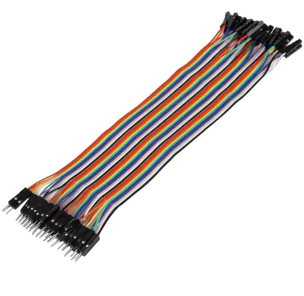
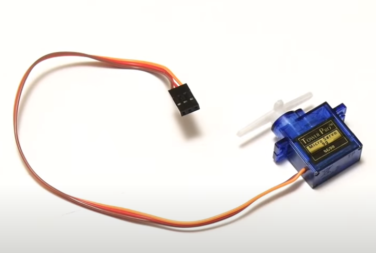
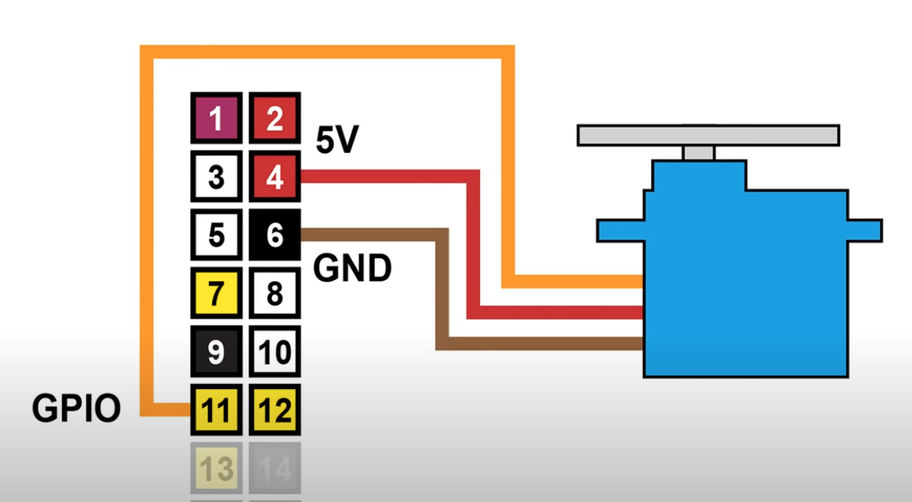

# Ph-UI!!!

For lab this week, we focus on prototyping and the physical look and feel of the device. 

## Lab Preparation

1. Pull the new Github Repo.
2. To help think of ideas, read: 
* [What do prototypes prototype?](https://www.semanticscholar.org/paper/What-do-Prototypes-Prototype-Houde-Hill/30bc6125fab9d9b2d5854223aeea7900a218f149)
* [Paper prototyping](https://www.uxpin.com/studio/blog/paper-prototyping-the-practical-beginners-guide/) is used by UX designers to quickly develop interface ideas and run them by people before any programming occurs. 
* [Cardboard prototypes](https://www.youtube.com/watch?v=k_9Q-KDSb9o) help interactive product designers to work through additional issues, like how big something should be, how it could be carried, where it would sit. 
* [Tips to Cut, Fold, Mold and Papier-Mache Cardboard](https://makezine.com/2016/04/21/working-with-cardboard-tips-cut-fold-mold-papier-mache/) from Make Magazine.
* [Surprisingly complicated forms](https://www.pinterest.com/pin/50032245843343100/) can be built with paper, cardstock or cardboard.  The most advanced and challenging prototypes to prototype with paper are [cardboard mechanisms](https://www.pinterest.com/helgangchin/paper-mechanisms/) which move and change. 
* [Dyson Vacuum Cardboard Prototypes](http://media.dyson.com/downloads/JDF/JDF_Prim_poster05.pdf)
<p align="center"> </p>

3. In addition to your lab kit, it will help to gather:

* Cardboard (start collecting those shipping boxes!)
* Found objects and materials--like bananas and twigs.
* Cutting board
* Cutting tools
* Markers

4. Finally, the deliverables for this lab are, writings, sketches, photos, and videos that show what your prototype:
* "Looks like": shows how the device should look, feel, sit, weigh, etc.
* "Works like": shows what the device can do
* "Acts like": shows how a person would interact with the device

5. Submission
* The readme.md page for this lab should be edited to include the work you have done. 
* Upload any materials that explain what you did, into your lab 4 repository, and link them in your lab 4 readme.
* Link your lab 4 readme in your main Interactive-Lab-Hub readme.md. 
* Each group member should post their own copy of the work to their own repository, even if some of the work is the same for each person in the group.
* Labs are due on Mondays, make sure to submit your lab 4 readme.md to Canvas.

## Lab Overview

A) [Capacitive Sensing](#part-a)

B) [OLED screen](#part-b) 

C) [Paper Display](#part-c)

D) [Servo Control](#part-d)

E) [Materiality](#part-e)

F) [Record the interaction](#part-f)

## The Report


### Part A
### Capacitive Sensing, a.k.a. Human-Twizzler Interaction

We wanted to introduce you to the [capacitive sensor](https://learn.adafruit.com/adafruit-mpr121-gator) in your kit. It's one of the most flexible input devices we were able to provide. At boot it measures the capacitance on each of the 12 contacts. Whenever that capacitance changes it considers it a user touch. You can attach any conductive material. In your kit you have conductive fabric and copper tape that will work well, but don't limit yourself! In this lab we will use Twizzlers!

<p float="left">


</p>

Plug in the capacitive sensor board with the qwiic connector. Connect your Twizzlers with either the copper tape or the alligator clips (the clips work better). make sure to install the requirements from `requirements.txt`


These Twizzler's are connected to pads 6 and 10. When you run the code and touch a twizzler the terminal will print out the following

```
(circuitpython) pi@ixe00:~/Interactive-Lab-Hub/Lab 4 $ python cap_test.py 
Twizzler 10 touched!
Twizzler 6 touched!
```

### Part B
### OLED screen

Your kit includes these SparkFun Qwiic OLED screens. These don't have colors like the one on the pi but you can move it around on a cable making for more flexible interface design. The way you program this display is almost identical to the pi display. Take a look at `oled_test.py` and some more of the [Adafruit examples](https://github.com/adafruit/Adafruit_CircuitPython_SSD1306/tree/master/examples).

<p float="left">


</p>


### Part C
### Paper Display

Here is an Pi with a paper faceplate on it to turn it into a display:


This is fine, but it can be a bit difficult to lay out a great and user friendly display within the constraints of the Pi. Also, it really only works for applications where people can come and stand over the Pi, or where you can mount the Pi to the wall.

Here is another prototype for a paper display:


It holds a pi and usb power supply, and provides a front stage on which to put writing, graphics, LEDs, buttons or displays.

This design can be made by scoring a long strip of corrugated cardboard of width X, with the following measurements:

| Y height of box <br> <sub><sup>- thickness of cardboard</sup></sub> | Z  depth of box <br><sub><sup>- thickness of cardboard</sup></sub> | Y height of box  | Z  depth of box | H height of faceplate <br><sub><sup>* * * * * (don't make this too short) * * * * *</sup></sub>|
| --- | --- | --- | --- | --- | 

Fold the first flap of the strip so that it sits flush against the back of the face plate, and tape, velcro or hot glue it in place. This will make a H x X interface, with a box of Z x X footprint (which you can adapt to the things you want to put in the box) and a height Y in the back. 

Here is an example:


Make a paper display for your project that communicates the state of the Pi and a sensor. Ideally you should design it so that you can slide the Pi out to work on the circuit or programming, and then slide it back in and reattach a few wires to be back in operation.
 
**a. Document the design for your paper display.** (e.g. if you had to make it again from scratch, what information would you need?). Include interim iterations (or at least tell us about them).

**b. Make a video of your paper display in action.**

**c. Explain the rationale for the design.** (e.g. Does it need to be a certain size or form or need to be able to be seen from a certain distance?)

### Part D
### Servo Control

By using the Qwiic OLED screen instead of the LED hat, you should have more GPIO pins opened up. With extra GPIO pins, we'll connect the 9-gram SG90 mini-servo using the jumper wires, both included in your kit.

<p align="center"> </p>

Use the wires to attach the 5V, Ground, and GPIO. 5V and Ground can go next to each other on the outer row, pins 4 and 6, and GPIO should go in the inner row, at pin 11. This is shown in the diagram below.

<p align="center"></p>

Then, in this lab you can find a script named ```servo_control.py```, you can use this to control the servo. In the directory you have this script in, you can run ```python servo_control.py```, it is specifically looking for connection to pin 11, so if you find it isn't connecting, try checking the GPIO diagram above, and making sure that on [line 6](https://github.com/vbartle/idd-drafting/blob/7edfa05097f88f35b00dc84ff932f4a371be6dc7/servo_control.py#L6), the same pin is being called, i.e. ```GPIO.setup(*PIN NUMBER*, GPIO.out)``` and ```servo = GPIO.PWM(*PIN NUMBER*, 50)```.

This script will ask you for an input degree for it to rotate, so you can wizard your device as we learned in the last lab. It is also possible to control the servo using the capacitive sensing as in part A, and/or from some of the buttons or controls, like the Joystick, included in your kit, the simplest way might be to chain Qwiic buttons to the other end of the Qwiic OLED. Like this:

<p align="center"> </p>

You can then call whichever control you like, within the ```servo_control.py``` file, rather than having it ask for a value. For more information on controlling Qwiic, Sparkfun has several python examples, such as [this](https://learn.sparkfun.com/tutorials/qwiic-joystick-hookup-guide/all#python-examples), which for the joystick boils down to something like: 

```
import qwiic_joystick
joystick = qwiic_joystick.QwiicJoystick()
joystick.begin()
```

We encourage you to try using these controls, **while** paying particular attention to how the interaction changes depending on the position of the controls. For example, if you have your servo rotating a screen (or a piece of cardboard) from one position to another, what changes about the interaction if the control is on the same side of the screen, or the opposite side of the screen? Trying and retrying different configurations generally helps reveal what a design choice changes about the interaction -- _make sure to document what you tried_!

### Part E
### Materiality

**Open Ended**: We are putting very few constraints on this part and we want you to get creative.

Design a system with the Pi and anything from your kit with a focus on form, and materiality. The "stuff" that enclose the system should be informed by the desired interaction. What would a computer made of rocks be like? How would an ipod made of grass behave? Would a roomba made of gold clean your floor any differently? Document what material you are prototyping with, include candidates that were considered even if they were set aside later, and explain your selection(s).


### Part 2.

Following exploration and reflection from Part 1, complete the "looks like," "works like" and "acts like" prototypes for your design, reiterated below.

### Part F
### Record

### Reiterating: 
Deliverables for this lab are writings, sketches, photos, and videos that show what your prototype:
* "Looks like": shows how the device should look, feel, sit, weigh, etc.
* "Works like": shows what the device can do
* "Acts like": shows how a person would interact with the device

