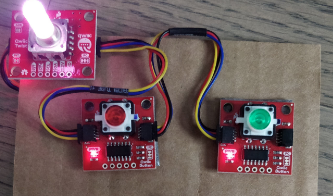

# Ph-UI!!!

**NAMES OF COLLABORATORS HERE**
John Li (jl4239), Shiying Wu (sw2298), Mingze Gao (mg2454), Crystal Chong (cc2795), Qianxin(Carl) Gan (qg72), Mingzhe Sun (ms3636)

For lab this week, we focus both on sensing, to bring in new modes of input into your devices, as well as prototyping the physical look and feel of the device. You will think about the physical form the device needs to perform the sensing as well as present the display or feedback about what was sensed. 

## Part 1 Lab Preparation

### Get the latest content:
As always, pull updates from the class Interactive-Lab-Hub to both your Pi and your own GitHub repo. As we discussed in the class, there are 2 ways you can do so:


Option 1: On the Pi, `cd` to your `Interactive-Lab-Hub`, pull the updates from upstream (class lab-hub) and push the updates back to your own GitHub repo. You will need the personal access token for this.

```
pi@ixe00:~$ cd Interactive-Lab-Hub
pi@ixe00:~/Interactive-Lab-Hub $ git pull upstream Fall2022
pi@ixe00:~/Interactive-Lab-Hub $ git add .
pi@ixe00:~/Interactive-Lab-Hub $ git commit -m "get lab4 content"
pi@ixe00:~/Interactive-Lab-Hub $ git push
```

Option 2: On your own GitHub repo, [create pull request](https://github.com/FAR-Lab/Developing-and-Designing-Interactive-Devices/blob/2021Fall/readings/Submitting%20Labs.md) to get updates from the class Interactive-Lab-Hub. After you have latest updates online, go on your Pi, `cd` to your `Interactive-Lab-Hub` and use `git pull` to get updates from your own GitHub repo.

Option 3: (preferred) use the Github.com interface to update the changes.

### Start brainstorming ideas by reading: 
* [What do prototypes prototype?](https://www.semanticscholar.org/paper/What-do-Prototypes-Prototype-Houde-Hill/30bc6125fab9d9b2d5854223aeea7900a218f149)
* [Paper prototyping](https://www.uxpin.com/studio/blog/paper-prototyping-the-practical-beginners-guide/) is used by UX designers to quickly develop interface ideas and run them by people before any programming occurs. 
* [Cardboard prototypes](https://www.youtube.com/watch?v=k_9Q-KDSb9o) help interactive product designers to work through additional issues, like how big something should be, how it could be carried, where it would sit. 
* [Tips to Cut, Fold, Mold and Papier-Mache Cardboard](https://makezine.com/2016/04/21/working-with-cardboard-tips-cut-fold-mold-papier-mache/) from Make Magazine.
* [Surprisingly complicated forms](https://www.pinterest.com/pin/50032245843343100/) can be built with paper, cardstock or cardboard.  The most advanced and challenging prototypes to prototype with paper are [cardboard mechanisms](https://www.pinterest.com/helgangchin/paper-mechanisms/) which move and change. 
* [Dyson Vacuum Cardboard Prototypes](http://media.dyson.com/downloads/JDF/JDF_Prim_poster05.pdf)
<p align="center"> </p>

### Gathering materials for this lab:

* Cardboard (start collecting those shipping boxes!)
* Found objects and materials--like bananas and twigs.
* Cutting board
* Cutting tools
* Markers
* New hardware for your kit will be handed out. Update your parts list. 

(We do offer shared cutting board, cutting tools, and markers on the class cart during the lab, so do not worry if you don't have them!)

## Deliverables \& Submission for Lab 4

The deliverables for this lab are, writings, sketches, photos, and videos that show what your prototype:
* "Looks like": shows how the device should look, feel, sit, weigh, etc.
* "Works like": shows what the device can do.
* "Acts like": shows how a person would interact with the device.

For submission, the readme.md page for this lab should be edited to include the work you have done:
* Upload any materials that explain what you did, into your lab 4 repository, and link them in your lab 4 readme.md.
* Link your Lab 4 readme.md in your main Interactive-Lab-Hub readme.md. 
* Group members can turn in one repository, but make sure your Hub readme.md links to the shared repository.
* Labs are due on Mondays, make sure to submit your Lab 4 readme.md to Canvas.


## Lab Overview

A) [Capacitive Sensing](#part-a)

B) [OLED screen](#part-b) 

C) [Paper Display](#part-c)

D) [Materiality](#part-d)

E) [Servo Control](#part-e)

F) [Camera Test](#part-f)

G) [Record the interaction](#part-g)

## The Report (Part 1: A-D, Part 2: E-F)

### Part A
### Capacitive Sensing, a.k.a. Human-Twizzler Interaction 

We want to introduce you to the [capacitive sensor](https://learn.adafruit.com/adafruit-mpr121-gator) in your kit. It's one of the most flexible input devices we are able to provide. At boot, it measures the capacitance on each of the 12 contacts. Whenever that capacitance changes, it considers it a user touch. You can attach any conductive material. In your kit, you have copper tape that will work well, but don't limit yourself! In the example below, we use Twizzlers--you should pick your own objects.


<p float="left">

</p>

Plug in the capacitive sensor board with the QWIIC connector. Connect your Twizzlers with either the copper tape or the alligator clips (the clips work better). Install the latest requirements from your working virtual environment:

```
(circuitpython) pi@ixe00:~/Interactive-Lab-Hub/Lab 4 $ pip install -r requirements.txt
```


These Twizzlers are connected to pads 6 and 10. When you run the code and touch a Twizzler, the terminal will print out the following

```
(circuitpython) pi@ixe00:~/Interactive-Lab-Hub/Lab 4 $ python cap_test.py 
Twizzler 10 touched!
Twizzler 6 touched!
```

### Part B
### More sensors

#### Light/Proximity/Gesture sensor (APDS-9960)

We here want you to get to know this awesome sensor [Adafruit APDS-9960](https://www.adafruit.com/product/3595). It is capable of sensing proximity, light (also RGB), and gesture! 


Connect it to your pi with Qwiic connector and try running the three example scripts individually to see what the sensor is capable of doing!

```
(circuitpython) pi@ixe00:~/Interactive-Lab-Hub/Lab 4 $ python proximity_test.py
...
(circuitpython) pi@ixe00:~/Interactive-Lab-Hub/Lab 4 $ python gesture_test.py
...
(circuitpython) pi@ixe00:~/Interactive-Lab-Hub/Lab 4 $ python color_test.py
...
```

You can go the the [Adafruit GitHub Page](https://github.com/adafruit/Adafruit_CircuitPython_APDS9960) to see more examples for this sensor!

#### Rotary Encoder (optional)

> **_NOTE:_**  Not in the kit yet - skip this.

A rotary encoder is an electro-mechanical device that converts the angular position to analog or digital output signals. The [Adafruit rotary encoder](https://www.adafruit.com/product/4991#technical-details) we ordered for you came with separate breakout board and encoder itself, that is, they will need to be soldered if you have not yet done so! We will be bringing the soldering station to the lab class for you to use, also, you can go to the MakerLAB to do the soldering off-class. Here is some [guidance on soldering](https://learn.adafruit.com/adafruit-guide-excellent-soldering/preparation) from Adafruit. When you first solder, get someone who has done it before (ideally in the MakerLAB environment). It is a good idea to review this material beforehand so you know what to look at.

<p float="left">


</p>

Connect it to your pi with Qwiic connector and try running the example script, it comes with an additional button which might be useful for your design!

```
(circuitpython) pi@ixe00:~/Interactive-Lab-Hub/Lab 4 $ python encoder_test.py
```

You can go to the [Adafruit Learn Page](https://learn.adafruit.com/adafruit-i2c-qt-rotary-encoder/python-circuitpython) to learn more about the sensor! The sensor actually comes with an LED (neo pixel): Can you try lighting it up? 

#### Joystick (optional)

A [joystick](https://www.sparkfun.com/products/15168) can be used to sense and report the input of the stick for it pivoting angle or direction. It also comes with a button input!

<p float="left">

</p>

Connect it to your pi with Qwiic connector and try running the example script to see what it can do!

```
(circuitpython) pi@ixe00:~/Interactive-Lab-Hub/Lab 4 $ python joystick_test.py
```

You can go to the [SparkFun GitHub Page](https://github.com/sparkfun/Qwiic_Joystick_Py) to learn more about the sensor!

#### Distance Sensor

Earlier we have asked you to play with the proximity sensor, which is able to sense objects within a short distance. Here, we offer [Sparkfun Proximity Sensor Breakout](https://www.sparkfun.com/products/15177), With the ability to detect objects up to 20cm away.

<p float="left">

</p>

Connect it to your pi with Qwiic connector and try running the example script to see how it works!

```
(circuitpython) pi@ixe00:~/Interactive-Lab-Hub/Lab 4 $ python qwiic_distance.py
```

You can go to the [SparkFun GitHub Page](https://github.com/sparkfun/Qwiic_Proximity_Py) to learn more about the sensor and see other examples!

### Part C
### Physical considerations for sensing

Usually, sensors need to be positioned in specific locations or orientations to make them useful for their application. Now that you've tried a bunch of the sensors, pick one that you would like to use, and an application where you use the output of that sensor for an interaction. For example, you can use a distance sensor to measure someone's height if you position it overhead and get them to stand under it.

**\*\*\*Draw 5 sketches of different ways you might use your sensor, and how the larger device needs to be shaped in order to make the sensor useful.\*\*\***

We picked the distance sensor as our primary sensor for the following ideas:

1. Handheld Device for Visually Impaired Individuals (detect the distance of obstacles)

2. Modern Doorbell System (detect people approachness when within certian distance of the door)


3. Dance Motion Capturer / Detector
Distance and gesture sensors are used to help detect and capture motions for a dancing game that can be played on the TV.


4. Food delivery defender (detect the absense of food)


5. Home Light Assitant
During the night or when the outdoor light is dimmed, turn on the light of the room when users are within the detectable area.


**\*\*\*What are some things these sketches raise as questions? What do you need to physically prototype to understand how to anwer those questions?\*\*\***

- What is the maximum and minimum range of the distance sensor to be effective for the user?
- How is feedback provided to the user (auditory, haptic)?
- Is the device ergonomic and easy to hold for extended periods?
- What is the optimal range to detect a person approaching without causing false alarms?
- How should the system notify the homeowner: sound, light, or a combination?
- How does the system handle varying sizes of individuals (e.g., children)?

Prototyping Needs:

- Set up a prototype on a table or countertop to simulate real-world scenarios.
- Test with various objects and food items to gauge accuracy.
- Test the system in different lighting conditions, including complete darkness and dim light.
- Evaluate the sensor's response time when someone enters or exits the detection zone.
- Evaluate sensor accuracy in real-time motion tracking and feedback.


**\*\*\*Pick one of these designs to prototype.\*\*\***


This a handheld device for visually impaired person, where he the button start the scan the surrunding enviroment, and the speaker in the center describe the surrounding to the user.


### Part D
### Physical considerations for displaying information and housing parts


Here is a Pi with a paper faceplate on it to turn it into a display interface:


This is fine, but the mounting of the display constrains the display location and orientation a lot. Also, it really only works for applications where people can come and stand over the Pi, or where you can mount the Pi to the wall.

Here is another prototype for a paper display:


Your kit includes these [SparkFun Qwiic OLED screens](https://www.sparkfun.com/products/17153). These use less power than the MiniTFTs you have mounted on the GPIO pins of the Pi, but, more importantly, they can be more flexibly mounted elsewhere on your physical interface. The way you program this display is almost identical to the way you program a  Pi display. Take a look at `oled_test.py` and some more of the [Adafruit examples](https://github.com/adafruit/Adafruit_CircuitPython_SSD1306/tree/master/examples).

`pip install adafruit-circuitpython-ssd1306`

<p float="left">

</p>


It holds a Pi and usb power supply, and provides a front stage on which to put writing, graphics, LEDs, buttons or displays.

This design can be made by scoring a long strip of corrugated cardboard of width X, with the following measurements:

| Y height of box <br> <sub><sup>- thickness of cardboard</sup></sub> | Z  depth of box <br><sub><sup>- thickness of cardboard</sup></sub> | Y height of box  | Z  depth of box | H height of faceplate <br><sub><sup>* * * * * (don't make this too short) * * * * *</sup></sub>|
| --- | --- | --- | --- | --- | 

Fold the first flap of the strip so that it sits flush against the back of the face plate, and tape, velcro or hot glue it in place. This will make a H x X interface, with a box of Z x X footprint (which you can adapt to the things you want to put in the box) and a height Y in the back. 

Here is an example:


Think about how you want to present the information about what your sensor is sensing! Design a paper display for your project that communicates the state of the Pi and a sensor. Ideally you should design it so that you can slide the Pi out to work on the circuit or programming, and then slide it back in and reattach a few wires to be back in operation.
 
**\*\*\*Sketch 5 designs for how you would physically position your display and any buttons or knobs needed to interact with it.\*\*\***

1. Home center control panel
2. Intergrated Task completion reminder
3. Car racing game
4. Flappy bird game
5. 3D-Map generator


Home center control panel
Position the knobs on the right side of the screen that displays the light information. Use the knobs to change the light level and color temperature. Push the knobs to turn on and off the light.


Intergrated Task completion reminder
Position the knobs on the right side of the screen that displays the task list. Use the knobs to scroll through the list and push the knobs to check an existing task.


Car Racing Game
Modern refrigerators sometimes come with built-in screens for various smart features. Integrate the game to display and play directly from the refrigerator while cooking, so that you can monitor the stove top while not having to get bored in the kitchen with the little joystick on the fridge.


Flappy Bird
Coffee brewers with built-in touch displays can be perfect for Flappy Bird. While waiting for your awesome cup of coffee, enojy this fun little game using the buttons on the machine. The game will automatically end and return a "WIN" screen if the player kept the bird alive until the coffee finished brewing.


3D Map Generator
The 3D Map Generator adeptly identifies surrounding objects and terrains. Users can either hold the generator or position it on a flat surface, prompting the device to scan the entirety of the view and subsequently display a 3D map on the screen. The device is equipped with two buttons and a joystick controller to facilitate interaction. The joystick enables users to rotate the map a full 360 degrees, providing a comprehensive view of the area. Meanwhile, the buttons permit users to either generate a new map or browse through existing maps with ease.
 
**\*\*\*What are some things these sketches raise as questions? What do you need to physically prototype to understand how to anwer those questions?\*\*\***

We need to further study the use cases for our designs and research the users' behavior if they does not have a similar device at hand to see the feasibility, ergonomics, and practicality of our designs. In addition, we need to consider when integrating a game into certain appliances, especially those that generate heat or have moving parts, if it will pose any safety risks. We should also consider if the game's integration enhancing the user's experience with the appliance or becoming a nuisance. Different appliances have different screen sizes and resolutions. Testing how the game looks and feels on these various displays will be crucial. Getting feedback from potential users will provide insights into usability, user experience, and any unforeseen issues.

**\*\*\*Explain the rationale for the design.\*\*\*** (e.g. Does it need to be a certain size or form or need to be able to be seen from a certain distance?)

- The device's size must be compact enough for easy portability, allowing users to scan various environments without it being cumbersome.
- A handheld form ensures that users can elevate the device if necessary to capture a wider view, especially in terrains with obstructions.
- A joystick offers intuitive control for rotating the 3D map. Its 360-degree maneuverability provides users with a full, panoramic view of the scanned area.
- Compared to touch gestures or buttons, a joystick offers precision, especially when viewing intricate details of a 3D map.
- The device needs to integrate advanced sensors to accurately detect surrounding objects and terrains. The sensor's capability determines the fidelity and accuracy of the 3D map.
- The scanning mechanism should be quick, capturing a full view in a short duration to enhance user convenience.

Build a cardboard prototype of your design.
**\*\*\*Pick one of these display designs to integrate into your prototype.\*\*\***
**\*\*\*Document your rough prototype.\*\*\***


the prototype have a button for start scanning and a display shows the status of the scanning, and it have a sensor at the top of the gun.

LAB PART 2

### Part 2

Following exploration and reflection from Part 1, complete the "looks like," "works like" and "acts like" prototypes for your design, reiterated below.

### Part E (Optional)
### Servo Control with Joystick
> **_NOTE:_**  Not in the kit yet.

In the class kit, you should be able to find the [Qwiic Servo Controller](https://www.sparkfun.com/products/16773) and [Micro Servo Motor SG51](https://www.adafruit.com/product/2201). The Qwiic Servo Controller will need external power supply to drive, which is included in your kit. Connect the servo controller to the miniPiTFT through qwiic connector and connect the external battery to the 2-Pin JST port (ower port) on the servo controller. Connect your servo to channel 2 on the controller, make sure the brown is connected to GND and orange is connected to PWM.


In this exercise, we will be using the nice [ServoKit library](https://learn.adafruit.com/16-channel-pwm-servo-driver/python-circuitpython) developed by Adafruit! We will continue to use the `circuitpython` virtual environment we created. Activate the virtual environment and make sure to install the latest required libraries by running:

```
(circuitpython) pi@ixe00:~/Interactive-Lab-Hub/Lab 4 $ pip3 install -r requirements.txt
```

A servo motor is a rotary actuator or linear actuator that allows for precise control of angular or linear position. The position of a servo motor is set by the width of an electrical pulse, that is, we can use PWM (pulse-width modulation) to set and control the servo motor position. You can read [this](https://learn.adafruit.com/adafruit-arduino-lesson-14-servo-motors/servo-motors) to learn a bit more about how exactly a servo motor works.

Now that you have a basic idea of what a servo motor is, look into the script `servo_test.py` we provide. In line 14, you should see that we have set up the min_pulse and max_pulse corresponding to the servo turning 0 - 180 degrees. Try running the servo example code now and see what happens:

```
(circuitpython) pi@ixe00:~/Interactive-Lab-Hub/Lab 4 $ python servo_test.py
```

It is also possible to control the servo using the sensors mentioned in as in part A and part B, and/or from some of the buttons or parts included in your kit, the simplest way might be to chain Qwiic buttons to the other end of the Qwiic OLED. Like this:

<p align="center"> </p>

You can then call whichever control you like rather than setting a fixed value for the servo. For more information on controlling Qwiic devices, Sparkfun has several python examples, such as [this](https://learn.sparkfun.com/tutorials/qwiic-joystick-hookup-guide/all#python-examples).

We encourage you to try using these controls, **while** paying particular attention to how the interaction changes depending on the position of the controls. For example, if you have your servo rotating a screen (or a piece of cardboard) from one position to another, what changes about the interaction if the control is on the same side of the screen, or the opposite side of the screen? Trying and retrying different configurations generally helps reveal what a design choice changes about the interaction -- _make sure to document what you tried_!

### Part F (Optional)
### Camera
You can use the inputs and outputs from the video camera in the kit. 
We provide another script called camera_test.py to test the USB camera on raspberry pi. 
It uses qt to render a video to the screen, so it is necessary to connect a screen or to connect via VNC to run this script. 

First install some more dependencies into your virtual environment. OpenCV should already be installed on the Pi for the super user. 

```
sudo apt-get install portaudio19-dev python-all-dev
pip install opencv-python pyaudio pygame
```

Once executed the script will render the camera output, press 'q' to stop video and record a sound through the microphone which will be played back by specificing the audio output. 

---
The video is rendered locally on the pi. For wizarding interactions and prototyping it can be necessary to stream the video to another device such as your laptop. A wizard, observing the user and acting as a computer vision algorithm, can then trigger interactions remotley, such as we did in the tinkerbelle lab.

The following resources are good starts on how to stream video: 
* [OpenCV – Stream video to web browser/HTML page](https://pyimagesearch.com/2019/09/02/opencv-stream-video-to-web-browser-html-page/)
* [Live video streaming over network with OpenCV and ImageZMQ](https://pyimagesearch.com/2019/04/15/live-video-streaming-over-network-with-opencv-and-imagezmq/)
### Part G
### Record

We are doing a Russian roulette like device. 

Document all the prototypes and iterations you have designed and worked on! Again, deliverables for this lab are writings, sketches, photos, and videos that show what your prototype:

**Components used:**
- Camera with speaker: plays sounds
- Red LED: init the game
- OLED Screen: start and end game display, game mode: display the number of triggers have pulled
- Joystick: trigger of the gun
</br>


</br>

**Detailed Descriptions:**


* "Looks like": shows how the device should look, feel, sit, weigh, etc.


Our prototype is a handheld device resembling a futuristic gun. It has a compact and ergonomic design, allowing users to hold it comfortably. The device is constructed using sturdy cardboard for the main body, with copper tape for the capacitive sensor and various sensors integrated. The addition of an OLED screen on the body provides a sleek and modern touch. The screen displays essential information, such as the start and end of the game, and during gameplay, it shows the count of bullets fired. The device features a distinctive LED Red button on the outside that serves as a game initiation trigger. The inclusion of a camera inside the device adds an interactive element, releasing sound effects when the device is "shot." The prototype has been designed to be lightweight and easy to handle, with the added feature of being pushable and pullable for additional tactile engagement.


* "Works like": shows what the device can do


The prototype is designed to provide a simulated and safe version of the classic game. The joystick is configured to simulate the trigger-pulling action, enhancing the overall user experience. Users can load simulated bullets into the rotating chamber, with the OLED screen indicating the number of bullets fired during the game. The chamber can be manually rotated, mimicking the randomness of the Russian roulette game. The device incorporates a camera inside that captures the action and triggers sound effects when "shot." The LED Red button outside the device is a multifunctional control, allowing users to start the game with a press. Importantly, the device lacks any functional firing mechanism, ensuring it cannot cause harm.

* "Acts like": shows how a person would interact with the device


To start the game, users press the LED Red button on the outside of the device. The OLED screen displays the game status and prompts users to load the simulated bullets into the rotating chamber. Users can then push or pull the device's body to engage with the tactile features. Interacting with the joystick simulates pulling the trigger, initiating the suspenseful sequence. The OLED screen updates in real-time to show the count of bullets fired during gameplay. Auditory cues, including sounds triggered by the internal camera, add to the immersive experience. Safety features are emphasized through the design and messaging, ensuring users understand that it is a toy and not a functional weapon. 

**Video:**
*Click the image below to watch the video:*
[](https://www.youtube.com/watch?v=PHGshE1JnpA)
