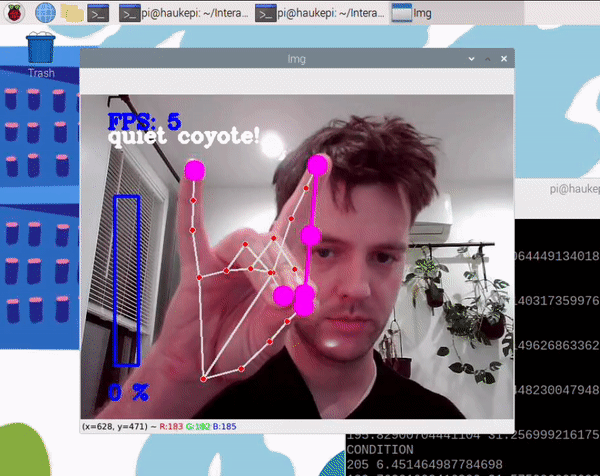
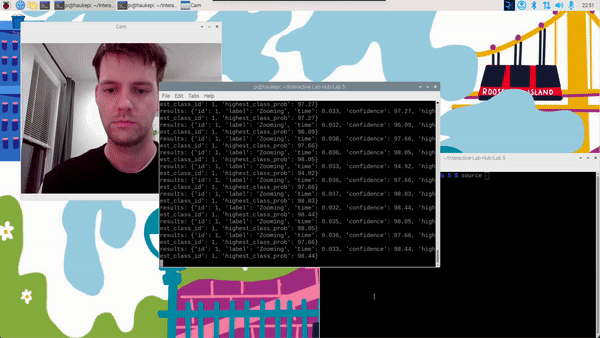
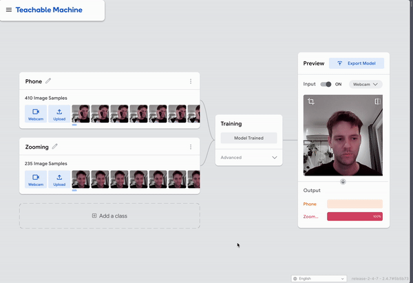

# Observant Systems

**NAMES OF COLLABORATORS HERE**
John Li (jl4239), Shiying Wu (sw2298), Mingze Gao (mg2454), Crystal Chong (cc2795), Qianxin(Carl) Gan (qg72), Mingzhe Sun (ms3636)


For lab this week, we focus on creating interactive systems that can detect and respond to events or stimuli in the environment of the Pi, like the Boat Detector we mentioned in lecture. 
Your **observant device** could, for example, count items, find objects, recognize an event or continuously monitor a room.

This lab will help you think through the design of observant systems, particularly corner cases that the algorithms need to be aware of.

## Prep

1.  Install VNC on your laptop if you have not yet done so. This lab will actually require you to run script on your Pi through VNC so that you can see the video stream. Please refer to the [prep for Lab 2](https://github.com/FAR-Lab/Interactive-Lab-Hub/blob/-/Lab%202/prep.md#using-vnc-to-see-your-pi-desktop).
2.  Install the dependencies as described in the [prep document](prep.md). 
3.  Read about [OpenCV](https://opencv.org/about/),[Pytorch](https://pytorch.org/), [MediaPipe](https://mediapipe.dev/), and [TeachableMachines](https://teachablemachine.withgoogle.com/).
4.  Read Belloti, et al.'s [Making Sense of Sensing Systems: Five Questions for Designers and Researchers](https://www.cc.gatech.edu/~keith/pubs/chi2002-sensing.pdf).

### For the lab, you will need:
1. Pull the new Github Repo
1. Raspberry Pi
1. Webcam 

### Deliverables for this lab are:
1. Show pictures, videos of the "sense-making" algorithms you tried.
1. Show a video of how you embed one of these algorithms into your observant system.
1. Test, characterize your interactive device. Show faults in the detection and how the system handled it.

## Overview
Building upon the paper-airplane metaphor (we're understanding the material of machine learning for design), here are the four sections of the lab activity:

A) [Play](#part-a)

B) [Fold](#part-b)

C) [Flight test](#part-c)

D) [Reflect](#part-d)

---

### Part A
### Play with different sense-making algorithms.

#### Pytorch for object recognition

For this first demo, you will be using PyTorch and running a MobileNet v2 classification model in real time (30 fps+) on the CPU. We will be following steps adapted from [this tutorial](https://pytorch.org/tutorials/intermediate/realtime_rpi.html).


To get started, install dependencies into a virtual environment for this exercise as described in [prep.md](prep.md).

Make sure your webcam is connected.

You can check the installation by running:

```
python -c "import torch; print(torch.__version__)"
```

If everything is ok, you should be able to start doing object recognition. For this default example, we use [MobileNet_v2](https://arxiv.org/abs/1801.04381). This model is able to perform object recognition for 1000 object classes (check [classes.json](classes.json) to see which ones.

Start detection by running  

```
python infer.py
```

The first 2 inferences will be slower. Now, you can try placing several objects in front of the camera.

Read the `infer.py` script, and get familiar with the code. You can change the video resolution and frames per second (fps). You can also easily use the weights of other pre-trained models. You can see examples of other models [here](https://pytorch.org/tutorials/intermediate/realtime_rpi.html#model-choices). 


**Testing out Pytorch for object detaction**


### Machine Vision With Other Tools
The following sections describe tools ([MediaPipe](#mediapipe) and [Teachable Machines](#teachable-machines)).

#### MediaPipe

A recent open source and efficient method of extracting information from video streams comes out of Google's [MediaPipe](https://mediapipe.dev/), which offers state of the art face, face mesh, hand pose, and body pose detection.



To get started, install dependencies into a virtual environment for this exercise as described in [prep.md](prep.md):

Each of the installs will take a while, please be patient. After successfully installing mediapipe, connect your webcam to your Pi and use **VNC to access to your Pi**, open the terminal, and go to Lab 5 folder and run the hand pose detection script we provide:
(***it will not work if you use ssh from your laptop***)


```
(venv-ml) pi@ixe00:~ $ cd Interactive-Lab-Hub/Lab\ 5
(venv-ml) pi@ixe00:~ Interactive-Lab-Hub/Lab 5 $ python hand_pose.py
```

Try the two main features of this script: 1) pinching for percentage control, and 2) "[Quiet Coyote](https://www.youtube.com/watch?v=qsKlNVpY7zg)" for instant percentage setting. Notice how this example uses hardcoded positions and relates those positions with a desired set of events, in `hand_pose.py`. 

Consider how you might use this position based approach to create an interaction, and write how you might use it on either face, hand or body pose tracking.

(You might also consider how this notion of percentage control with hand tracking might be used in some of the physical UI you may have experimented with in the last lab, for instance in controlling a servo or rotary encoder.)

Hand Tracking Interactions:
Leveraging the intuitive nature of hand movements offers an immersive experience in controlling media. Adjusting volume can be as simple as moving one's hand up or down, while a pinch might serve to mute. For navigation, a hand swipe left or right can replace traditional scrolling, and pushing forward can act as a 'press' on digital buttons.

Face Pose Interactions:
The face, laden with expressiveness, can be a tool for interaction. Simple nods or shakes of the head can translate to affirmative or negative responses in apps. Blinking might replace a mouse click, enhancing accessibility. Even opening the mouth could be harnessed, perhaps activating voice assistants or initiating recordings.

Body Pose Interactions:
The full body as a control instrument opens avenues for immersive applications. Dance games can detect and respond to entire body movements. Meanwhile, the system could provide real-time feedback on one's posture during work. Gestures can also transition into the realm of home automation, like raising arms to illuminate a room or crossing them to secure doors.

Physical UI Integration:
Integrating pose controls with tangible interfaces bridges the digital and physical. Hand elevation might dictate a servo's angle, and twisting one's hand can mirror the action of a rotary encoder. Furthermore, the intuitive pinch action for percentage control can be repurposed, adjusting ambient lighting in a room, for instance.

**Testing out media pipe**

Click to view video:

[](https://youtu.be/1QZkdNUnvrc)


#### Teachable Machines
Google's [TeachableMachines](https://teachablemachine.withgoogle.com/train) is very useful for prototyping with the capabilities of machine learning. We are using [a python package](https://github.com/MeqdadDev/teachable-machine-lite) with tensorflow lite to simplify the deployment process.



To get started, install dependencies into a virtual environment for this exercise as described in [prep.md](prep.md):

After installation, connect your webcam to your Pi and use **VNC to access to your Pi**, open the terminal, and go to Lab 5 folder and run the example script:
(***it will not work if you use ssh from your laptop***)


```
(venv-tml) pi@ixe00:~ Interactive-Lab-Hub/Lab 5 $ python tml_example.py
```


Next train your own model. Visit [TeachableMachines](https://teachablemachine.withgoogle.com/train), select Image Project and Standard model. The raspberry pi 4 is capable to run not just the low resource models. Second, use the webcam on your computer to train a model. *Note: It might be advisable to use the pi webcam in a similar setting you want to deploy it to improve performance.*  For each class try to have over 150 samples, and consider adding a background or default class where you have nothing in view so the model is trained to know that this is the background. Then create classes based on what you want the model to classify. Lastly, preview and iterate. Finally export your model as a 'Tensorflow lite' model. You will find an '.tflite' file and a 'labels.txt' file. Upload these to your pi (through one of the many ways such as [scp](https://www.raspberrypi.com/documentation/computers/remote-access.html#using-secure-copy), sftp, [vnc](https://help.realvnc.com/hc/en-us/articles/360002249917-VNC-Connect-and-Raspberry-Pi#transferring-files-to-and-from-your-raspberry-pi-0-6), or a connected visual studio code remote explorer).



Include screenshots of your use of Teachable Machines, and write how you might use this to create your own classifier. Include what different affordances this method brings, compared to the OpenCV or MediaPipe options.


Simplicity and Accessibility: Teachable Machines provides a user-friendly interface, making the training process more accessible to beginners. There's no need for extensive code to train and test the model.

Real-time Feedback: The platform allows for instantaneous testing and tweaking, which can expedite the model refinement process.

Customization: Teachable Machines allows you to customize your model to specific needs. While OpenCV and MediaPipe come with pre-trained models and predefined capabilities, Teachable Machines lets you define and train classes based on your unique requirements.

Limitations: However, while Teachable Machines simplifies the training process, it might not offer the depth of customization or optimization available in more advanced tools like OpenCV or MediaPipe. For more complex or nuanced applications, one might need the extensive functionalities and controls that OpenCV and MediaPipe offer.

#### (Optional) Legacy audio and computer vision observation approaches
In an earlier version of this class students experimented with observing through audio cues. Find the material here:
[Audio_optional/audio.md](Audio_optional/audio.md). 
Teachable machines provides an audio classifier too. If you want to use audio classification this is our suggested method. 

In an earlier version of this class students experimented with foundational computer vision techniques such as face and flow detection. Techniques like these can be sufficient, more performant, and allow non discrete classification. Find the material here:
[CV_optional/cv.md](CV_optional/cv.md).

### Part B
### Construct a simple interaction.

* Pick one of the models you have tried, and experiment with prototyping an interaction.
* This can be as simple as the boat detector showen in a previous lecture from Nikolas Matelaro.
* Try out different interaction outputs and inputs.

**\*\*\*Describe and detail the interaction, as well as your experimentation here.\*\*\***

We want to use media pipe model to perform gesture detection to control mouse of the laptop.

To do this, we need to install mouse package using `pip install mouse`.

And we modified the `hand_pose.py` to test out different finger tips to move the mouse.

Click the below image to see the video of an experiment interaction of using index finger tip to control the mouse.

To move the mouse, we used `numpy` to convert the coordinate of the screen to coordinate of the web camera. And made the mouse to move based on the converted coordinate provided.

Click to view video:
[](https://youtu.be/mkKc_FbBc1o)


By comparing with using different finger tips, we found that using the index finger is the most intuitive way of asking an user to use their hand gesture to move the mouse.


### Part C
### Test the interaction prototype

Now flight test your interactive prototype and **note down your observations**:
For example:
1. When does it what it is supposed to do?
- The system successfully detects and responds to hand gestures for mouse control.
- Moving the index finger in front of the camera effectively moves the mouse cursor on the laptop.

2. When does it fail?
- The system may fail when the hand is not properly detected or when there is confusion in the hand gestures.
- Rapid or erratic movements can lead to inaccurate mouse control.
- The system might struggle if there are multiple hands in the frame, as it is currently designed to track one hand.
3. When it fails, why does it fail?
- Failures are often related to the limitations of the hand pose detection model. If the model misinterprets the hand pose or fails to identify the fingertips accurately, it can lead to erratic mouse movements.
4. Based on the behavior you have seen, what other scenarios could cause problems?
- Changes in lighting conditions might affect the hand pose detection.
- Occlusion of the hand or fingers, even partially, could lead to misinterpretation.
- Background clutter or other objects resembling hand gestures might cause confusion.

**\*\*\*Think about someone using the system. Describe how you think this will work.\*\*\***
1. Are they aware of the uncertainties in the system?
- Users may not be fully aware of the system's limitations, especially regarding potential misinterpretations of hand gestures.

2. How bad would they be impacted by a miss classification?
- A misclassification could result in unintended mouse movements, potentially causing the user to click on the wrong elements or activate unintended functions.
3. How could change your interactive system to address this?
- Provide visual or audio feedback when the system is uncertain or when it detects a potential misclassification.
- Implement a calibration or initialization step to ensure the system understands the user's hand gestures accurately.
6. Are there optimizations you can try to do on your sense-making algorithm.
- Fine-tune the hand pose detection model to improve accuracy.
- Implement more sophisticated filtering to reduce noise and erratic movements.
- Include a brief tutorial or onboarding process to familiarize users with the system's capabilities and limitations.
- Provide visual cues or instructions on how to perform gestures effectively.
### Part D
### Characterize your own Observant system

Now that you have experimented with one or more of these sense-making systems **characterize their behavior**.
During the lecture, we mentioned questions to help characterize a material:
* What can you use X for?
    * Users can navigate menus, control playback, or play games using hand gestures. It is also possible for users to answer calls, take photos, or navigate screens using gestures. This could be very useful in consumer electronics, or navigating the infotainment system while driving. In addition, it can facilitate users to control the electronics when their hands are dirty (e.g. when cooking, or eating with hands), or when they do not have access to keyboard or mouse.
* What is a good environment for X?
    * Environment with adequate lighting
    * Spacious where camera's field of view can capture the entire hand gesture.
* What is a bad environment for X?
    * Low light environment 
    * Extreme light enviroment
    * Environment with a lot of disturbance (e.g. a hand picture on the wall, hands waving around)
* When will X break?
    * Moving hand too fast that the camera fails to capture the motion, or when the lighting condition is not suitable for device to be fully functioning
    * Too many hands appear in the same frame
    * The hand is partially covered 
    * The hand has other than five fingers
* When it breaks how will X break?
    * It will failed to recognize the tracking point of the fingers.
    * The tracking points will be placed on incorrect finger(s).
* What are other properties/behaviors of X?
    * Provide tracking of a maximum of two hands, with the latter recognized one considered as the dominant hand
* How does X feel?
    * Responsive
    * Smooth
    * Can be further improved for frame rate

**\*\*\*Include a short video demonstrating the answers to these questions.\*\*\***

Click to view video:

[](https://youtu.be/2V9fs32dfkc)

### Part 2.

Following exploration and reflection from Part 1, finish building your interactive system, and demonstrate it in use with a video.

**\*\*\*Include a short video demonstrating the finished result.\*\*\***
