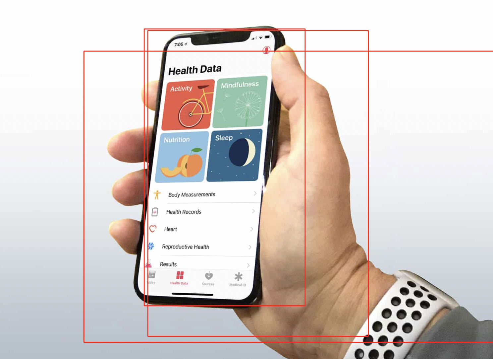
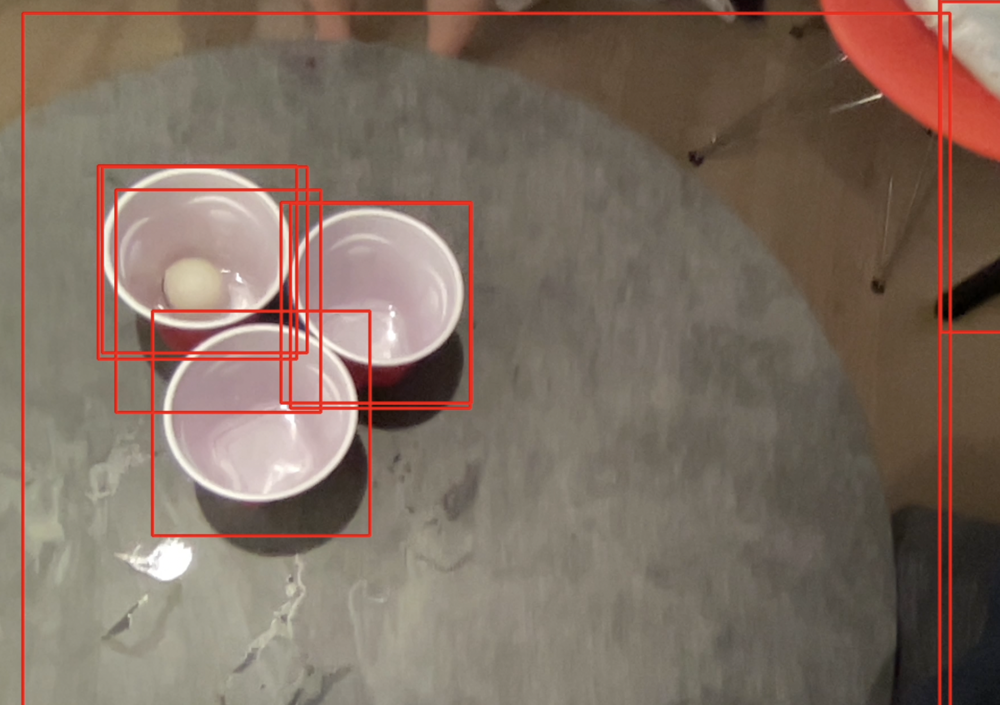
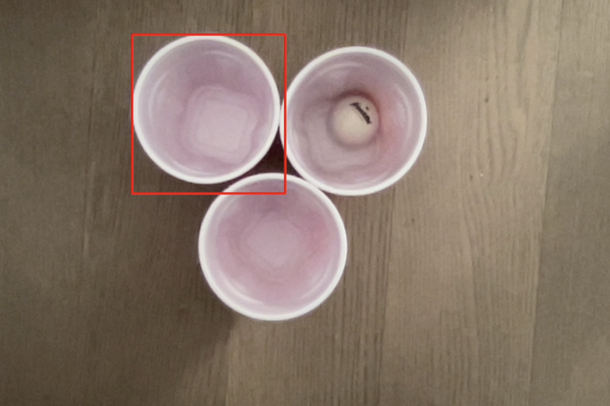
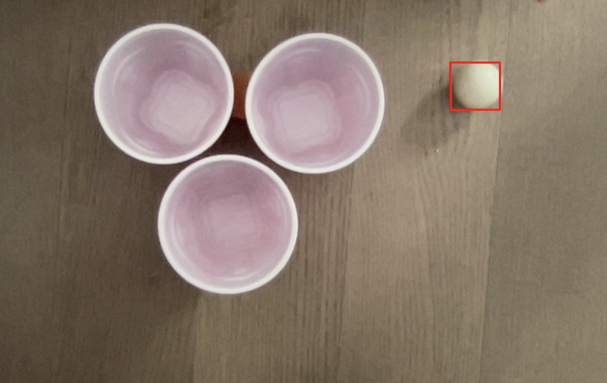

# Observant Systems


For lab this week, we focus on creating interactive systems that can detect and respond to events or stimuli in the environment of the Pi, like the Boat Detector we mentioned in lecture. 
Your **observant device** could, for example, count items, find objects, recognize an event or continuously monitor a room.

This lab will help you think through the design of observant systems, particularly corner cases that the algorithms need to be aware of.

In Lab 5 part 1, we focus on detecting and sense-making.

In Lab 5 part 2, we'll incorporate interactive responses.


## Prep

1.  Pull the new Github Repo.
2.  Read about [OpenCV](https://opencv.org/about/).
3.  Read Belloti, et al's [Making Sense of Sensing Systems: Five Questions for Designers and Researchers](https://www.cc.gatech.edu/~keith/pubs/chi2002-sensing.pdf)

### For the lab, you will need:

1. Raspberry Pi
1. Raspberry Pi Camera (2.1)
1. Microphone (if you want speech or sound input)
1. Webcam (if you want to be able to locate the camera more flexibly than the Pi Camera)

### Deliverables for this lab are:
1. Show pictures, videos of the "sense-making" algorithms you tried.
1. Show a video of how you embed one of these algorithms into your observant system.
1. Test, characterize your interactive device. Show faults in the detection and how the system handled it.


## Overview
Building upon the paper-airplane metaphor (we're understanding the material of machine learning for design), here are the four sections of the lab activity:

A) [Play](#part-a)

B) [Fold](#part-b)

C) [Flight test](#part-c)

D) [Reflect](#part-d)

---

### Part A
### Play with different sense-making algorithms.

Befor you get started connect the RaspberryPi Camera V2. [The Pi hut has a great explanation on how to do that](https://thepihut.com/blogs/raspberry-pi-tutorials/16021420-how-to-install-use-the-raspberry-pi-camera).  

#### OpenCV
A more traditional to extract information out of images is provided with OpenCV. The RPI image provided to you comes with an optimized installation that can be accessed through python.

Additionally, we also included 4 standard OpenCV examples. These examples include contour(blob) detection, face detection with the ``Haarcascade``, flow detection(a type of keypoint tracking), and standard object detection with the [Yolo](https://pjreddie.com/darknet/yolo/) darknet.

Most examples can be run with a screen (I.e. VNC or ssh -X or with an HDMI monitor), or with just the terminal. The examples are separated out into different folders. Each folder contains a ```HowToUse.md``` file, which explains how to run the python example.

```shell
pi@ixe00:~/openCV-examples $ tree -l
.
├── contours-detection
│   ├── contours.py
│   └── HowToUse.md
├── data
│   ├── slow_traffic_small.mp4
│   └── test.jpg
├── face-detection
│   ├── face-detection.py
│   ├── faces_detected.jpg
│   ├── haarcascade_eye_tree_eyeglasses.xml
│   ├── haarcascade_eye.xml
│   ├── haarcascade_frontalface_alt.xml
│   ├── haarcascade_frontalface_default.xml
│   └── HowToUse.md
├── flow-detection
│   ├── flow.png
│   ├── HowToUse.md
│   └── optical_flow.py
└── object-detection
    ├── detected_out.jpg
    ├── detect.py
    ├── frozen_inference_graph.pb
    ├── HowToUse.md
    └── ssd_mobilenet_v2_coco_2018_03_29.pbtxt
```
#### Filtering, FFTs, and Time Series data. (beta, optional)
Additional filtering and analysis can be done on the sensors that were provided in the kit. For example, running a Fast Fourier Transform over the IMU data stream could create a simple activity classifier between walking, running, and standing.

Using the set up from the [Lab 3 demo](https://github.com/FAR-Lab/Interactive-Lab-Hub/tree/Spring2021/Lab%203/demo) and the accelerometer, try the following:

**1. Set up threshold detection** Can you identify when a signal goes above certain fixed values?

**2. Set up averaging** Can you average your signal in N-sample blocks? N-sample running average?

**3. Set up peak detection** Can you identify when your signal reaches a peak and then goes down?

Include links to your code here, and put the code for these in your repo--they will come in handy later.

#### Teachable Machines (beta, optional)
Google's [TeachableMachines](https://teachablemachine.withgoogle.com/train) might look very simple.  However, its simplicity is very useful for experimenting with the capabilities of this technology.

You can train a Model on your browser, experiment with its performance, and then port it to the Raspberry Pi to do even its task on the device.

Here is Adafruit's directions on using Raspberry Pi and the Pi camera with Teachable Machines:

1. [Setup](https://learn.adafruit.com/teachable-machine-raspberry-pi-tensorflow-camera/raspberry-pi-setup)
2. Install Tensorflow: Like [this](https://learn.adafruit.com/running-tensorflow-lite-on-the-raspberry-pi-4/tensorflow-lite-2-setup), but use this [pre-built binary](https://github.com/bitsy-ai/tensorflow-arm-bin/) [the file](https://github.com/bitsy-ai/tensorflow-arm-bin/releases/download/v2.4.0/tensorflow-2.4.0-cp37-none-linux_armv7l.whl) for Tensorflow, it will speed things up a lot.
3. [Collect data and train models using the PiCam](https://learn.adafruit.com/teachable-machine-raspberry-pi-tensorflow-camera/training)
4. [Export and run trained models on the Pi](https://learn.adafruit.com/teachable-machine-raspberry-pi-tensorflow-camera/transferring-to-the-pi)

Alternative less steps option is [here](https://github.com/FAR-Lab/TensorflowonThePi).

#### PyTorch  
As a note, the global Python install contains also a PyTorch installation. That can be experimented with as well if you are so inclined.

### Part B
### Construct a simple interaction.
Pick one of the models you have tried, pick a class of objects, and experiment with prototyping an interaction.
This can be as simple as the boat detector earlier.
Try out different interactions outputs and inputs.

**Describe and detail the interaction, as well as your experimentation.**

We used the object detection model. We first tested the object detection model on the image of david as seen below:


We then tested out the model on a stock image of the Apple Health app: 


For our object detection experiment, we thought it would be a fun to see if it could be applied in a party game like beer pong (water pong for the purposes of this experiment). Since it is usually a point of contention among partygoers of whether or not the ping pong ball has actually landed into the red solo cup, we wanted to eliminate all debates of beer pong fairness and create an object detection system that can detect whether or not the ping pong has indeed landed into the red solo cup. 

Below is the apparatus of the three red solo cups we will be using in our experimentation: 


Below is the apparatus of the three red solo cups with the two differently colored ping pong balls we will be testing if the model detects. 


In our experiment, we will be bouncing the two differently shaded ping pong balls into the red solo cups filled with water (one that is orange and one that is white). The goal is to have the object detection model detect both of the ping pong balls thrown into the cups. We will see whether or not the balls are detected when it is in the air, when it has landed into the cup, and after it has landed in the cup after a few seconds. We will also see how the object detection model reacts when the ping pong balls are thrown at different speeds and backgrounds. 

### Part C
### Test the interaction prototype
Now flight test your interactive prototype and **note your observations**:

[Here is a video testing out the interaction](https://drive.google.com/file/d/1947zpF992Qu8PfrY8AMpiZ0kKdCEJDfz/view?usp=sharing) </br>

[Here is a video testing out the interaction Attempt 2](https://drive.google.com/file/d/1R6-es-YyW_FgjdKsFkKlekFKr9ia0Drt/view?usp=sharing) </br>

[Here is a video testing out the interaction with a different background with the camera fixed in place](https://drive.google.com/file/d/1ELxcZHWK4ICmsvwLeMCQQ-ruYeDqn0wG/view?usp=sharing)

[Here is a video testing out a new interaction since our previous attempts failed](https://drive.google.com/file/d/1oj4tROrg_KRTd9geLWc-R2xYPnzvEyME/view?usp=sharing) </br>

**Description of the pivoted second interaction when the first one didn't work as well:**
For our second object detection experiment, we created a device to detect whether or not a ball completely crosses the goal line in soccer. We used a ping pong ball as a proxy for a football while experimenting. One edge of the frame of the camera was assumed to be exactly at the goal line. So if a ball only comes half way into the frame we would hope it would not be detected. We only wanted the ball to be detected once it completely entered the frame. The device seemed to do this effectively. We also experimented with rolling the ping pong balls at different speeds, which the model handled well and detected the ball every time.

For example: </br>
**1. When does it do what it is supposed to do?** </br>
The object detection device is supposed to detect the ping pong ball when it enters into one of the three red solo cups in the frame. There should be a clear red square around the ball when it enters into the frame. For the second object detection interaction, the device is supposed to detect the ping pong ball as it rolls in and out of the frame. 

**2. When does it fail?** </br>
The object detection device is supposed to fail when it does not detect the ping pong ball entering into one of the red solo cups in the frame or when the ping pong ball is not detected at all as it enters into the frame in the second interaction. 

**3. When it fails, why does it fail?** </br>
For the first interaction, the device failed when it did not detect any of the balls that entered into the frame. While the device detected the red solo cups and all the other surrounding objects in the frame, it did not detect the ping pong ball as it entered into the cup:


Even when we tried to place the cups onto a different background and keep the camera fixed to ensure less movement, the object detection system was not able to detect the ping pong ball. 


The device fails because there was too much motion when the camera is filming the frame. It also fails when the ball enters into the frame too fast, which does not give the system enough of a reaction time to quickly detect the moving object. The device could also fail when there is poor lighting or the presence of shadows in the environment. It could also fail when there isn't enough of a stark color contrast between the balls, cups, and surroudning environment, indicating that all of the colors and objects have camouflaged into one. 

After our system failed in both of our attempts, we wanted to see if the system could detect the ping pong ball at all, without the presence of the red solo cups: 


Once we found that the red solo cups were causing the system to not detect the balls, we decided to try out a new experiment where the ping pong ball represents a ball coming into the goal in a soccer game. Here is an image of the ball moving in the frame in action:


**4. Based on the behavior you have seen, what other scenarios could cause problems?** </br>
As mentioned above, motion, lighting, presence of shadows, objects, or players in the frame could all lead to the device not detecting the ball. 

**Think about someone using the system. Describe how you think this will work.**

**1. Are they aware of the uncertainties in the system?** </br>
They would not be aware of the unertanities unless they were informed of them before hand. They would just go about performing the activity normally if the system hadn't existed in the first place. 

**2. How bad would they be impacted by a miss classification?** </br>
In the context of the beer pong game, the player could be negatively impacted by a miss classification when the ball is not detected but has actually landed into a red cup. When this happens, the player would not receive a point in the game they have rightfully earned. This could lead to severe discontent by the player. 

In the context of the soccer game being played, there would be a negative impact when the device mistakenly detects another object, leading to a false goal being given. There could also be an error when the system does not detect the object at all. If it were in the context of a major sport champinionship event like the World Cup, this error could lead to great consequences. 

**3. How could you change your interactive system to address this?** </br>
The interactive system could be changed to incorporate a more specific object classification rather than be a general object detection system. By specifying what type of objects (in this case, ping ball balls) the model is detecting, the model would be much better at performing its desired effect as a whole. 

**4. Are there optimizations you can try to do on your sense-making algorithm?** </br>
The object detection algorithm could be changed to also classify objects. This would allow the device to distinguish between a ball and a player (or any other object) in the frame. Thus negating a potential failing of the device.


### Part D
### Characterize your own Observant system
Now that you have experimented with one or more of  these sense-making systems **characterize their behavior**.
During the lecture, we mentioned questions to help characterize a material:
We experimented with the objected detection algorithm.
* What can you use X for? </br>
As mentioned in the earlier parts, the sense making system can be used for detecting ping pong balls in red solo cups in a game of beer pong. It could also be used to detect whether or not a ball has entered into a goal in a sports game like soccer. Since the system can be used to detect the presence of an object or multiple objects in a frame, it could serve a variety of additional use cases like a security system.

* What is a good environment for X? </br>
A well lit environment. Also one where there is a contrast between the background and the object being detected.

* What is a bad environment for X? </br>
A bad environment would include the opposite of the above - bad lighting, bad contrast. Additonally an environment that is clutterred with different moving objects might be too confusing and not allow for interpretable insights.

* When will X break? </br>
It might break, as stated above, if there are too many objects moving in the frame. It could also break if the camera capturing the object detection is not fixed in place (eg. when it is handheld). 

* When it breaks how will X break? </br>
When it breaks, it will break by not detecting any of the desired objects, thus not accomplishing the set task of the system. In the context of the beer pong game, it will break when it does not detect the ping pong ball that has entered into the red solo cup. 

* What are other properties/behaviors of X? </br>
The ball detection system should also be able to detect when the ping pong ball is in the air and after the ping pong ball has landed into the cup. 

* How does X feel? </br>
Not completely sure what this question is asking but the ball detection system should feel fairly straightforward. It is a camera mounted on a fixed platform to ensure stability as it detects balls. Users are told to land the balls into the cups. Users should feel like the system is reliable and an objective indicator of whether or not a ball has been scored in a game. 
**Include a short video demonstrating the answers to these questions.**

### Part 2.
Following exploration and reflection from Part 1, finish building your interactive system, and demonstrate it in use with a video.

For Part 2 of the lab, we wanted to refine our observant system so that it would be better at detecting the ping pong balls during the game of beer pong since our first few attempts using the object detection didn't work as well in Part 1. As a recap, in Part 1 of the lab, when using the object detection system (videos above), the model detected too many different items in the frame and/or didn't detect the ping pong balls at all when it was thrown into the red solo cup. We wanted to refine our code so that our observant system could be more precise and have better performance. 

**Include a short video demonstrating the finished result.**

[Here is a video of the observant system detecting the ping pong balls in the cup](https://drive.google.com/file/d/1vLRKCyX9XOmoSvGJaoniovgVnQyuYS6j/view?usp=sharing) </br>

As you can see in the video above, the system is much better at detecting the ping pong ball compared to the previous attempts highlighted above. Whenever the ping pong ball enters into the frame, a blue square will automatically center around it. Although at times the system misclassified my hand as the ping pong ball, overall, the precision of the model is much better. 

[Here is a video showing what happens when other random objects are placed into the cup](https://drive.google.com/file/d/1jDNf8U0esyZujxK62XRFKO-HXL0RXsfx/view?usp=sharing) </br>

In the video above, a series of random objects (ginger, edamame beans, crackers, tomato etc.) were thrown into the mix alongside the ping pong ball to see how good the system is at detecting the ping pong ball when other objects of similar sizes and shape are also thrown in. The only random object the system mistook for a ping pong ball was the ginger that was a similar round shape, size, and color (darker brown compared to the orange ping pong ball). Overall, the system did a good job at solely detecting the ping pong ball and not detecting the other items. 

--
I worked with Ahaan Parekh on this lab. 
