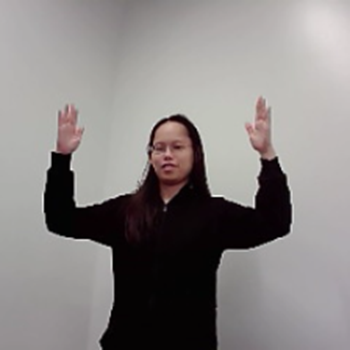
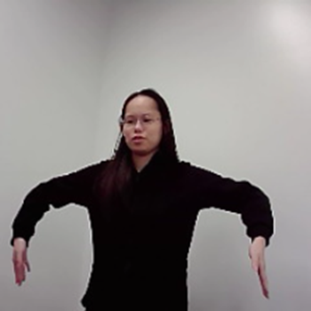
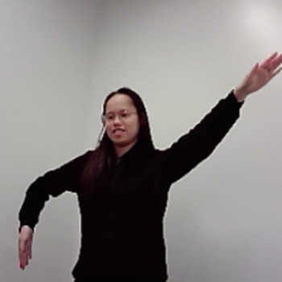
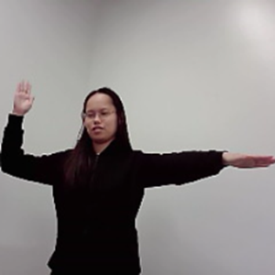
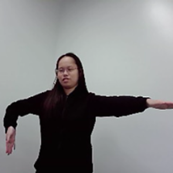
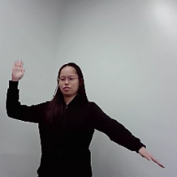
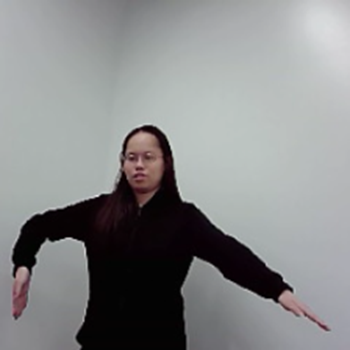

# Observant Systems

**NAMES OF COLLABORATORS HERE**

+ Tingrui（Freya) Zhang - tz428
+ Khiem Pham - dpk45
+ Sissel Sun - rs923

For lab this week, we focus on creating interactive systems that can detect and respond to events or stimuli in the environment of the Pi, like the Boat Detector we mentioned in lecture. 
Your **observant device** could, for example, count items, find objects, recognize an event or continuously monitor a room.

This lab will help you think through the design of observant systems, particularly corner cases that the algorithms need to be aware of.

## Prep

1.  Install VNC on your laptop if you have not yet done so. This lab will actually require you to run script on your Pi through VNC so that you can see the video stream. Please refer to the [prep for Lab 2](https://github.com/FAR-Lab/Interactive-Lab-Hub/blob/-/Lab%202/prep.md#using-vnc-to-see-your-pi-desktop).
2.  Install the dependencies as described in the [prep document](prep.md). 
3.  Read about [OpenCV](https://opencv.org/about/),[Pytorch](https://pytorch.org/), [MediaPipe](https://mediapipe.dev/), and [TeachableMachines](https://teachablemachine.withgoogle.com/).
4.  Read Belloti, et al.'s [Making Sense of Sensing Systems: Five Questions for Designers and Researchers](https://www.cc.gatech.edu/~keith/pubs/chi2002-sensing.pdf).

### For the lab, you will need:
1. Pull the new Github Repo
1. Raspberry Pi
1. Webcam 

### Deliverables for this lab are:
1. Show pictures, videos of the "sense-making" algorithms you tried.
1. Show a video of how you embed one of these algorithms into your observant system.
1. Test, characterize your interactive device. Show faults in the detection and how the system handled it.

## Overview
Building upon the paper-airplane metaphor (we're understanding the material of machine learning for design), here are the four sections of the lab activity:

A) [Play](#part-a)

B) [Fold](#part-b)

C) [Flight test](#part-c)

D) [Reflect](#part-d)

---

### Part A
### Play with different sense-making algorithms.

#### Pytorch for object recognition

For this first demo, you will be using PyTorch and running a MobileNet v2 classification model in real time (30 fps+) on the CPU. We will be following steps adapted from [this tutorial](https://pytorch.org/tutorials/intermediate/realtime_rpi.html).


To get started, install dependencies into a virtual environment for this exercise as described in [prep.md](prep.md).

Make sure your webcam is connected.

You can check the installation by running:

```
python -c "import torch; print(torch.__version__)"
```

If everything is ok, you should be able to start doing object recognition. For this default example, we use [MobileNet_v2](https://arxiv.org/abs/1801.04381). This model is able to perform object recognition for 1000 object classes (check [classes.json](classes.json) to see which ones.

Start detection by running  

```
python infer.py
```

The first 2 inferences will be slower. Now, you can try placing several objects in front of the camera.

Read the `infer.py` script, and get familiar with the code. You can change the video resolution and frames per second (fps). You can also easily use the weights of other pre-trained models. You can see examples of other models [here](https://pytorch.org/tutorials/intermediate/realtime_rpi.html#model-choices). 


### Machine Vision With Other Tools
The following sections describe tools ([MediaPipe](#mediapipe) and [Teachable Machines](#teachable-machines)).

#### MediaPipe

A recent open source and efficient method of extracting information from video streams comes out of Google's [MediaPipe](https://mediapipe.dev/), which offers state of the art face, face mesh, hand pose, and body pose detection.


To get started, install dependencies into a virtual environment for this exercise as described in [prep.md](prep.md):

Each of the installs will take a while, please be patient. After successfully installing mediapipe, connect your webcam to your Pi and use **VNC to access to your Pi**, open the terminal, and go to Lab 5 folder and run the hand pose detection script we provide:
(***it will not work if you use ssh from your laptop***)


```
(venv-ml) pi@ixe00:~ $ cd Interactive-Lab-Hub/Lab\ 5
(venv-ml) pi@ixe00:~ Interactive-Lab-Hub/Lab 5 $ python hand_pose.py
```

Try the two main features of this script: 1) pinching for percentage control, and 2) "[Quiet Coyote](https://www.youtube.com/watch?v=qsKlNVpY7zg)" for instant percentage setting. Notice how this example uses hardcoded positions and relates those positions with a desired set of events, in `hand_pose.py`. 

Consider how you might use this position based approach to create an interaction, and write how you might use it on either face, hand or body pose tracking.

(You might also consider how this notion of percentage control with hand tracking might be used in some of the physical UI you may have experimented with in the last lab, for instance in controlling a servo or rotary encoder.)


#### Teachable Machines
Google's [TeachableMachines](https://teachablemachine.withgoogle.com/train) is very useful for prototyping with the capabilities of machine learning. We are using [a python package](https://github.com/MeqdadDev/teachable-machine-lite) with tensorflow lite to simplify the deployment process.


To get started, install dependencies into a virtual environment for this exercise as described in [prep.md](prep.md):

After installation, connect your webcam to your Pi and use **VNC to access to your Pi**, open the terminal, and go to Lab 5 folder and run the example script:
(***it will not work if you use ssh from your laptop***)


```
(venv-tml) pi@ixe00:~ Interactive-Lab-Hub/Lab 5 $ python tml_example.py
```


Next train your own model. Visit [TeachableMachines](https://teachablemachine.withgoogle.com/train), select Image Project and Standard model. The raspberry pi 4 is capable to run not just the low resource models. Second, use the webcam on your computer to train a model. *Note: It might be advisable to use the pi webcam in a similar setting you want to deploy it to improve performance.*  For each class try to have over 150 samples, and consider adding a background or default class where you have nothing in view so the model is trained to know that this is the background. Then create classes based on what you want the model to classify. Lastly, preview and iterate. Finally export your model as a 'Tensorflow lite' model. You will find an '.tflite' file and a 'labels.txt' file. Upload these to your pi (through one of the many ways such as [scp](https://www.raspberrypi.com/documentation/computers/remote-access.html#using-secure-copy), sftp, [vnc](https://help.realvnc.com/hc/en-us/articles/360002249917-VNC-Connect-and-Raspberry-Pi#transferring-files-to-and-from-your-raspberry-pi-0-6), or a connected visual studio code remote explorer).


Include screenshots of your use of Teachable Machines, and write how you might use this to create your own classifier. Include what different affordances this method brings, compared to the OpenCV or MediaPipe options.


[Teachable Machines Demo](https://drive.google.com/file/d/150dOQDbp3P3kZaYMGIjLEX3Q7znTEJNH/view?usp=sharing)

#### (Optional) Legacy audio and computer vision observation approaches
In an earlier version of this class students experimented with observing through audio cues. Find the material here:
[Audio_optional/audio.md](Audio_optional/audio.md). 
Teachable machines provides an audio classifier too. If you want to use audio classification this is our suggested method. 

In an earlier version of this class students experimented with foundational computer vision techniques such as face and flow detection. Techniques like these can be sufficient, more performant, and allow non discrete classification. Find the material here:
[CV_optional/cv.md](CV_optional/cv.md).

### Part B
### Construct a simple interaction.

* Pick one of the models you have tried, and experiment with prototyping an interaction.
* This can be as simple as the boat detector showen in a previous lecture from Nikolas Matelaro.
* Try out different interaction outputs and inputs.

We picked Teachable Machines and developed a conductor simulator where users can use pose gestures to turn on/off an instrument track of the music. Our gesture set consists of 9 instances:

- Background

    

- Start all

    

- Stop all

    

- Turn on instrument 1

    

- Turn off instrument 1

    

- Turn on instrument 2

    

- Turn off instrument 2

    

- Turn on instrument 3

    

- Turn off instrument 3

    


We picked a delightful piece of music with three instrument tracks (violin, acoustic guitar and mandolin) for demonstration. The left arm controls whether to turn on or off the instrument by having the arm 90 degrees up or down. The right arm decides which instrument is selected. Three positions of arms (in 135, 90, and 45 degrees) are for three different tracks. We also have a “start all” and a “stop all” gesture, where users put both their arms 90 degrees up or down.

Originally, we’ve designed body gestures that only track the position of the hand in space. However, although they resemble a conductor more, they are more subtle and much harder to classify. Adding one labmate’s data would impact the performance for other labmates. As a result, we moved on with this version of gesture set despite it being more bulky.  

Code: [instrument.html](instrument.html)

Here is our video demo: [Video Demo](https://drive.google.com/file/d/12-3f5IDIZrsoqET3ODr7K7YyxY9KyZfv/view?usp=drive_link)


**\*\*\*Describe and detail the interaction, as well as your experimentation here.\*\*\***

### Part C
### Test the interaction prototype

Now flight test your interactive prototype and **note down your observations**:
For example:
1. When does it what it is supposed to do?

    There are 3 tracks that compose a song. The system recognizes the user's gestures and plays / pauses the corresponding tracks. There are also 2 more options to play / pause the song (i.e. all 3 tracks)

1. When does it fail?

    The system is quite robust to our image inputs. We tried to add multiple edge cases (a background class, user pose out of frame, multiple body base, diverse backgrounds and lighting, all 3 labmates contribute to the data).The system defaults to ‘do nothing’ when poses are out of frame or when the classification probability of the best class is less than 90%. That said, there is overlap between the motions and the system sometimes fails to play the right sound that users intended.

1. When it fails, why does it fail?

    The motions overlap. This is because as the number of options we give increases, there are fewer easily distinguishable gestures. For example, we chose the gesture ‘straight right arm, x degree’ where x is in [45, 90, 135] to activate a sound. Obviously, when the user does not put their arms at the exact degree, or when the camera has a different angle compared to during training, the model makes mistakes. In contrast, we use 2 very different gestures for the left arm to indicate on / off, and the model rarely makes mistakes on this.

1. Based on the behavior you have seen, what other scenarios could cause problems?

    Other problems can be: when users do not stay in the frame / the camera is positioned incorrectly. This is especially true for tall users / short users.


**\*\*\*Think about someone using the system. Describe how you think this will work.\*\*\***
1. Are they aware of the uncertainties in the system?

    Most probably not. For example, they would expect the system to be robust to camera / body position, but the system requires good centering of the body.

1. How bad would they be impacted by a miss classification?

    Since our application is used for entertainment purposes and not a critical one, we expect that a few wrong answers will not hurt.

1. How could change your interactive system to address this?

    Again, the nature of our application is creative, so wrong answers are not very impactful. We can improve on the system by: training a system with a confidence score along with its classification score. The confidence score indicates whether the system is sure about the gesture; when the system is repeatedly unconfident about a particular gesture, it can ask the users for input, suggest what users should do, or potentially even adapt to individuals after receiving feedback.

1. Are there optimizations you can try to do on your sense-making algorithm.

    We can train on more data, collect data with diverse backgrounds and individuals. We can use a more sophisticated model than what ‘teachable machine’ uses by default. We can augment our data for more robustness and accuracy. 

### Part D
### Characterize your own Observant system

Now that you have experimented with one or more of these sense-making systems **characterize their behavior**.
During the lecture, we mentioned questions to help characterize a material:
* What can you use X for?

    We can use the gesture detection system for controlling various aspects of music playback, such as starting and stopping tracks and turning on or off specific instrument tracks. It allows for hands-free interaction with the music player, which can be useful in situations where manual control is inconvenient, like during a live performance.

* What is a good environment for X?
    
    A good environment is one with adequate lighting conditions and minimal background distractions. It works best in scenarios where the user's gestures can be easily captured and distinguished from the background. 

* What is a bad environment for X?

    A bad environment includes poor lighting and cluttered background. Outdoors with changing lighting conditions and unpredictable factors will also be challenging for accurate gesture recognition.

* When will X break?

    It will break when there are multiple people making gestures simultaneously. It can also struggle if the user's gestures are not well-defined or if there are hardware issues with the sensor or camera used for detection.

* When it breaks how will X break?

    When it breaks, it may misinterpret gestures or fail to recognize them altogether. After it breaks, we have not figured out how to make it resume from the previous break. Instead, everytime it starts right from the beginning. （But when we were casting the video, the bug fixed itself:)

* What are other properties/behaviors of X?

    Other properties of this system include: its response time, accuracy in recognizing specific gestures, and the ability to handle a wide range of user movements. It might also have features for customizing gesture mappings and sensitivity settings.

* How does X feel?

    As the user experiences largely depend on its accuracy and responsiveness, the user should feel intuitive and convenient to work as a conductor of an orchestra whereas they don’t have to work as much professionally when the system was well-implemented and consisted of enough responsive processes.

**\*\*\*Include a short video demonstrating the answers to these questions.\*\*\***

[Video Demo](https://drive.google.com/file/d/12-3f5IDIZrsoqET3ODr7K7YyxY9KyZfv/view?usp=drive_link) (Same as part B)

### Part 2.

Following exploration and reflection from Part 1, finish building your interactive system, and demonstrate it in use with a video.

**\*\*\*Include a short video demonstrating the finished result.\*\*\***

Based on part 1, we improved our prototype so that it can control the volume of each track instead of just turning up/down. We also included an improvise version of letting the model decide the volume based on new and random gestures "in the spirit of jazz". 

[Demo Video](https://drive.google.com/file/d/1kT_DmciYyDpyx9DZT51t-3RiCTf8t1c9/view?usp=sharing)

Code: [instrument.html](./instrument.html) and [instrument_random.html](./instrument_random.html)

Models: [instrument_model](./instrument_model/) and [instrument_random_model](./instrument_random_model/)